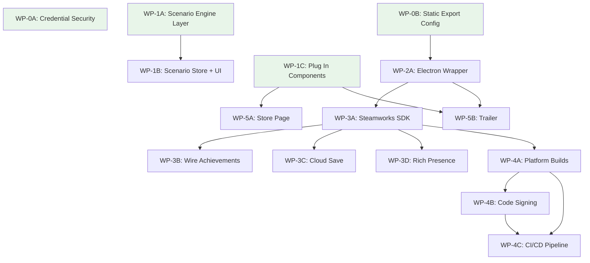

# TalentScout Steam Launch -- Implementation Plan

**Created:** 2026-02-23
**Status:** Ready for execution
**Architect:** Software Architect agent

---

## Table of Contents

1. [Codebase Assessment](#codebase-assessment)
2. [Architecture Decision Records](#architecture-decision-records)
3. [Phase Overview](#phase-overview)
4. [Work Package Definitions](#work-package-definitions)
5. [Dependency Graph](#dependency-graph)
6. [Risk Register](#risk-register)
7. [Handoff Notes](#handoff-notes)

---

## Codebase Assessment

### Current State (verified 2026-02-23)

| Area | Status | Notes |
|---|---|---|
| TypeScript / ESLint | Zero errors | Clean build confirmed in audit |
| Build mode | SSR (not static export) | `next.config.ts` has NO `output: "export"`. Must add for Electron. |
| Supabase credentials | `.env.local` exists with real anon key, NOT tracked in git | `.gitignore` already excludes `.env.local`. `.env.example` exists with placeholders. |
| Scenario engine | Definitions (10) + objective checker + failure checker exist | Missing: `startScenario()`, store field `selectedScenarioId`, `applyScenarioSetup()`, objective tracking in `advanceWeek`, completion/failure UI |
| Unused components | `PlayerAvatar.tsx`, `ClubCrest.tsx`, `WorldMap.tsx`, `effects/Celebration.tsx` exist with full implementations | Zero imports in any screen component. Tutorial overlay/store exist but `startSequence()` is never called from game actions. |
| Steam interface | `NoopSteamInterface` + `SteamInterface` abstraction + `achievementMap.ts` (45 entries) | Factory pattern ready. Just need real SDK implementation class. |
| Achievement system | 45 definitions in `lib/achievements.ts`, store with localStorage persistence, Steam sync stub via `achievementMap.ts` | Already calls `steam.unlockAchievement()` -- will work once real SDK is wired. |
| Tutorial system | `tutorialStore.ts` with `startSequence()`, `TutorialOverlay`, `tutorialSteps.ts` | Store imported in `gameStore.ts` but `startSequence()` never called. |
| Game state | 3,769-line `gameStore.ts` with Zustand, `GameState` interface in `engine/core/types.ts` | No `scenarioId` field on `GameState`. `NewGameConfig` lacks scenario fields. |
| Supabase usage | 8 files import Supabase: auth, cloud saves, leaderboard | Already optional (auth init is a no-op if no client). Needs verification of graceful degradation. |

### Key Architectural Constraints

1. **Single-page app**: All routing via `useGameStore.currentScreen` state. No Next.js router pages.
2. **Pure engine**: All engine functions in `src/engine/` are pure (state in, state out). No React imports.
3. **Zustand store**: Single `gameStore` holds all game state + actions. ~3,769 lines.
4. **Component pattern**: Each screen is a standalone component rendered by `page.tsx` switch.
5. **Save system**: IndexedDB via Dexie for local, Supabase for cloud. Steam Cloud would be a third provider.

---

## Architecture Decision Records

### ADR-001: Electron Framework for Desktop Wrapper

#### Status: proposed

#### Context
TalentScout must ship as a native desktop application on Steam. The game is built as a Next.js single-page app with static assets, IndexedDB persistence, and optional Supabase cloud features. We need a wrapper that loads the static export and provides native OS integration (window management, file dialogs, system tray) plus access to the Steamworks SDK via Node.js bindings.

#### Options Considered
1. **Electron** -- Pros: Mature ecosystem, largest community, excellent Steamworks bindings (`steamworks.js`), electron-builder handles all 3 platforms, well-documented Steam integration patterns. Cons: Large binary size (~150MB+), higher memory usage, Chromium bundled.
2. **Tauri** -- Pros: Much smaller binary (~10MB), uses system WebView, Rust backend. Cons: Steamworks integration requires FFI to C++ SDK (no mature crate), WebView2 on Windows can have rendering inconsistencies, smaller ecosystem for game distribution.
3. **Neutralinojs** -- Pros: Tiny runtime. Cons: No mature Steamworks bindings, limited builder tooling, small community.

#### Decision
**Electron**

#### Rationale
The binary size concern is irrelevant for Steam distribution (games are routinely 1GB+). Electron's `steamworks.js` npm package provides battle-tested Steamworks bindings used by multiple shipped Steam games. electron-builder provides one-command builds for all three platforms with code signing support. The existing `NoopSteamInterface` pattern maps cleanly to Electron's IPC model. Tauri would require significant custom FFI work for Steamworks with no proven path.

#### Consequences
- Binary size will be ~150-200MB (acceptable for Steam).
- Must configure Next.js for static export (`output: "export"` in `next.config.ts`).
- Must handle Electron's main/renderer process split: Steamworks SDK runs in main process, game UI in renderer.
- IPC bridge needed for Steam API calls from renderer to main.
- `Content-Security-Policy` header in `next.config.ts` may need adjustment for Electron's `file://` protocol.

---

### ADR-002: Steamworks Node.js Binding

#### Status: proposed

#### Context
We need a Node.js binding for the Steamworks SDK to unlock achievements, manage cloud saves, set Rich Presence, and authenticate the user. The binding must work in Electron's main process on Windows, macOS, and Linux.

#### Options Considered
1. **steamworks.js** -- Pros: Active maintenance (2024-2025 releases), TypeScript types, covers achievements/cloud/overlay/rich presence, used by multiple shipped Electron+Steam games, supports Electron 28+. Cons: Requires Steamworks SDK redistribution files.
2. **greenworks** -- Pros: Older and well-known. Cons: Last meaningful update 2022, does not support Electron 28+, requires manual native rebuilds, many open issues.
3. **node-steamworks** -- Pros: Low-level access. Cons: Minimal abstraction, no TypeScript types, sparse documentation, unmaintained.

#### Decision
**steamworks.js**

#### Rationale
`steamworks.js` is the only actively maintained option with TypeScript support and proven Electron compatibility. It covers all four required features (achievements, cloud saves, rich presence, player identity). The API surface maps directly to our existing `SteamInterface` abstraction.

#### Consequences
- Must include Steamworks SDK redistribution binaries (`steam_api.dll`, `libsteam_api.so`, `libsteam_api.dylib`) in the Electron build.
- Must create `steam_appid.txt` for development testing.
- The `steamworks.js` init call must happen in Electron main process; results forwarded to renderer via IPC.
- Falls back to `NoopSteamInterface` when not running in Electron (web dev mode).

---

### ADR-003: Scenario Execution Architecture

#### Status: proposed

#### Context
10 scenario definitions exist with objectives and failure conditions. The scenario engine can check objectives and detect failure. But there is no mechanism to: (a) store the selected scenario in game state, (b) apply scenario setup parameters to a new game, (c) track objective progress during gameplay, or (d) surface completion/failure to the player.

#### Options Considered
1. **Extend GameState + NewGameConfig** -- Add `activeScenarioId?: string` to `GameState` and scenario override fields to `NewGameConfig`. The `startNewGame` action checks for a scenario and overrides tier/rep/week/season/country. `advanceWeek` checks objectives when `activeScenarioId` is set. Pros: Minimal new code, pure functions, works with existing save/load. Cons: Adds fields to the already-large GameState.
2. **Separate ScenarioStore** -- New Zustand store holding scenario state independently. Pros: Separation of concerns. Cons: Must sync with GameState on every week advance, save/load must coordinate two stores, increases complexity for marginal benefit.

#### Decision
**Option 1: Extend GameState + NewGameConfig**

#### Rationale
The scenario engine already operates on `GameState`. Adding `activeScenarioId` to `GameState` means objective checks work naturally with existing save/load (the scenario context persists across sessions). A separate store would require complex synchronization and break the single-source-of-truth pattern the codebase consistently uses.

#### Consequences
- Add `activeScenarioId?: string` to `GameState` interface in `types.ts`.
- Add `selectedScenarioId` to `gameStore` (transient, used between ScenarioSelect and NewGameScreen).
- Create `applyScenarioSetup(config: NewGameConfig, scenario: ScenarioDef): NewGameConfig` pure function.
- Modify `startNewGame` to apply scenario overrides when `selectedScenarioId` is set.
- Add scenario objective checking to `advanceWeek` flow in `gameStore.ts`.
- Add `ScenarioProgressPanel` component to `Dashboard.tsx`.
- Add scenario completion/failure overlay (reuse `Celebration` for wins, new `ScenarioFailure` for losses).

---

### ADR-004: Credential Security for Public Repository

#### Status: proposed

#### Context
The `.env.local` file contains a Supabase anon key. While `.env.local` is already in `.gitignore` and NOT tracked in git, we must verify no credentials were ever committed to git history and ensure Supabase features degrade gracefully when credentials are absent.

#### Options Considered
1. **Verify clean history + harden graceful degradation** -- Check git log for any past `.env.local` commits, verify all Supabase imports handle missing client gracefully. Pros: Minimally invasive if history is clean. Cons: Must audit 8 files.
2. **Full history scrub with BFG** -- Run BFG Repo-Cleaner regardless. Pros: Belt-and-suspenders. Cons: Rewrites history, force push required, disruptive.

#### Decision
**Option 1** (verify first, scrub only if needed)

#### Rationale
`git ls-files --error-unmatch .env.local` confirms the file is NOT tracked. `.gitignore` already excludes it. A history scrub is only warranted if inspection reveals past commits containing credentials. The 8 Supabase-importing files need a graceful-degradation audit regardless.

#### Consequences
- Must run `git log --all --diff-filter=A -- .env.local` to verify no historical commits.
- Must audit these 8 files for graceful degradation when Supabase client is null: `authStore.ts`, `supabase.ts`, `supabaseCloudSave.ts`, `supabaseLeaderboard.ts`, `cloudSave.ts`, `localCloudSave.ts`, `LeaderboardScreen.tsx`, `page.tsx`.
- If any historical credential exposure is found, escalate to BFG + credential rotation (new Supabase project or key rotation).

---

## Phase Overview

```
Phase 0: Credential Security + Static Export Config         [Day 1]
         (Blocker for everything -- must be clean before public repo)

Phase 1: Game Completeness (parallel tracks)                [Days 1-5]
  |-- Track A: Wire Scenario Execution
  |-- Track B: Plug In Unused Components + Tutorial Triggers
  |-- Track C: Celebration System Integration

Phase 2: Desktop Shell                                      [Days 6-12]
  |-- WP-2A: Electron Wrapper + Dev Workflow
  |-- WP-2B: Static Export Compatibility Fixes

Phase 3: Steam Integration                                  [Days 10-22]
  |-- WP-3A: Steamworks SDK Setup + Real SteamInterface
  |-- WP-3B: Achievement Wiring (already 90% done)
  |-- WP-3C: Cloud Save Integration
  |-- WP-3D: Rich Presence

Phase 4: Platform Builds + CI/CD                            [Days 18-28]
  |-- WP-4A: electron-builder Config (Win/Mac/Linux)
  |-- WP-4B: Code Signing + Notarization
  |-- WP-4C: GitHub Actions Build Pipeline

Phase 5: Store Presence                                     [Days 15-28]
  |-- WP-5A: Store Page Copy + Screenshots
  |-- WP-5B: Trailer Planning
```

### Parallelism Map

```
Day:  1    2    3    4    5    6    7    8    9   10   11   12  ...  22  ...  28
      |----Phase 0----|
      |-------Track A: Scenarios-------|
      |-------Track B: Components------|
      |-------Track C: Celebrations----|
                              |--------Phase 2: Electron---------|
                                            |--------Phase 3: Steam----------|
                                                              |---Phase 4: Builds---|
                                    |----------Phase 5: Store Page-----------|
```

---

## Work Package Definitions

### WP-0A: Credential Security Audit

**Agent type:** Security / DevOps
**Dependencies:** None (start immediately)
**Estimated effort:** 1-2 hours
**Parallelism:** Can run alongside all Phase 1 work

#### Tasks

1. **Verify git history is clean:**
   ```
   git log --all --diff-filter=A -- .env.local
   git log --all --diff-filter=A -- .env
   git log --all -p -S "eyJhbGciOiJIUzI1NiI" -- .  (search for the JWT prefix)
   ```
   If any results: escalate to BFG scrub + Supabase key rotation.

2. **Audit graceful degradation in all 8 Supabase-importing files:**
   - `/Users/tsc-001/talentscout/src/stores/authStore.ts` -- verify `initialize()` no-ops cleanly
   - `/Users/tsc-001/talentscout/src/lib/supabase.ts` -- verify client creation handles missing env vars
   - `/Users/tsc-001/talentscout/src/lib/supabaseCloudSave.ts` -- verify save/load return null/empty
   - `/Users/tsc-001/talentscout/src/lib/supabaseLeaderboard.ts` -- verify submissions silently fail
   - `/Users/tsc-001/talentscout/src/lib/cloudSave.ts` -- verify fallback to local-only
   - `/Users/tsc-001/talentscout/src/lib/localCloudSave.ts` -- verify works without Supabase
   - `/Users/tsc-001/talentscout/src/components/game/LeaderboardScreen.tsx` -- verify empty state UI
   - `/Users/tsc-001/talentscout/src/app/page.tsx` -- verify auth init handles missing client

3. **Add null-guard wrapper to Supabase client creation** (if not already present):
   In `/Users/tsc-001/talentscout/src/lib/supabase.ts`, ensure that when `NEXT_PUBLIC_SUPABASE_URL` or `NEXT_PUBLIC_SUPABASE_ANON_KEY` are empty/missing, the module exports `null` and all consumers handle it.

4. **Verify `.env.example` is sufficient:**
   `/Users/tsc-001/talentscout/.env.example` already has placeholder values. Confirm it documents all required env vars.

#### Files to modify
- `/Users/tsc-001/talentscout/src/lib/supabase.ts` (add null guard if missing)
- Up to 7 other Supabase-consuming files (add null checks if missing)

#### Acceptance criteria
- [ ] `git log` search for credentials returns zero results
- [ ] App builds and runs with empty `.env.local` (or no `.env.local`)
- [ ] All Supabase features silently degrade: no crashes, no console errors
- [ ] Cloud save UI shows "unavailable" state, not an error
- [ ] Leaderboard shows empty/offline state

---

### WP-0B: Enable Static HTML Export

**Agent type:** Frontend
**Dependencies:** None (start immediately, but Phase 2 depends on this)
**Estimated effort:** 2-4 hours
**Parallelism:** Can run alongside all Phase 1 work

#### Tasks

1. **Add `output: "export"` to `next.config.ts`:**

   File: `/Users/tsc-001/talentscout/next.config.ts`

   Add `output: "export"` to the config object. Remove the `headers` function (not supported in static export mode -- CSP headers will be set via Electron's `session.webRequest` or a `<meta>` tag instead).

2. **Verify build succeeds:**
   ```
   npm run build
   ```
   Static export writes to `out/` directory. Verify `out/index.html` exists.

3. **Identify and fix any SSR-only features:**
   The current `next.config.ts` uses `headers()` which is server-only. Since the app is a single-page SPA with no API routes, static export should work, but verify:
   - No `getServerSideProps` or `getStaticProps` in any page
   - No API routes in `src/app/api/`
   - All data fetching is client-side (Zustand + IndexedDB + Supabase client)

4. **Move CSP to `<meta>` tag:**
   Add a `<meta http-equiv="Content-Security-Policy" ...>` tag in `/Users/tsc-001/talentscout/src/app/layout.tsx` to preserve CSP protection in static export mode.

#### Files to modify
- `/Users/tsc-001/talentscout/next.config.ts`
- `/Users/tsc-001/talentscout/src/app/layout.tsx` (add CSP meta tag)

#### Acceptance criteria
- [ ] `npm run build` produces `out/` directory with `index.html`
- [ ] Opening `out/index.html` in a browser shows the main menu
- [ ] No console errors related to missing server features
- [ ] CSP is enforced via meta tag

---

### WP-1A: Wire Scenario Execution -- Engine Layer

**Agent type:** Game engine / Backend logic
**Dependencies:** None (start immediately)
**Estimated effort:** 1-2 days
**Parallelism:** Runs alongside WP-1B, WP-1C, WP-0A, WP-0B

#### Tasks

1. **Add `activeScenarioId` to `GameState`:**

   File: `/Users/tsc-001/talentscout/src/engine/core/types.ts`

   Add to the `GameState` interface (after line ~968, in the Phase 3 extensions section):
   ```typescript
   /** The ID of the active scenario, if any. Null/undefined for freeplay. */
   activeScenarioId?: string;
   ```

2. **Create `applyScenarioSetup` pure function:**

   File: `/Users/tsc-001/talentscout/src/engine/scenarios/scenarioSetup.ts` (NEW)

   ```typescript
   export function applyScenarioSetup(
     config: NewGameConfig,
     scenario: ScenarioDef,
   ): NewGameConfig {
     return {
       ...config,
       // Override fields from scenario.setup
       // startingTier maps to which club tier the scout starts at
       // startingReputation maps to initial rep
       // startingCountry maps to selectedCountries[0]
       // startingWeek/Season applied post-init
     };
   }
   ```

   This function takes the player's `NewGameConfig` (name, specialization, skill points) and overlays the scenario's setup parameters. It returns a modified config. The scenario's `startingWeek` and `startingSeason` cannot be applied via `NewGameConfig` (which has no week/season fields), so those must be applied as a post-init mutation on the `GameState` object.

3. **Create `applyScenarioOverrides` for post-init GameState mutation:**

   Same file: `/Users/tsc-001/talentscout/src/engine/scenarios/scenarioSetup.ts`

   ```typescript
   export function applyScenarioOverrides(
     state: GameState,
     scenario: ScenarioDef,
   ): GameState {
     return {
       ...state,
       activeScenarioId: scenario.id,
       currentWeek: scenario.setup.startingWeek,
       currentSeason: scenario.setup.startingSeason,
       scout: {
         ...state.scout,
         reputation: scenario.setup.startingReputation,
         careerTier: scenario.setup.startingTier,
       },
     };
   }
   ```

4. **Update barrel export:**

   File: `/Users/tsc-001/talentscout/src/engine/scenarios/index.ts`

   Add exports for the new functions.

#### Files to create/modify
- `/Users/tsc-001/talentscout/src/engine/core/types.ts` (add `activeScenarioId` field)
- `/Users/tsc-001/talentscout/src/engine/scenarios/scenarioSetup.ts` (NEW)
- `/Users/tsc-001/talentscout/src/engine/scenarios/index.ts` (update barrel)

#### Acceptance criteria
- [ ] `applyScenarioSetup` is a pure function with unit-testable signature
- [ ] `applyScenarioOverrides` correctly sets week, season, reputation, tier, and `activeScenarioId`
- [ ] Zero TypeScript errors after changes
- [ ] Existing save/load works (new optional field doesn't break deserialization)

---

### WP-1B: Wire Scenario Execution -- Store + UI Layer

**Agent type:** Frontend
**Dependencies:** WP-1A (needs `applyScenarioSetup`, `applyScenarioOverrides`, and `activeScenarioId` on GameState)
**Estimated effort:** 1-2 days
**Parallelism:** Starts after WP-1A completes; runs alongside WP-1C, WP-0A, WP-0B

#### Tasks

1. **Add `selectedScenarioId` transient field to gameStore:**

   File: `/Users/tsc-001/talentscout/src/stores/gameStore.ts`

   Add to the `GameStore` interface (~line 202):
   ```typescript
   /** Transient: scenario selected in ScenarioSelect, consumed by startNewGame. */
   selectedScenarioId: string | null;
   setSelectedScenario: (id: string | null) => void;
   ```

   Initialize as `null` in the store creation (~line 385).

2. **Wire ScenarioSelect to set `selectedScenarioId`:**

   File: `/Users/tsc-001/talentscout/src/components/game/ScenarioSelect.tsx`

   Modify `handleConfirm` (line 142-148) to call `setSelectedScenario(selectedScenario.id)` before navigating to `newGame`.

3. **Modify `startNewGame` to apply scenario setup:**

   File: `/Users/tsc-001/talentscout/src/stores/gameStore.ts`

   In the `startNewGame` action (line 405+):
   - Read `selectedScenarioId` from store
   - If set, look up `ScenarioDef` via `getScenarioById()`
   - Call `applyScenarioSetup(config, scenarioDef)` to get modified config
   - After building `gameState`, call `applyScenarioOverrides(gameState, scenarioDef)`
   - Clear `selectedScenarioId` after consumption

4. **Add objective checking to `advanceWeek`:**

   File: `/Users/tsc-001/talentscout/src/stores/gameStore.ts`

   At the end of the `advanceWeek` action (after state is updated, before autosave):
   - If `gameState.activeScenarioId` is set, call `checkScenarioObjectives(newState, scenarioId)`
   - If `allRequiredComplete === true`, show completion celebration + add inbox message
   - If `failed === true`, show failure overlay + add inbox message
   - Store `ScenarioProgress` in a transient store field for Dashboard to read

5. **Create `ScenarioProgressPanel` component:**

   File: `/Users/tsc-001/talentscout/src/components/game/ScenarioProgressPanel.tsx` (NEW)

   A compact panel showing:
   - Scenario name
   - List of objectives with checkmark/circle status
   - Progress fraction (e.g., "2/3 required objectives")
   - If failed: red banner with fail reason

6. **Add `ScenarioProgressPanel` to Dashboard:**

   File: `/Users/tsc-001/talentscout/src/components/game/Dashboard.tsx`

   Conditionally render `ScenarioProgressPanel` when `gameState.activeScenarioId` is set. Place it prominently near the top of the dashboard layout.

7. **Add scenario completion/failure overlays:**

   File: `/Users/tsc-001/talentscout/src/components/game/ScenarioOutcomeOverlay.tsx` (NEW)

   Two modes:
   - **Victory:** Reuses `Celebration` component (tier: "epic") with scenario-specific text
   - **Failure:** Red-themed modal with fail reason and "Return to Menu" / "Try Again" buttons

#### Files to create/modify
- `/Users/tsc-001/talentscout/src/stores/gameStore.ts` (add selectedScenarioId, modify startNewGame, modify advanceWeek)
- `/Users/tsc-001/talentscout/src/components/game/ScenarioSelect.tsx` (wire to store)
- `/Users/tsc-001/talentscout/src/components/game/ScenarioProgressPanel.tsx` (NEW)
- `/Users/tsc-001/talentscout/src/components/game/ScenarioOutcomeOverlay.tsx` (NEW)
- `/Users/tsc-001/talentscout/src/components/game/Dashboard.tsx` (add progress panel)
- `/Users/tsc-001/talentscout/src/app/page.tsx` (add ScenarioOutcomeOverlay to root)

#### Acceptance criteria
- [ ] Selecting a scenario in ScenarioSelect and starting a new game produces a GameState with correct `activeScenarioId`, `currentWeek`, `currentSeason`, `scout.reputation`, `scout.careerTier`
- [ ] Dashboard shows objective progress panel when scenario is active
- [ ] Completing all required objectives triggers victory celebration
- [ ] Exceeding the season limit triggers failure overlay
- [ ] "The Rescue Job" scenario fails correctly when week > 28 without 3 qualified reports
- [ ] Freeplay games (no scenario) are unaffected
- [ ] Save/load preserves scenario state
- [ ] Zero TypeScript errors

---

### WP-1C: Plug In Unused Components

**Agent type:** Frontend
**Dependencies:** None (start immediately)
**Estimated effort:** 1-2 days
**Parallelism:** Runs alongside WP-1A, WP-0A, WP-0B

#### Tasks

##### PlayerAvatar Integration

1. **PlayerProfile.tsx** -- Add `PlayerAvatar` to the header section, next to the player name.

   File: `/Users/tsc-001/talentscout/src/components/game/PlayerProfile.tsx`

   Import `PlayerAvatar` and render with `playerId={player.id}` and `nationality={player.nationality}`.

2. **PlayerDatabase.tsx** -- Add small `PlayerAvatar` (size 48) to each row in the player list.

   File: `/Users/tsc-001/talentscout/src/components/game/PlayerDatabase.tsx`

3. **ReportWriter.tsx** -- Add `PlayerAvatar` to the report header alongside the player being scouted.

   File: `/Users/tsc-001/talentscout/src/components/game/ReportWriter.tsx`

4. **MatchScreen.tsx** -- Add `PlayerAvatar` to the focus panel when a player is selected for observation.

   File: `/Users/tsc-001/talentscout/src/components/game/MatchScreen.tsx`

##### ClubCrest Integration

5. **Dashboard.tsx** -- Add `ClubCrest` next to the current club name (if scout has `currentClubId`).

   File: `/Users/tsc-001/talentscout/src/components/game/Dashboard.tsx`

6. **PlayerDatabase.tsx** -- Add small `ClubCrest` (size 32) to each row showing the player's club.

   File: `/Users/tsc-001/talentscout/src/components/game/PlayerDatabase.tsx`

7. **FixtureBrowser.tsx** -- Add `ClubCrest` next to home and away team names in fixture rows.

   File: `/Users/tsc-001/talentscout/src/components/game/FixtureBrowser.tsx`

8. **PlayerProfile.tsx** -- Add `ClubCrest` next to the player's club name in the profile header.

   File: `/Users/tsc-001/talentscout/src/components/game/PlayerProfile.tsx`

##### WorldMap Integration

9. **InternationalScreen.tsx** -- Add `WorldMap` as the primary visual navigation element above or alongside the existing country list view.

   File: `/Users/tsc-001/talentscout/src/components/game/InternationalScreen.tsx`

   The `WorldMap` component already accepts `countries`, `familiarityLevels`, `currentLocation`, `activeAssignments`, and `onCountryClick`. Wire these to the game state:
   - `countries` = `gameState.countries`
   - `familiarityLevels` = derived from `scout.countryReputations`
   - `currentLocation` = `scout.currentCountry`
   - `onCountryClick` = handler that scrolls to / filters the country detail view

##### Celebration Integration

10. **Wire Celebration to advanceWeek results:**

    File: `/Users/tsc-001/talentscout/src/stores/gameStore.ts` and `/Users/tsc-001/talentscout/src/app/page.tsx`

    Add a `pendingCelebration` field to `gameStore`:
    ```typescript
    pendingCelebration: {
      tier: "minor" | "major" | "epic";
      title: string;
      description: string;
    } | null;
    dismissCelebration: () => void;
    ```

    In the `advanceWeek` action, after processing results, detect celebration triggers:
    - **Minor:** Perk unlock (check if `unlockedTools` grew), new equipment tier
    - **Major:** Tier promotion (check if `scout.careerTier` increased), wonderkid discovery
    - **Epic:** Generational talent discovery, scenario completion

    In `page.tsx`, render `<Celebration>` overlay when `pendingCelebration` is non-null.

##### Tutorial Trigger Wiring

11. **First week tutorial:**

    File: `/Users/tsc-001/talentscout/src/stores/gameStore.ts`

    At the end of `startNewGame`, after setting game state:
    ```typescript
    useTutorialStore.getState().startSequence("firstWeek");
    ```

12. **First report tutorial:**

    File: `/Users/tsc-001/talentscout/src/stores/gameStore.ts`

    At the beginning of `startReport` action:
    ```typescript
    useTutorialStore.getState().startSequence("firstReport");
    ```
    (Will no-op if already completed or dismissed.)

13. **Career progression tutorial:**

    File: `/Users/tsc-001/talentscout/src/stores/gameStore.ts`

    In `advanceWeek`, when a tier promotion is detected:
    ```typescript
    useTutorialStore.getState().startSequence("careerProgression");
    ```

#### Files to create/modify
- `/Users/tsc-001/talentscout/src/components/game/PlayerProfile.tsx` (add PlayerAvatar + ClubCrest)
- `/Users/tsc-001/talentscout/src/components/game/PlayerDatabase.tsx` (add PlayerAvatar + ClubCrest)
- `/Users/tsc-001/talentscout/src/components/game/ReportWriter.tsx` (add PlayerAvatar)
- `/Users/tsc-001/talentscout/src/components/game/MatchScreen.tsx` (add PlayerAvatar)
- `/Users/tsc-001/talentscout/src/components/game/Dashboard.tsx` (add ClubCrest)
- `/Users/tsc-001/talentscout/src/components/game/FixtureBrowser.tsx` (add ClubCrest)
- `/Users/tsc-001/talentscout/src/components/game/InternationalScreen.tsx` (add WorldMap)
- `/Users/tsc-001/talentscout/src/stores/gameStore.ts` (add pendingCelebration, tutorial triggers)
- `/Users/tsc-001/talentscout/src/app/page.tsx` (render Celebration overlay)

#### Acceptance criteria
- [ ] PlayerAvatar visible on PlayerProfile, PlayerDatabase rows, ReportWriter header, MatchScreen focus panel
- [ ] ClubCrest visible on Dashboard (current club), PlayerDatabase rows, FixtureBrowser fixtures, PlayerProfile
- [ ] WorldMap renders on InternationalScreen with correct country data
- [ ] Clicking a country on WorldMap filters/scrolls the country detail view
- [ ] Minor celebration triggers on perk unlock
- [ ] Major celebration triggers on tier promotion
- [ ] Epic celebration triggers on generational talent discovery
- [ ] Tutorial "firstWeek" starts after new game creation (first time only)
- [ ] Tutorial "firstReport" starts when entering ReportWriter for the first time
- [ ] Tutorial "careerProgression" starts on first tier promotion
- [ ] All tutorials respect `dismissed` and `completedSequences` state
- [ ] Zero TypeScript errors
- [ ] Zero visual regressions on existing screens (components add to, not replace, existing UI)

---

### WP-2A: Electron Wrapper + Dev Workflow

**Agent type:** DevOps / Full-stack
**Dependencies:** WP-0B (needs static export working)
**Estimated effort:** 3-5 days
**Parallelism:** Can start as soon as WP-0B is complete. Runs alongside Phase 1 tail-end.

#### Tasks

1. **Install Electron dependencies:**

   ```bash
   npm install --save-dev electron electron-builder
   ```

   Add to `package.json` devDependencies.

2. **Create Electron main process entry:**

   File: `/Users/tsc-001/talentscout/electron/main.js` (NEW)

   Responsibilities:
   - Create `BrowserWindow` loading `out/index.html` (production) or `localhost:3000` (dev)
   - Set window title to "TalentScout"
   - Set minimum window size (1024x768)
   - Handle fullscreen toggle (F11)
   - Set up IPC handlers for Steam API calls (stubbed initially)
   - Set up IPC handler for native file dialogs (save export/import)
   - Load `steam_appid.txt` in dev mode

3. **Create Electron preload script:**

   File: `/Users/tsc-001/talentscout/electron/preload.js` (NEW)

   Expose IPC bridge to renderer via `contextBridge`:
   ```javascript
   contextBridge.exposeInMainWorld("electronAPI", {
     steam: {
       isAvailable: () => ipcRenderer.invoke("steam:isAvailable"),
       unlockAchievement: (name) => ipcRenderer.invoke("steam:unlockAchievement", name),
       setCloudSave: (slot, data) => ipcRenderer.invoke("steam:setCloudSave", slot, data),
       getCloudSave: (slot) => ipcRenderer.invoke("steam:getCloudSave", slot),
       getPlayerName: () => ipcRenderer.invoke("steam:getPlayerName"),
     },
     dialog: {
       saveFile: (data, filename) => ipcRenderer.invoke("dialog:saveFile", data, filename),
       openFile: () => ipcRenderer.invoke("dialog:openFile"),
     },
   });
   ```

4. **Create `ElectronSteamInterface` class:**

   File: `/Users/tsc-001/talentscout/src/lib/steam/electronSteamInterface.ts` (NEW)

   Implements `SteamInterface` by calling `window.electronAPI.steam.*` methods. Falls back to noop if `window.electronAPI` is undefined (web builds).

5. **Update `getSteam()` factory:**

   File: `/Users/tsc-001/talentscout/src/lib/steam/steamInterface.ts`

   Detect Electron environment and return `ElectronSteamInterface` when `window.electronAPI?.steam` exists.

6. **Add npm scripts:**

   File: `/Users/tsc-001/talentscout/package.json`

   ```json
   "electron:dev": "concurrently \"next dev\" \"wait-on http://localhost:3000 && electron electron/main.js\"",
   "electron:build": "next build && electron-builder",
   "electron:dist": "next build && electron-builder --publish never"
   ```

   Also install `concurrently` and `wait-on` as dev dependencies.

7. **Configure electron-builder:**

   File: `/Users/tsc-001/talentscout/electron-builder.yml` (NEW)

   ```yaml
   appId: com.talentscout.game
   productName: TalentScout
   directories:
     output: dist
     buildResources: build
   files:
     - electron/**/*
     - out/**/*
   extraResources:
     - from: steam_appid.txt
       to: .
   win:
     target: nsis
     icon: build/icon.ico
   mac:
     target: dmg
     icon: build/icon.icns
     category: public.app-category.games
   linux:
     target: AppImage
     icon: build/icon.png
     category: Game
   nsis:
     oneClick: false
     allowToChangeInstallationDirectory: true
   ```

8. **Create placeholder app icons:**

   Directory: `/Users/tsc-001/talentscout/build/` (NEW)

   Placeholder icons (to be replaced with real art):
   - `icon.ico` (Windows, 256x256)
   - `icon.icns` (macOS)
   - `icon.png` (Linux, 512x512)

   NOTE: Real icons need to be designed. Placeholder can be a simple green circle with "TS" text.

9. **Create `steam_appid.txt`:**

   File: `/Users/tsc-001/talentscout/steam_appid.txt` (NEW)

   Contains the Steam App ID (placeholder `480` for testing with Spacewar).
   Add to `.gitignore`.

10. **Handle Electron-specific CSP:**

    File: `/Users/tsc-001/talentscout/electron/main.js`

    Set CSP headers via `session.webRequest.onHeadersReceived` to allow `file://` protocol.

#### Files to create/modify
- `/Users/tsc-001/talentscout/package.json` (add deps + scripts)
- `/Users/tsc-001/talentscout/electron/main.js` (NEW)
- `/Users/tsc-001/talentscout/electron/preload.js` (NEW)
- `/Users/tsc-001/talentscout/electron-builder.yml` (NEW)
- `/Users/tsc-001/talentscout/build/icon.ico` (NEW placeholder)
- `/Users/tsc-001/talentscout/build/icon.icns` (NEW placeholder)
- `/Users/tsc-001/talentscout/build/icon.png` (NEW placeholder)
- `/Users/tsc-001/talentscout/steam_appid.txt` (NEW)
- `/Users/tsc-001/talentscout/.gitignore` (add steam_appid.txt)
- `/Users/tsc-001/talentscout/src/lib/steam/electronSteamInterface.ts` (NEW)
- `/Users/tsc-001/talentscout/src/lib/steam/steamInterface.ts` (update factory)

#### Acceptance criteria
- [ ] `npm run electron:dev` opens the game in an Electron window loading from Next.js dev server
- [ ] `npm run electron:build` produces a runnable desktop app
- [ ] Window title is "TalentScout"
- [ ] F11 toggles fullscreen
- [ ] Minimum window size enforced (1024x768)
- [ ] `window.electronAPI` is available in the renderer process
- [ ] `getSteam()` returns `ElectronSteamInterface` when running in Electron
- [ ] `getSteam()` returns `NoopSteamInterface` when running in browser
- [ ] Game loads and plays identically to browser version
- [ ] IndexedDB saves work in Electron

---

### WP-3A: Steamworks SDK Integration

**Agent type:** DevOps / Backend
**Dependencies:** WP-2A (needs Electron wrapper)
**Estimated effort:** 5-7 days
**Parallelism:** Starts after WP-2A

#### Pre-requisites (user action required)
- Steamworks partner account must be created
- App ID must be assigned by Valve
- Steamworks SDK must be downloaded from partner site

#### Tasks

1. **Install steamworks.js:**

   ```bash
   npm install steamworks.js
   ```

2. **Wire real Steamworks in Electron main process:**

   File: `/Users/tsc-001/talentscout/electron/main.js`

   ```javascript
   const steamworks = require("steamworks.js");
   const client = steamworks.init(YOUR_APP_ID);
   // Set up IPC handlers that delegate to client
   ```

3. **Implement IPC handlers for all SteamInterface methods:**

   In `electron/main.js`:
   - `steam:isAvailable` -- return `client !== null`
   - `steam:unlockAchievement` -- `client.achievement.activate(name)`
   - `steam:setCloudSave` -- `client.cloud.writeFile(slot, data)`
   - `steam:getCloudSave` -- `client.cloud.readFile(slot)`
   - `steam:getPlayerName` -- `client.localplayer.getName()`

4. **Include Steamworks redistribution binaries:**

   Add platform-specific Steamworks SDK files to `electron-builder.yml` `extraFiles`:
   - `steam_api64.dll` (Windows)
   - `libsteam_api.dylib` (macOS)
   - `libsteam_api.so` (Linux)

5. **Test with Spacewar (App ID 480):**

   Use `steam_appid.txt` with `480` to test all integration points without a real App ID.

#### Files to create/modify
- `/Users/tsc-001/talentscout/package.json` (add steamworks.js)
- `/Users/tsc-001/talentscout/electron/main.js` (add real Steamworks initialization + IPC)
- `/Users/tsc-001/talentscout/electron-builder.yml` (add extraFiles for SDK redistribution)

#### Acceptance criteria
- [ ] `steamworks.js` initializes without errors when Steam client is running
- [ ] Achievement unlocks appear in Steam overlay
- [ ] Cloud save writes/reads successfully via Steam Remote Storage
- [ ] Player name is retrieved from Steam profile
- [ ] App gracefully handles Steam client not running (falls back to noop)
- [ ] No native module build errors on target platforms

---

### WP-3B: Wire Achievements to Steam

**Agent type:** Frontend / Game engine
**Dependencies:** WP-3A (needs working Steamworks integration)
**Estimated effort:** 1 day
**Parallelism:** Starts after WP-3A

#### Status: 90% complete

The achievement system is already wired:
- `achievementStore.ts` calls `steam.unlockAchievement(steamName)` for each newly unlocked achievement (line 111-116)
- `achievementMap.ts` maps all 45 in-game IDs to SCREAMING_SNAKE_CASE Steam API names
- `page.tsx` runs `checkAndUnlock(gameState)` on every game state change

#### Remaining Tasks

1. **Create achievement definitions in Steamworks partner dashboard:**

   Manual step. Create 45 achievements matching the API names in `achievementMap.ts`. Document the process in `/Users/tsc-001/talentscout/docs/steamworks-setup.md`.

2. **Verify all 45 mappings are correct:**

   Cross-reference `achievementMap.ts` against `achievements.ts` to ensure every ID in `ACHIEVEMENTS` has a corresponding Steam mapping.

3. **Add Steam achievement reset for debugging:**

   File: `/Users/tsc-001/talentscout/src/lib/steam/steamInterface.ts`

   Add `resetAllAchievements(): void` to the interface (dev builds only).

4. **Test unlock flow end-to-end:**

   Start new game, perform actions that trigger "first-observation", "first-report", "first-week", and verify they appear in Steam.

#### Files to create/modify
- `/Users/tsc-001/talentscout/src/lib/steam/steamInterface.ts` (add resetAllAchievements)
- `/Users/tsc-001/talentscout/src/lib/steam/achievementMap.ts` (verify completeness)
- `/Users/tsc-001/talentscout/docs/steamworks-setup.md` (NEW -- setup guide)

#### Acceptance criteria
- [ ] All 45 achievements are created in Steamworks dashboard
- [ ] Every achievement in `achievements.ts` has a mapping in `achievementMap.ts`
- [ ] Unlocking an achievement in-game triggers Steam overlay notification
- [ ] Previously unlocked achievements are not re-triggered
- [ ] Reset function works for development testing

---

### WP-3C: Steam Cloud Save Integration

**Agent type:** Frontend / Game engine
**Dependencies:** WP-3A (needs working Steamworks integration)
**Estimated effort:** 2-3 days
**Parallelism:** Can run alongside WP-3B

#### Tasks

1. **Define Steam Cloud file naming convention:**

   Steam Remote Storage uses filename-based slots. Convention:
   - `save_slot_{n}.json` for manual saves (n = 1-5)
   - `autosave.json` for autosave
   - Max file size consideration: GameState JSON is ~500KB-2MB depending on game progress

2. **Implement Steam Cloud in `ElectronSteamInterface`:**

   The `setCloudSave` and `getCloudSave` methods in `electronSteamInterface.ts` already define the interface. Ensure the IPC handlers in `electron/main.js` correctly serialize/deserialize.

3. **Create save provider abstraction:**

   File: `/Users/tsc-001/talentscout/src/lib/saveProvider.ts` (NEW)

   Abstraction that chooses between three save backends:
   - **IndexedDB** (always available, primary)
   - **Supabase Cloud** (if authenticated)
   - **Steam Cloud** (if running in Electron with Steam)

   Strategy: Always save to IndexedDB. Additionally save to Steam Cloud when available. On load, offer choice if Steam Cloud save is newer than local.

4. **Handle save conflict resolution:**

   When loading, compare IndexedDB `lastSaved` timestamp with Steam Cloud version. If they differ, show a dialog asking which to use.

5. **Configure Steam Cloud storage quota:**

   In Steamworks partner dashboard: set maximum file count and total bytes.

#### Files to create/modify
- `/Users/tsc-001/talentscout/src/lib/saveProvider.ts` (NEW)
- `/Users/tsc-001/talentscout/src/lib/steam/electronSteamInterface.ts` (implement cloud save)
- `/Users/tsc-001/talentscout/electron/main.js` (cloud save IPC handlers)
- `/Users/tsc-001/talentscout/src/stores/gameStore.ts` (use saveProvider abstraction)

#### Acceptance criteria
- [ ] Saves persist to both IndexedDB and Steam Cloud simultaneously
- [ ] Loading detects if Steam Cloud save is newer and offers choice
- [ ] Game loads correctly from Steam Cloud save on a fresh machine (no IndexedDB)
- [ ] Corrupt Steam Cloud saves are handled gracefully (fall back to IndexedDB)
- [ ] Save/load works when Steam is offline (IndexedDB only)

---

### WP-3D: Rich Presence

**Agent type:** Frontend
**Dependencies:** WP-3A (needs working Steamworks integration)
**Estimated effort:** 0.5 days
**Parallelism:** Can run alongside WP-3B, WP-3C

#### Tasks

1. **Define Rich Presence strings:**

   File: `/Users/tsc-001/talentscout/electron/rich_presence.vdf` (NEW, uploaded to Steamworks)

   Example strings:
   - `"Scouting in {country}"` -- when on Dashboard/Calendar
   - `"Watching {fixture}"` -- during MatchScreen
   - `"Writing a report"` -- in ReportWriter
   - `"Season {season}, Week {week}"` -- always shown as secondary line
   - `"Playing scenario: {scenario_name}"` -- when scenario is active

2. **Add Rich Presence updates to game state transitions:**

   File: `/Users/tsc-001/talentscout/src/lib/steam/richPresence.ts` (NEW)

   Export a function `updateRichPresence(screen: GameScreen, gameState: GameState)` that calls the Steam `setRichPresence` API.

3. **Call `updateRichPresence` from `page.tsx` or `gameStore.setScreen`:**

   Update presence string whenever the current screen changes.

#### Files to create/modify
- `/Users/tsc-001/talentscout/src/lib/steam/richPresence.ts` (NEW)
- `/Users/tsc-001/talentscout/src/lib/steam/steamInterface.ts` (add `setRichPresence` to interface)
- `/Users/tsc-001/talentscout/electron/main.js` (add IPC handler for rich presence)
- `/Users/tsc-001/talentscout/electron/rich_presence.vdf` (NEW)
- `/Users/tsc-001/talentscout/src/stores/gameStore.ts` or `/Users/tsc-001/talentscout/src/app/page.tsx` (call updateRichPresence on screen change)

#### Acceptance criteria
- [ ] Steam friends list shows current activity
- [ ] Presence updates when changing screens
- [ ] No errors when Steam is unavailable

---

### WP-4A: Platform Build Configuration

**Agent type:** DevOps
**Dependencies:** WP-2A (needs Electron wrapper), WP-3A (needs Steamworks SDK files)
**Estimated effort:** 3-4 days
**Parallelism:** Starts after WP-3A

#### Tasks

1. **Windows NSIS installer:**

   Update `/Users/tsc-001/talentscout/electron-builder.yml`:
   - Configure NSIS installer with custom install directory
   - Include Steam redistribution DLLs
   - Set file associations if needed
   - Configure uninstaller

2. **macOS DMG:**

   Update electron-builder config:
   - DMG background image
   - App icon placement
   - Code signing (see WP-4B)
   - Universal binary (x64 + arm64) for Intel + Apple Silicon

3. **Linux AppImage:**

   Update electron-builder config:
   - AppImage with bundled libraries
   - Desktop file with icon and category
   - Steam runtime compatibility

4. **Test on each platform:**

   Build and run on actual hardware:
   - Windows 10/11
   - macOS 13+ (both Intel and Apple Silicon)
   - Ubuntu 22.04 / SteamOS

#### Files to modify
- `/Users/tsc-001/talentscout/electron-builder.yml`

#### Acceptance criteria
- [ ] Windows: NSIS installer creates working app with Start Menu shortcut
- [ ] macOS: DMG mounts, app drags to Applications, launches correctly
- [ ] Linux: AppImage runs on Ubuntu 22.04 and SteamOS
- [ ] All platforms: Steam integration works (achievements, cloud saves)
- [ ] All platforms: Game saves persist across app restarts

---

### WP-4B: Code Signing + Notarization

**Agent type:** DevOps
**Dependencies:** WP-4A (needs builds working first)
**Estimated effort:** 2-3 days
**Parallelism:** After WP-4A

#### Pre-requisites (user action required)
- **Windows:** EV code signing certificate (or standard OV certificate)
- **macOS:** Apple Developer account ($99/year), Developer ID Application certificate

#### Tasks

1. **Windows code signing:**

   Configure electron-builder to sign with certificate:
   ```yaml
   win:
     signingHashAlgorithms: [sha256]
     certificateFile: path/to/cert.pfx
     certificatePassword: ${WIN_CSC_KEY_PASSWORD}
   ```

2. **macOS code signing + notarization:**

   Configure electron-builder:
   ```yaml
   mac:
     hardenedRuntime: true
     entitlements: build/entitlements.mac.plist
     entitlementsInherit: build/entitlements.mac.plist
   afterSign: scripts/notarize.js
   ```

   Create entitlements file and notarization script.

3. **Create entitlements plist:**

   File: `/Users/tsc-001/talentscout/build/entitlements.mac.plist` (NEW)

4. **Create notarization script:**

   File: `/Users/tsc-001/talentscout/scripts/notarize.js` (NEW)

#### Files to create/modify
- `/Users/tsc-001/talentscout/electron-builder.yml`
- `/Users/tsc-001/talentscout/build/entitlements.mac.plist` (NEW)
- `/Users/tsc-001/talentscout/scripts/notarize.js` (NEW)

#### Acceptance criteria
- [ ] Windows build does not trigger SmartScreen warning
- [ ] macOS build does not show "unidentified developer" dialog
- [ ] macOS notarization succeeds with `xcrun stapler validate`

---

### WP-4C: GitHub Actions CI/CD Pipeline

**Agent type:** DevOps
**Dependencies:** WP-4A, WP-4B
**Estimated effort:** 2-3 days
**Parallelism:** After WP-4A (signing can be added later)

#### Tasks

1. **Create build workflow:**

   File: `/Users/tsc-001/talentscout/.github/workflows/build.yml` (NEW)

   ```yaml
   name: Build Desktop App
   on:
     push:
       tags: ["v*"]
   jobs:
     build-windows:
       runs-on: windows-latest
       steps: [checkout, setup-node, install, build, sign, upload artifact]
     build-macos:
       runs-on: macos-latest
       steps: [checkout, setup-node, install, build, sign+notarize, upload artifact]
     build-linux:
       runs-on: ubuntu-latest
       steps: [checkout, setup-node, install, build, upload artifact]
     create-release:
       needs: [build-windows, build-macos, build-linux]
       steps: [download artifacts, create GitHub Release with all binaries]
   ```

2. **Configure secrets:**

   GitHub repo secrets needed:
   - `WIN_CSC_LINK` + `WIN_CSC_KEY_PASSWORD` (Windows code signing)
   - `APPLE_ID` + `APPLE_ID_PASSWORD` + `APPLE_TEAM_ID` (macOS notarization)
   - `CSC_LINK` + `CSC_KEY_PASSWORD` (macOS code signing)
   - `STEAM_APP_ID`

3. **Add lint + type-check job:**

   Run `npm run lint` and `tsc --noEmit` before building.

4. **Upload to Steam:**

   Document the `steamcmd` upload process for Steamworks. This is typically manual for initial release but can be automated later.

#### Files to create
- `/Users/tsc-001/talentscout/.github/workflows/build.yml` (NEW)

#### Acceptance criteria
- [ ] Pushing a `v*` tag triggers automated builds on all 3 platforms
- [ ] Build artifacts are attached to a GitHub Release
- [ ] Failed builds report clear error messages
- [ ] Type-check and lint run before build

---

### WP-5A: Steam Store Page Content

**Agent type:** Copywriter / Marketing
**Dependencies:** WP-1C partially complete (need screenshots with components wired in)
**Estimated effort:** 2-3 days
**Parallelism:** Can start as soon as unused components are wired (WP-1C)

#### Tasks

1. **Write store page description:**

   File: `/Users/tsc-001/talentscout/docs/steam-store-page.md` (NEW)

   Sections:
   - Short description (1-2 sentences for search results)
   - About This Game (3-5 paragraphs with formatting)
   - Key Features (bullet list with bold headers)
   - System Requirements (minimum + recommended for Win/Mac/Linux)

2. **Prepare screenshot list:**

   Document 5-8 specific screenshots to capture:
   - Dashboard with club crest and season overview
   - MatchScreen with player avatars and focus panel
   - ReportWriter mid-report
   - PlayerDatabase with avatars and crests
   - WorldMap on InternationalScreen
   - Scenario selection screen
   - Career progression / tier promotion celebration
   - Tutorial overlay in action

3. **Write FAQ / Known Issues:**

   Common questions about save data, platform requirements, offline play.

4. **Draft system requirements:**

   Minimum:
   - OS: Windows 10, macOS 12, Ubuntu 20.04
   - CPU: Any x64 processor
   - RAM: 4GB
   - Disk: 500MB
   - Display: 1280x720

   Recommended:
   - RAM: 8GB
   - Display: 1920x1080

#### Files to create
- `/Users/tsc-001/talentscout/docs/steam-store-page.md` (NEW)

#### Acceptance criteria
- [ ] Store description conveys the game's unique premise (football scouting sim, not a manager game)
- [ ] Key features list covers: 5 specializations, 10 scenarios, 45 achievements, procedural world, multi-season career
- [ ] System requirements are accurate and tested
- [ ] 5-8 screenshot descriptions ready for capture

---

### WP-5B: Trailer Storyboard

**Agent type:** Creative / Copywriter
**Dependencies:** WP-1C + WP-2A (need polished game running in Electron)
**Estimated effort:** 2-3 days
**Parallelism:** Can start planning immediately; capture requires WP-1C + WP-2A

#### Tasks

1. **Draft trailer storyboard:**

   File: `/Users/tsc-001/talentscout/docs/trailer-storyboard.md` (NEW)

   2-3 minute structure:
   - Opening: Title card + tagline ("Every great player was discovered by a scout")
   - Act 1 (30s): Create a scout, choose specialization, world generates
   - Act 2 (45s): Weekly gameplay loop -- calendar, match attendance, observation, report writing
   - Act 3 (30s): Progression -- tier promotions, discoveries, celebrations
   - Act 4 (30s): Scenarios -- The Rescue Job, Zero to Hero, quick cuts of different challenges
   - Closing: Feature highlights, release date, Steam wishlist CTA

2. **Identify key capture moments:**

   List specific in-game states to set up for recording.

#### Files to create
- `/Users/tsc-001/talentscout/docs/trailer-storyboard.md` (NEW)

#### Acceptance criteria
- [ ] Storyboard covers all major game systems
- [ ] Total runtime planned for 2-3 minutes
- [ ] Specific capture states identified for each segment

---

## Dependency Graph



*Green nodes can start immediately (no dependencies).*

### Maximum Parallelism Schedule

| Time | Agent 1 | Agent 2 | Agent 3 | Agent 4 |
|------|---------|---------|---------|---------|
| Day 1 | WP-0A: Credential audit | WP-0B: Static export | WP-1A: Scenario engine | WP-1C: Components |
| Day 2 | WP-0A: Finish + verify | WP-0B: Finish + verify | WP-1A: Finish | WP-1C: Continue |
| Day 3 | WP-1B: Scenario store (after WP-1A) | WP-2A: Electron (after WP-0B) | -- | WP-1C: Continue |
| Day 4 | WP-1B: Continue | WP-2A: Continue | -- | WP-1C: Finish |
| Day 5 | WP-1B: Finish | WP-2A: Continue | WP-5A: Store page (after WP-1C) | -- |
| Day 6-8 | -- | WP-2A: Finish | WP-5A: Continue | WP-5B: Trailer storyboard |
| Day 9-12 | WP-3A: Steamworks (after WP-2A) | WP-3D: Rich Presence | WP-5A: Finish | WP-5B: Finish |
| Day 13-15 | WP-3A: Continue | WP-3B: Achievements (after WP-3A) | WP-3C: Cloud Save (after WP-3A) | -- |
| Day 16-20 | WP-4A: Platform builds | WP-3C: Finish | -- | -- |
| Day 21-25 | WP-4B: Code signing | WP-4C: CI/CD | -- | -- |
| Day 26-28 | WP-4C: Finish | Final testing | -- | -- |

**Critical path:** WP-0B -> WP-2A -> WP-3A -> WP-4A -> WP-4B -> WP-4C (28 days)

---

## Risk Register

| # | Risk | Impact | Likelihood | Mitigation |
|---|------|--------|------------|------------|
| R1 | Static export breaks Supabase auth flow | Medium | Medium | Auth is already client-side. Test thoroughly in WP-0B. Supabase JS client works in static sites. |
| R2 | steamworks.js native module fails to build on target platform | High | Low | Pin to known-good version. Test on all three platforms early in WP-3A. |
| R3 | GameState JSON too large for Steam Cloud | Medium | Low | Current estimate ~500KB-2MB. Steam Cloud supports up to 100MB per file. Compress if needed. |
| R4 | Electron main process crash on Steamworks init when Steam not running | High | Medium | Wrap init in try/catch. Fall back to NoopSteamInterface. |
| R5 | IndexedDB not available in Electron | Low | Very Low | Electron uses Chromium which supports IndexedDB. Verify in WP-2A. |
| R6 | macOS notarization rejected due to hardened runtime issues | Medium | Medium | Test notarization early. steamworks.js may need entitlements for dylib loading. |
| R7 | next.config.ts `headers()` function causes static export failure | High | High | Already identified. Must remove `headers()` and move CSP to meta tag. |
| R8 | 3,769-line gameStore.ts merge conflicts when multiple agents edit simultaneously | Medium | High | WP-1B and WP-1C both modify gameStore.ts. Assign to same agent or serialize. |

### R8 Mitigation Strategy

Both WP-1B (scenario store changes) and WP-1C (celebration + tutorial trigger changes) modify `gameStore.ts`. To avoid merge conflicts:

**Option A (recommended):** Assign WP-1B and the gameStore portions of WP-1C to the same agent. A second agent handles only the component files (PlayerAvatar, ClubCrest, WorldMap integrations) which are in separate files.

**Option B:** WP-1C starts with component-only changes (no gameStore edits). After WP-1B completes and merges, WP-1C adds celebration + tutorial trigger changes to gameStore.

---

## Handoff Notes

### For Frontend Agents (WP-1B, WP-1C, WP-3B, WP-3D, WP-5A)
- All components use Tailwind CSS with the project's dark theme (`bg-[#0a0a0a]`, emerald accent `#22c55e`)
- UI components in `/Users/tsc-001/talentscout/src/components/ui/` (Button, Card, Badge, etc.)
- State management exclusively via Zustand stores, never React state for game data
- Component imports use `@/` path alias
- `"use client"` directive required on all components

### For Engine Agents (WP-1A)
- All engine functions must be pure: `(state) => newState`
- No React imports, no side effects, no DOM access
- Types defined in `/Users/tsc-001/talentscout/src/engine/core/types.ts`
- Barrel exports in each module's `index.ts`

### For DevOps Agents (WP-0A, WP-0B, WP-2A, WP-3A, WP-4A-C)
- Project uses npm (not yarn/pnpm) -- `package-lock.json` exists
- No existing CI/CD pipeline
- No existing Electron setup
- Current build: `next build` (SSR mode, must convert to static export)
- `.gitignore` already covers `.env.local`, `.next/`, `out/`, `node_modules/`

### For Security Review
- Supabase anon key is a public key (safe to expose in client bundles per Supabase docs)
- No server-side secrets in the codebase
- RLS policies on Supabase tables should be verified independently
- Steam API key (if used) must stay in Electron main process, never in renderer

### For QA
- Key test scenarios:
  1. New freeplay game -> full gameplay loop -> save -> load -> continue
  2. Scenario game (The Rescue Job) -> complete objectives -> victory
  3. Scenario game (The Rescue Job) -> miss deadline -> failure
  4. Game with all components visible (PlayerAvatar, ClubCrest, WorldMap, Celebration)
  5. Tutorial flow: new game -> firstWeek tutorial -> first report -> firstReport tutorial
  6. Electron: window management, fullscreen, save/load in desktop context
  7. Steam: achievement unlock, cloud save, rich presence
  8. Offline: game works without Supabase, without Steam

---

## Appendix: File Inventory

### Files that exist and are ready (no changes needed)
- `/Users/tsc-001/talentscout/src/engine/scenarios/scenarioDefinitions.ts` -- 10 scenarios, complete
- `/Users/tsc-001/talentscout/src/engine/scenarios/scenarioEngine.ts` -- objective checking, complete
- `/Users/tsc-001/talentscout/src/components/game/PlayerAvatar.tsx` -- procedural SVG avatar, complete
- `/Users/tsc-001/talentscout/src/components/game/ClubCrest.tsx` -- procedural SVG crest, complete
- `/Users/tsc-001/talentscout/src/components/game/WorldMap.tsx` -- SVG map with interactions, complete
- `/Users/tsc-001/talentscout/src/components/game/effects/Celebration.tsx` -- 3-tier celebration overlays, complete
- `/Users/tsc-001/talentscout/src/components/game/tutorial/TutorialOverlay.tsx` -- spotlight overlay, complete
- `/Users/tsc-001/talentscout/src/components/game/tutorial/tutorialSteps.ts` -- step definitions, complete
- `/Users/tsc-001/talentscout/src/stores/tutorialStore.ts` -- tutorial state management, complete
- `/Users/tsc-001/talentscout/src/stores/achievementStore.ts` -- achievement tracking + Steam sync, complete
- `/Users/tsc-001/talentscout/src/lib/steam/achievementMap.ts` -- 45 Steam API name mappings, complete
- `/Users/tsc-001/talentscout/src/lib/steam/steamInterface.ts` -- SteamInterface + NoopSteamInterface, complete
- `/Users/tsc-001/talentscout/src/lib/achievements.ts` -- 45 achievement definitions, complete
- `/Users/tsc-001/talentscout/.env.example` -- placeholder env vars, complete
- `/Users/tsc-001/talentscout/.gitignore` -- already excludes .env.local, complete

### Files to create (new)
- `/Users/tsc-001/talentscout/src/engine/scenarios/scenarioSetup.ts`
- `/Users/tsc-001/talentscout/src/components/game/ScenarioProgressPanel.tsx`
- `/Users/tsc-001/talentscout/src/components/game/ScenarioOutcomeOverlay.tsx`
- `/Users/tsc-001/talentscout/src/lib/steam/electronSteamInterface.ts`
- `/Users/tsc-001/talentscout/src/lib/steam/richPresence.ts`
- `/Users/tsc-001/talentscout/src/lib/saveProvider.ts`
- `/Users/tsc-001/talentscout/electron/main.js`
- `/Users/tsc-001/talentscout/electron/preload.js`
- `/Users/tsc-001/talentscout/electron-builder.yml`
- `/Users/tsc-001/talentscout/steam_appid.txt`
- `/Users/tsc-001/talentscout/build/entitlements.mac.plist`
- `/Users/tsc-001/talentscout/scripts/notarize.js`
- `/Users/tsc-001/talentscout/.github/workflows/build.yml`
- `/Users/tsc-001/talentscout/docs/steam-store-page.md`
- `/Users/tsc-001/talentscout/docs/trailer-storyboard.md`
- `/Users/tsc-001/talentscout/docs/steamworks-setup.md`

### Files to modify (existing)
- `/Users/tsc-001/talentscout/src/engine/core/types.ts` (add activeScenarioId)
- `/Users/tsc-001/talentscout/src/engine/scenarios/index.ts` (update barrel)
- `/Users/tsc-001/talentscout/src/stores/gameStore.ts` (scenario + celebration + tutorial wiring)
- `/Users/tsc-001/talentscout/src/components/game/ScenarioSelect.tsx` (wire to store)
- `/Users/tsc-001/talentscout/src/components/game/Dashboard.tsx` (add ClubCrest + ScenarioProgressPanel)
- `/Users/tsc-001/talentscout/src/components/game/PlayerProfile.tsx` (add PlayerAvatar + ClubCrest)
- `/Users/tsc-001/talentscout/src/components/game/PlayerDatabase.tsx` (add PlayerAvatar + ClubCrest)
- `/Users/tsc-001/talentscout/src/components/game/ReportWriter.tsx` (add PlayerAvatar)
- `/Users/tsc-001/talentscout/src/components/game/MatchScreen.tsx` (add PlayerAvatar)
- `/Users/tsc-001/talentscout/src/components/game/FixtureBrowser.tsx` (add ClubCrest)
- `/Users/tsc-001/talentscout/src/components/game/InternationalScreen.tsx` (add WorldMap)
- `/Users/tsc-001/talentscout/src/app/page.tsx` (add Celebration + ScenarioOutcomeOverlay)
- `/Users/tsc-001/talentscout/src/lib/steam/steamInterface.ts` (update factory + add methods)
- `/Users/tsc-001/talentscout/next.config.ts` (static export + remove headers)
- `/Users/tsc-001/talentscout/src/app/layout.tsx` (add CSP meta tag)
- `/Users/tsc-001/talentscout/package.json` (add Electron deps + scripts)
- `/Users/tsc-001/talentscout/.gitignore` (add steam_appid.txt, dist/)
- `/Users/tsc-001/talentscout/src/lib/supabase.ts` (add null guard if needed)
- `/Users/tsc-001/talentscout/electron-builder.yml` (iteratively updated across WP-3A, WP-4A, WP-4B)
