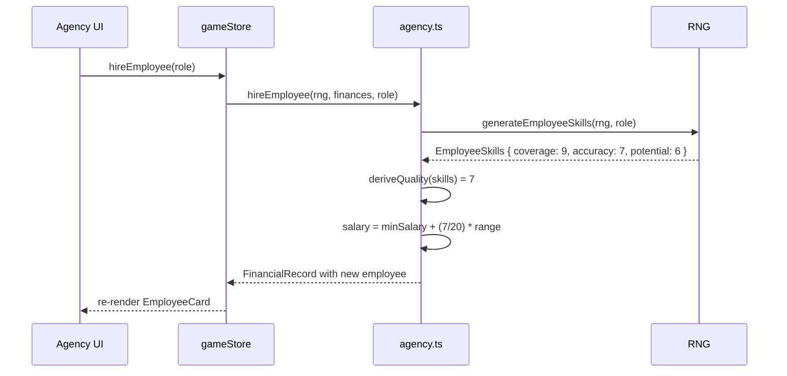
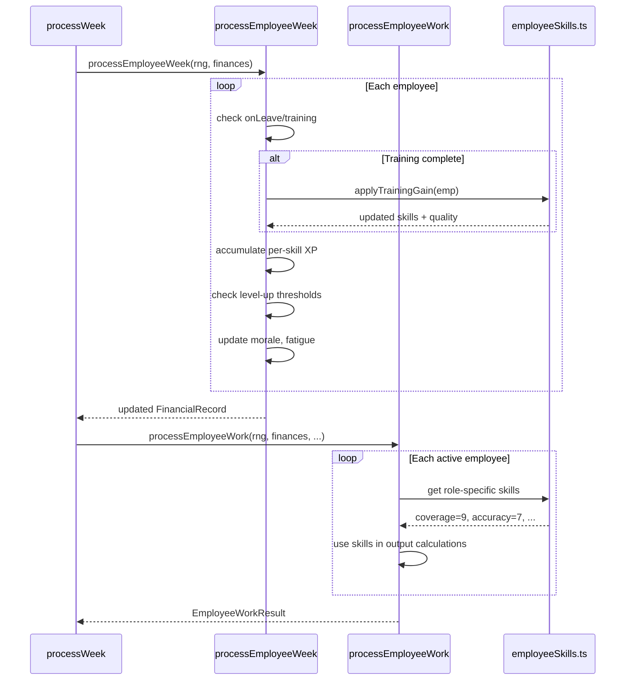
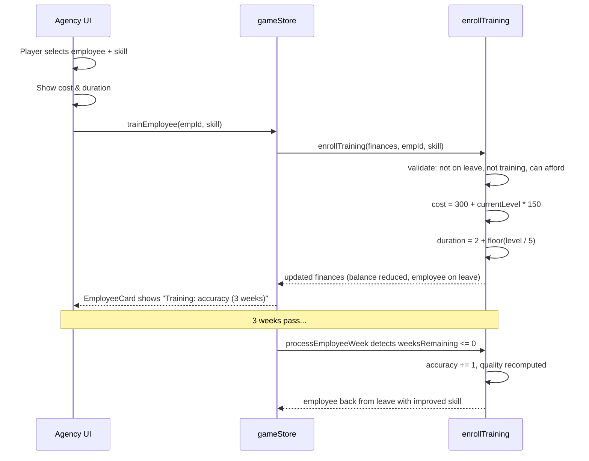
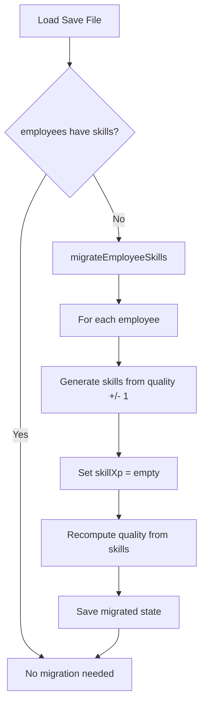

# Employee Skills/Attributes System -- Technical Specification

**Status:** proposed
**Date:** 2026-02-25
**Author:** Architect Agent

---

## Table of Contents

1. [ADR-001: Employee Skills Architecture](#adr-001-employee-skills-architecture)
2. [ADR-002: Training System Design](#adr-002-training-system-design)
3. [Type Definitions](#type-definitions)
4. [Skill Descriptions and Mechanical Effects](#skill-descriptions-and-mechanical-effects)
5. [Hire-Time Skill Generation](#hire-time-skill-generation)
6. [XP and Auto-Leveling](#xp-and-auto-leveling)
7. [Training System](#training-system)
8. [Quality Derivation](#quality-derivation)
9. [Salary Formula](#salary-formula)
10. [Skill-to-Output Mapping](#skill-to-output-mapping)
11. [Backward Compatibility](#backward-compatibility)
12. [Data Flow Diagrams](#data-flow-diagrams)
13. [Implementation Checklist](#implementation-checklist)

---

## ADR-001: Employee Skills Architecture

### Status: proposed

### Context

`AgencyEmployee` currently uses a single `quality: number` (1-20) that governs all work output. This is functional but flat -- a quality-12 scout and a quality-12 analyst feel identical to manage. The player has no reason to care about individual employees beyond their number.

The player character (Scout) already has a rich skill system with 7 skills and 6 attributes on a 1-20 scale, with XP-driven leveling. Extending a similar (but simpler) system to agency employees would add depth to the agency management feature without requiring the player to micromanage.

**Constraints:**
- Old saves contain only `quality: number` on employees -- backward compatibility is mandatory.
- The 1-20 scale must be preserved for consistency with the rest of the game.
- Five roles exist: `scout`, `analyst`, `administrator`, `relationshipManager`, `mentee`.
- `quality` must remain as a readable property so existing engine code continues to work without refactoring every call site.

### Options Considered

1. **Shared skill pool (all roles have the same skills)** -- Pros: Simple type definition, one XP system. Cons: Unrealistic; why would an administrator have "scoutingAccuracy"? Skills wouldn't map meaningfully to role output. Wastes UI space showing irrelevant stats.

2. **Role-specific skill sets (each role has its own 3-4 skills)** -- Pros: Every skill maps directly to a mechanical output. Tight thematic fit. Clean UI -- show only what matters. Natural differentiation between employees of the same role. Cons: More types to define. Cannot directly compare skills across roles. Slightly more complex hire generation.

3. **Reuse the Scout's ScoutSkill/ScoutAttribute types on all employees** -- Pros: Maximum type reuse, employees share the player character's progression system. Cons: Most skills are irrelevant to non-scout roles. Administrators don't need "technicalEye." Would require mapping irrelevant skills to zero, creating dead weight. Confusing in UI.

### Decision

**Option 2: Role-specific skill sets.**

### Rationale

Each role does fundamentally different work. A scout assesses player attributes. An analyst crunches data. An administrator manages paperwork. These require different competencies. Having 3-4 skills per role keeps the system lean (no stat screens with 10+ bars per employee), every skill has a visible effect on gameplay, and the player can make meaningful training decisions ("should I boost this scout's accuracy or their coverage?").

The `quality` field becomes a derived value (average of skills, floored) so all existing `emp.quality` references continue working without changes.

### Consequences

- New `EmployeeSkills` discriminated union type added to `types.ts`.
- `skills` field (optional) added to `AgencyEmployee`.
- `quality` remains on the interface but is computed at read time via a helper, or kept in sync when skills change.
- Old saves without `skills` fall back to generating skills from the existing `quality` value.
- Training system becomes a new player action in the Agency UI.
- `employeeWork.ts` updated to use specific skills instead of the generic `quality` for output calculations.

---

## ADR-002: Training System Design

### Status: proposed

### Context

The requirements specify that players should be able to spend money to train/upskill specific employee attributes. Currently, the only employee improvement mechanism is passive XP accumulation from weekly work (processed in `agency.ts` `processEmployeeWeek`), plus a random "training request" event in `employeeEvents.ts` that grants +50 XP and costs `500 + quality * 100`.

Training needs to be a deliberate player action, not just a random event response. It should feel like an investment with a meaningful cost and a predictable (but not instant) payoff.

### Options Considered

1. **Instant training (pay money, skill goes up immediately)** -- Pros: Simple, immediate feedback. Cons: No tension. Trivializes progression. Players would just buy max skills as soon as they can afford it. Boring.

2. **Enrollment-based training (pay upfront, employee goes on leave for N weeks, skill improves on return)** -- Pros: Creates a cost beyond money (lost productivity). Forces planning around absences. Predictable outcome. Cons: Slightly more state to track (enrollment object on employee). Player may find leave durations annoying.

3. **Mentorship/coaching (assign a higher-skill employee to mentor a lower one, both lose productivity)** -- Pros: Interesting interaction between employees. Cons: Requires having employees to spare. Doesn't work for solo/small agencies. Overly complex for the payoff.

### Decision

**Option 2: Enrollment-based training.** Option 3 can be added as a future enhancement but should not be the primary training mechanism.

### Rationale

Enrollment-based training creates a meaningful trade-off: money AND lost productivity. The player must decide whether they can afford to lose a scout for 3 weeks to improve their accuracy. This is the kind of decision that makes agency management interesting. The random training request event in `employeeEvents.ts` stays as-is but now grants skill-specific XP rather than generic XP.

### Consequences

- New `TrainingEnrollment` type added to `AgencyEmployee`.
- Employee marked `onLeave: true` during training (reuses existing leave system).
- Training costs scale with current skill level (diminishing returns at high levels).
- On training completion, target skill gains a fixed number of points.
- Weekly processing checks training completion and applies the skill gain.
- UI needs a "Train" action per employee with skill selection and cost display.

---

## Type Definitions

### File: `src/engine/core/types.ts`

```typescript
// =============================================================================
// EMPLOYEE SKILLS (per-role skill sets)
// =============================================================================

/** Scout employee skills -- mirror a subset of the player's ScoutSkill set */
export type EmployeeScoutSkills = {
  role: "scout";
  /** Chance of generating a report; affects number of players observed per week */
  coverage: number;         // 1-20
  /** Accuracy of attribute assessments; reduces error margin */
  accuracy: number;         // 1-20
  /** Ability to assess player potential, not just current ability */
  potential: number;        // 1-20
};

/** Analyst employee skills */
export type EmployeeAnalystSkills = {
  role: "analyst";
  /** Quality boost magnitude when reviewing reports */
  insightDepth: number;     // 1-20
  /** Ability to cross-reference data and spot trends */
  patternRecognition: number; // 1-20
  /** Speed / throughput of analysis work */
  efficiency: number;       // 1-20
};

/** Administrator employee skills */
export type EmployeeAdminSkills = {
  role: "administrator";
  /** Overhead cost reduction from streamlined operations */
  costControl: number;      // 1-20
  /** Organizational ability -- prevents fatigue buildup on other employees */
  organization: number;     // 1-20
  /** Contract and paperwork processing -- affects retainer renewal odds */
  paperwork: number;        // 1-20
};

/** Relationship manager employee skills */
export type EmployeeRMSkills = {
  role: "relationshipManager";
  /** Chance of generating new client leads */
  prospecting: number;      // 1-20
  /** Ability to maintain client satisfaction */
  clientRetention: number;  // 1-20
  /** Quality of deals negotiated (fee tier of generated retainers) */
  negotiation: number;      // 1-20
};

/** Mentee employee skills -- same shape as scout but with growth modifier */
export type EmployeeMenteeSkills = {
  role: "mentee";
  /** Same as scout coverage but starts lower */
  coverage: number;         // 1-20
  /** Same as scout accuracy but starts lower */
  accuracy: number;         // 1-20
  /** Same as scout potential but starts lower */
  potential: number;        // 1-20
};

/** Discriminated union of all role-specific skill sets */
export type EmployeeSkills =
  | EmployeeScoutSkills
  | EmployeeAnalystSkills
  | EmployeeAdminSkills
  | EmployeeRMSkills
  | EmployeeMenteeSkills;

/** Skill name unions per role, for type-safe XP/training targeting */
export type ScoutSkillName = "coverage" | "accuracy" | "potential";
export type AnalystSkillName = "insightDepth" | "patternRecognition" | "efficiency";
export type AdminSkillName = "costControl" | "organization" | "paperwork";
export type RMSkillName = "prospecting" | "clientRetention" | "negotiation";
export type MenteeSkillName = ScoutSkillName; // same as scout

export type AnyEmployeeSkillName =
  | ScoutSkillName
  | AnalystSkillName
  | AdminSkillName
  | RMSkillName;

/** Training enrollment state */
export interface TrainingEnrollment {
  /** Which skill is being trained */
  targetSkill: AnyEmployeeSkillName;
  /** Total weeks of training */
  durationWeeks: number;
  /** Weeks remaining */
  weeksRemaining: number;
  /** Skill points to gain on completion */
  skillGain: number;
  /** Cost already paid */
  costPaid: number;
}

/** XP accumulation per skill (parallels Scout's skillXp pattern) */
export type EmployeeSkillXp = Partial<Record<AnyEmployeeSkillName, number>>;
```

### Updated `AgencyEmployee` interface

```typescript
export interface AgencyEmployee {
  id: string;
  name: string;
  role: AgencyEmployeeRole;
  quality: number;            // KEPT -- derived from skills, or legacy value
  salary: number;
  morale: number;
  fatigue: number;
  // --- Phase 2 fields ---
  hiredWeek: number;
  hiredSeason: number;
  regionSpecialization?: string;
  positionSpecialization?: string;
  reportsGenerated: string[];
  currentAssignment?: EmployeeAssignment;
  experience: number;
  weeklyLog: EmployeeLogEntry[];
  // --- Phase 4 fields ---
  regionFocusWeeks: number;
  onLeave?: boolean;
  leaveReturnWeek?: number;
  // --- Phase 5: Skills ---
  skills?: EmployeeSkills;          // NEW -- undefined for legacy saves
  skillXp?: EmployeeSkillXp;        // NEW -- per-skill XP accumulation
  training?: TrainingEnrollment;    // NEW -- active training enrollment
}
```

**Key design note:** `skills` is optional (`?`). If undefined, the employee is a legacy employee and `quality` is used directly. If defined, `quality` is derived from skills. This is the backward compatibility strategy.

---

## Skill Descriptions and Mechanical Effects

### Scout Skills

| Skill | Description | Mechanical Effect |
|-------|-------------|-------------------|
| `coverage` | Breadth of observation -- how many players the scout can assess in a region per week | Governs `reportChance` in `processScoutWork`. Higher coverage = higher probability of generating a report each week. Also affects the pool of candidates considered. |
| `accuracy` | Precision of attribute assessments | Reduces the `error` margin on `AttributeAssessment.estimatedValue`. At accuracy 3, error is +/-4. At accuracy 18, error is +/-1. Directly replaces `emp.quality` in the error calculation. |
| `potential` | Ability to assess whether a young player will improve | Determines whether the scout report includes potential-related insights. At potential >= 12, reports may include a `conviction: "recommend"` for young players. Affects the `qualityScore` of reports on players under 21. |

### Analyst Skills

| Skill | Description | Mechanical Effect |
|-------|-------------|-------------------|
| `insightDepth` | Quality of analytical insights | Governs `qualityBoost` magnitude in `processAnalystWork`. Replaces `emp.quality * 2` with `insightDepth * 2.5`. |
| `patternRecognition` | Cross-referencing reports to spot trends | When >= 14, analyst may flag when multiple reports on the same player agree (inbox message). Future: affects data-driven player valuation accuracy. |
| `efficiency` | Throughput of analysis work | Determines how many reports can be reviewed per week (currently 1; at efficiency >= 14, chance of reviewing 2). Reduces analyst fatigue accumulation. |

### Administrator Skills

| Skill | Description | Mechanical Effect |
|-------|-------------|-------------------|
| `costControl` | Reducing operational waste | Governs `savingPercent` in `processAdminWork`. Replaces `emp.quality * 0.5` with `costControl * 0.6`. Higher ceiling for overhead reduction. |
| `organization` | Keeping the office running smoothly | Reduces fatigue accumulation for ALL other employees by `organization * 0.1` per week (capped at -2 fatigue per other employee). Passive aura effect. |
| `paperwork` | Contract and document processing | Improves retainer renewal odds. When administrator with paperwork >= 12 exists, `processRetainerRenewals` satisfaction threshold drops by 5 (from 40 to 35 for renewal, 70 to 65 for upgrade chance). |

### Relationship Manager Skills

| Skill | Description | Mechanical Effect |
|-------|-------------|-------------------|
| `prospecting` | Finding new client leads | Governs `leadChance` in `processRelationshipManagerWork`. Replaces `(emp.quality / 20) * 0.15` with `(prospecting / 20) * 0.18`. |
| `clientRetention` | Maintaining existing relationships | Adds a satisfaction bonus to all client relationships processed weekly. `+(clientRetention * 0.3)` satisfaction per active retainer, capped at +3/week. |
| `negotiation` | Deal quality | Affects the tier of generated retainer offers. At negotiation >= 14, offers may be one tier higher. Affects the fee within the tier range (biased toward max). |

### Mentee Skills

Same skills as Scout (`coverage`, `accuracy`, `potential`) but:
- Starting values are 2-4 points lower than scout equivalents.
- XP gain rate is 1.5x normal (mentees learn faster).
- At any point, a mentee can be "promoted" to scout role (keeps skills, loses growth bonus).

---

## Hire-Time Skill Generation

### File: `src/engine/finance/agency.ts` -- updated `hireEmployee`

Skills are generated using the RNG with role-specific base ranges. The current `quality = rng.nextInt(3, 15)` is replaced with per-skill generation.

### Skill generation profiles

```typescript
/** Base skill ranges [min, max] for each role at hire time */
const HIRE_SKILL_RANGES: Record<AgencyEmployeeRole, Record<string, [number, number]>> = {
  scout: {
    coverage:  [4, 14],
    accuracy:  [3, 13],
    potential: [3, 12],
  },
  analyst: {
    insightDepth:       [4, 14],
    patternRecognition: [3, 13],
    efficiency:         [4, 13],
  },
  administrator: {
    costControl:  [4, 14],
    organization: [3, 13],
    paperwork:    [4, 14],
  },
  relationshipManager: {
    prospecting:     [4, 14],
    clientRetention: [3, 13],
    negotiation:     [3, 12],
  },
  mentee: {
    coverage:  [2, 8],
    accuracy:  [1, 7],
    potential: [2, 9],
  },
};
```

### Generation algorithm

```typescript
function generateEmployeeSkills(rng: RNG, role: AgencyEmployeeRole): EmployeeSkills {
  const ranges = HIRE_SKILL_RANGES[role];
  const skills: Record<string, number> = {};

  for (const [skillName, [min, max]] of Object.entries(ranges)) {
    // Weighted toward center -- roll twice and average (gives a bell curve)
    const roll1 = rng.nextInt(min, max);
    const roll2 = rng.nextInt(min, max);
    skills[skillName] = Math.round((roll1 + roll2) / 2);
  }

  return { role, ...skills } as EmployeeSkills;
}
```

**Why two-roll average?** A flat `nextInt` would produce too many extreme values. Averaging two rolls creates a mild bell curve (triangular distribution). A quality-8 employee is common; quality-3 and quality-14 are rare. This matches how the player Scout creation uses Gaussian noise on base values.

### Derived quality at hire

```typescript
function deriveQuality(skills: EmployeeSkills): number {
  const values = getSkillValues(skills);
  return Math.floor(values.reduce((a, b) => a + b, 0) / values.length);
}
```

### Salary at hire (updated)

Salary is now derived from the average skill level rather than the old `quality`:

```typescript
const quality = deriveQuality(skills);
const [minSalary, maxSalary] = SALARY_BY_ROLE[role];
const salary = Math.round(minSalary + (quality / 20) * (maxSalary - minSalary));
```

No change to the formula itself -- it just uses the derived quality. This means skill distribution affects salary: a scout with coverage=14, accuracy=5, potential=5 (quality=8) costs less than one with coverage=10, accuracy=10, potential=10 (quality=10), even though the first scout is better at finding players.

---

## XP and Auto-Leveling

### Current system

In `processEmployeeWeek` (agency.ts line 208-219):
- Active employees earn `5 + quality * 0.5 + (morale / 100) * 3` XP per week.
- At hardcoded thresholds `[50, 120, 210, 320, 450, 600, 780, 990, 1230, 1500]`, quality goes up by 1.
- This is a single XP pool that increments a single quality number.

### New system

XP is split across the employee's role-specific skills. Each week of active work, XP is allocated to skills based on what the employee is doing.

#### XP allocation per role per week

```typescript
/** Base weekly XP gain per skill, by role (when actively working) */
const WEEKLY_SKILL_XP: Record<AgencyEmployeeRole, Record<string, number>> = {
  scout: {
    coverage:  3,   // always improves while scouting
    accuracy:  2,   // slower -- accuracy takes practice
    potential: 1,   // slowest -- judging potential is hard
  },
  analyst: {
    insightDepth:       2,
    patternRecognition: 2,
    efficiency:         3,   // throughput improves fastest
  },
  administrator: {
    costControl:  2,
    organization: 3,   // organizational skills come with experience
    paperwork:    2,
  },
  relationshipManager: {
    prospecting:     3,
    clientRetention: 2,
    negotiation:     1,   // negotiation is the hardest to improve
  },
  mentee: {
    coverage:  5,   // 1.5x scout rates (rounded up)
    accuracy:  3,
    potential: 2,
  },
};
```

#### XP threshold formula

Instead of hardcoded thresholds, use a formula per skill:

```
threshold(currentLevel) = currentLevel * 15
```

So level 5 -> 6 requires 75 XP. Level 14 -> 15 requires 210 XP. Level 19 -> 20 requires 285 XP.

At base rates, a scout's `coverage` (3 XP/week) takes:
- Level 5 -> 6: 75 / 3 = 25 weeks (~6 months)
- Level 10 -> 11: 150 / 3 = 50 weeks (~1 year)
- Level 15 -> 16: 225 / 3 = 75 weeks (~1.5 years)

This feels right: early improvement is noticeable, late improvement is slow. Mentees progress ~1.5x faster due to higher base XP rates.

#### Morale XP modifier

The morale-based XP bonus from the current system is preserved:

```typescript
const moraleMultiplier = 0.8 + (emp.morale / 100) * 0.4; // 0.8 at morale 0, 1.2 at morale 100
const weeklyXp = baseXp * moraleMultiplier;
```

#### Weekly processing changes

In `processEmployeeWeek`, replace the single-XP logic with:

```typescript
// Per-skill XP accumulation (only if actively working)
if (emp.skills && emp.currentAssignment?.type !== "idle") {
  const baseXps = WEEKLY_SKILL_XP[emp.role];
  const moraleMultiplier = 0.8 + (emp.morale / 100) * 0.4;
  const newSkillXp = { ...(emp.skillXp ?? {}) };
  let skillsChanged = false;
  const updatedSkills = { ...emp.skills };

  for (const [skill, baseXp] of Object.entries(baseXps)) {
    const gained = Math.round(baseXp * moraleMultiplier);
    const accumulated = (newSkillXp[skill] ?? 0) + gained;
    const currentLevel = getSkillLevel(updatedSkills, skill);

    if (currentLevel < 20) {
      const threshold = currentLevel * 15;
      if (accumulated >= threshold) {
        // Level up this skill
        setSkillLevel(updatedSkills, skill, currentLevel + 1);
        newSkillXp[skill] = accumulated - threshold; // carry over excess
        skillsChanged = true;
      } else {
        newSkillXp[skill] = accumulated;
      }
    }
  }

  // If any skill changed, recompute derived quality
  if (skillsChanged) {
    emp.quality = deriveQuality(updatedSkills);
  }
  emp.skills = updatedSkills;
  emp.skillXp = newSkillXp;
}

// Legacy employees (no skills) use the old system unchanged
```

The old `experience` field and `QUALITY_THRESHOLDS` logic remain for legacy employees. New employees use the per-skill system.

---

## Training System

### Player action: enroll employee in training

```typescript
interface TrainingOption {
  skill: AnyEmployeeSkillName;
  currentLevel: number;
  cost: number;
  durationWeeks: number;
  skillGain: number;
}
```

#### Cost formula

```
cost = 300 + (currentLevel * 150)
```

| Current Level | Cost    |
|---------------|---------|
| 3             | 750     |
| 6             | 1,200   |
| 9             | 1,650   |
| 12            | 2,100   |
| 15            | 2,550   |
| 18            | 3,000   |

This means training is cheap for low-level employees and expensive for high-level ones, but never astronomical. For context, monthly salaries range from 200-2500, so training a single skill costs roughly 1-5x the monthly salary.

#### Duration formula

```
durationWeeks = 2 + floor(currentLevel / 5)
```

| Current Level | Duration |
|---------------|----------|
| 1-4           | 2 weeks  |
| 5-9           | 3 weeks  |
| 10-14         | 4 weeks  |
| 15-19         | 5 weeks  |

#### Skill gain

Training always grants **+1 to the target skill**, capped at 20. The value proposition is certainty and speed: training guarantees a +1, while passive XP growth is slower and applies across all skills proportionally.

At level 10, passive XP would take ~50 weeks for coverage to gain +1. Training does it in 4 weeks for 1,800. That is a meaningful trade-off.

#### Training enrollment function

```typescript
export function enrollTraining(
  finances: FinancialRecord,
  employeeId: string,
  targetSkill: AnyEmployeeSkillName,
): FinancialRecord | null {
  const emp = finances.employees.find(e => e.id === employeeId);
  if (!emp || !emp.skills) return null;
  if (emp.training) return null;              // already training
  if (emp.onLeave) return null;               // on leave

  const currentLevel = getSkillLevel(emp.skills, targetSkill);
  if (currentLevel >= 20) return null;        // maxed

  const cost = 300 + currentLevel * 150;
  if (finances.balance < cost) return null;   // can't afford

  const durationWeeks = 2 + Math.floor(currentLevel / 5);

  const enrollment: TrainingEnrollment = {
    targetSkill,
    durationWeeks,
    weeksRemaining: durationWeeks,
    skillGain: 1,
    costPaid: cost,
  };

  return {
    ...finances,
    balance: finances.balance - cost,
    employees: finances.employees.map(e =>
      e.id === employeeId
        ? { ...e, training: enrollment, onLeave: true, leaveReturnWeek: durationWeeks }
        : e
    ),
    transactions: [
      ...finances.transactions,
      {
        week: 0, // caller fills in
        season: 0,
        amount: -cost,
        description: `Training: ${emp.name} -- ${targetSkill}`,
      },
    ],
  };
}
```

#### Training completion (in processEmployeeWeek)

```typescript
if (emp.training && emp.training.weeksRemaining <= 0) {
  // Apply skill gain
  const updatedSkills = { ...emp.skills! };
  const current = getSkillLevel(updatedSkills, emp.training.targetSkill);
  setSkillLevel(updatedSkills, emp.training.targetSkill, Math.min(20, current + emp.training.skillGain));

  return {
    ...emp,
    skills: updatedSkills,
    quality: deriveQuality(updatedSkills),
    training: undefined,
    onLeave: false,
    leaveReturnWeek: undefined,
  };
}
```

#### Training and the existing "training request" event

The random `trainingRequest` event in `employeeEvents.ts` is updated: instead of granting +50 generic XP, it now grants +30 XP to the employee's lowest skill. The cost formula stays the same (`500 + quality * 100`). This gives the player a cheaper but less targeted option alongside deliberate training enrollment.

---

## Quality Derivation

### Formula

```typescript
/**
 * Derive the legacy `quality` value from an employee's skill set.
 * Returns the floor of the arithmetic mean of all role skills.
 */
export function deriveQuality(skills: EmployeeSkills): number {
  const values = getSkillValues(skills);
  return Math.floor(values.reduce((sum, v) => sum + v, 0) / values.length);
}

/**
 * Extract the numeric skill values from any EmployeeSkills variant.
 */
export function getSkillValues(skills: EmployeeSkills): number[] {
  switch (skills.role) {
    case "scout":
    case "mentee":
      return [skills.coverage, skills.accuracy, skills.potential];
    case "analyst":
      return [skills.insightDepth, skills.patternRecognition, skills.efficiency];
    case "administrator":
      return [skills.costControl, skills.organization, skills.paperwork];
    case "relationshipManager":
      return [skills.prospecting, skills.clientRetention, skills.negotiation];
  }
}
```

### Behavior

| Skills (scout) | Derived Quality |
|----------------|-----------------|
| 5, 5, 5        | 5               |
| 10, 8, 6       | 8               |
| 14, 12, 10     | 12              |
| 18, 16, 14     | 16              |
| 20, 20, 20     | 20              |

`quality` is recomputed whenever any skill changes (level-up, training completion, or migration). All existing code reading `emp.quality` gets the correct value without modification.

---

## Salary Formula

### At hire time

No change to the formula structure. Salary is derived from the `quality` computed from generated skills:

```typescript
const quality = deriveQuality(skills);
const [minSalary, maxSalary] = SALARY_BY_ROLE[role];
const salary = Math.round(minSalary + (quality / 20) * (maxSalary - minSalary));
```

### Salary renegotiation on skill improvement

When an employee's derived quality increases by 1+ from auto-leveling, there is a **25% chance** per quality point gained that the employee requests a salary adjustment. This uses the existing `trainingRequest` event type or a new `salaryNegotiation` event type.

Requested salary = current salary * 1.1 (10% raise per quality point gained).

If denied, morale drops by 5. If the player manually adjusts salary (existing `adjustEmployeeSalary` action), no event fires.

**This is a future enhancement.** For the initial implementation, salary stays fixed at hire time unless manually adjusted by the player, matching current behavior.

---

## Skill-to-Output Mapping

This section details how each skill replaces `emp.quality` in the work output functions.

### Scout Work (`processScoutWork` in employeeWork.ts)

**Current code and replacement targets:**

```
Line 105: reportChance = 0.3 + (emp.quality / 20) * 0.4 * efficiency
  BECOMES: reportChance = 0.3 + (coverage / 20) * 0.45 * efficiency

Line 118: numAttributes = max(2, round(3 + emp.quality * 0.3))
  BECOMES: numAttributes = max(2, round(3 + coverage * 0.25 + accuracy * 0.15))

Line 124: error = max(1, round(4 - (emp.quality / 20) * 3))
  BECOMES: error = max(1, round(4 - (accuracy / 20) * 3))

Line 138: qualityScore = (emp.quality / 20) * 60 + efficiency * 30 + officeBonus * 100
  BECOMES: qualityScore = (accuracy / 20) * 40 + (potential / 20) * 20 + efficiency * 30 + officeBonus * 100

Line 152: conviction = emp.quality >= 14 ? "recommend" : "note"
  BECOMES: conviction = potential >= 14 ? "recommend" : "note"
```

**Efficiency helper update:**

```typescript
export function getEmployeeEfficiency(employee: AgencyEmployee): number {
  const moraleFactor = employee.morale / 100;
  const fatigueFactor = 1 - employee.fatigue / 200;
  // quality is still used here as the general competence factor
  const qualityFactor = employee.quality / 20;
  return moraleFactor * fatigueFactor * qualityFactor;
}
```

`getEmployeeEfficiency` keeps using `quality` (the derived average). This is intentional -- efficiency is a general modifier, not skill-specific. Individual skill effects are applied in the role-specific work functions.

### Analyst Work (`processAnalystWork` in employeeWork.ts)

```
Line 193: qualityBoost = round(emp.quality * 2 * efficiency)
  BECOMES: qualityBoost = round(insightDepth * 2.5 * efficiency)
```

New: at `patternRecognition >= 14`, analyst has a 20% chance per week of generating a "trend alert" inbox message when 2+ reports exist for the same player.

New: at `efficiency >= 14`, analyst has a 30% chance of processing a second report in the same week (second `qualityBoost` at 60% magnitude).

### Administrator Work (`processAdminWork` in employeeWork.ts)

```
Line 227: savingPercent = emp.quality * 0.5 * efficiency
  BECOMES: savingPercent = costControl * 0.6 * efficiency
```

New passive effect (`organization`): During `processEmployeeWeek`, if an administrator exists with `organization >= 8`, all other non-admin employees get their weekly fatigue reduced by `min(2, floor(organization * 0.15))`.

New passive effect (`paperwork`): In `processRetainerRenewals`, if an administrator exists with `paperwork >= 12`, the satisfaction threshold for contract renewal drops by 5 points.

### Relationship Manager Work (`processRelationshipManagerWork` in employeeWork.ts)

```
Line 266: leadChance = min(0.25, 0.10 + (emp.quality / 20) * 0.15 * efficiency)
  BECOMES: leadChance = min(0.30, 0.10 + (prospecting / 20) * 0.20 * efficiency)
```

New: `negotiation` affects the tier of generated offers:

```typescript
// Base tier from club reputation
let tier = prospect.reputation >= 75 ? 3 : prospect.reputation >= 40 ? 2 : 1;

// Negotiation bonus: chance to upgrade tier
if (negotiation >= 14 && tier < 3 && rng.chance(0.3)) {
  tier++;
}

// Negotiation affects fee within tier (biased toward max)
const feeRange = feeRanges[tier];
const feeSkew = negotiation / 20; // 0 to 1
const fee = Math.round(feeRange[0] + feeSkew * (feeRange[1] - feeRange[0]));
```

New: `clientRetention` feeds into `processClientRelationships` (clientRelationships.ts):

```typescript
// RM quality modifier (line 115)
const bestRM = Math.max(...rms.map(r =>
  r.skills?.role === "relationshipManager" ? r.skills.clientRetention : r.quality
));
```

### Employee Events (`checkEmployeeEvents` in employeeEvents.ts)

```
Line 39: employee.quality > 12 (poaching threshold)
  NO CHANGE -- uses derived quality. Higher-skilled employees attract more poaching.

Line 68: trainingCost = 500 + employee.quality * 100
  NO CHANGE -- uses derived quality. Training cost scales with overall competence.

Line 120: employee.quality > 10 (breakthrough threshold)
  BECOMES: employee.skills?.role === "scout" && (employee.skills.potential ?? employee.quality) > 10
```

---

## Backward Compatibility

### Strategy: optional `skills` field with migration on load

1. `skills` field is `EmployeeSkills | undefined` on `AgencyEmployee`.
2. When a legacy save is loaded, employees have `skills: undefined`.
3. All engine functions that need specific skills check `emp.skills` first. If undefined, they fall back to using `emp.quality` (existing behavior).
4. A migration function generates skills from the legacy `quality` value on first load.

### Migration function

Add to `saveMigration.ts`:

```typescript
/**
 * Migrate legacy employees to the skills system.
 * Called once on save load when employees lack a `skills` field.
 */
export function migrateEmployeeSkills(
  employees: AgencyEmployee[],
  rng: RNG,
): AgencyEmployee[] {
  return employees.map(emp => {
    if (emp.skills) return emp; // already migrated

    // Generate skills centered on the existing quality value
    // with small variance so the employee feels consistent
    const q = emp.quality;
    const variance = 1; // +/- 1 from quality

    const generateSkill = () =>
      Math.max(1, Math.min(20, q + rng.nextInt(-variance, variance)));

    let skills: EmployeeSkills;
    switch (emp.role) {
      case "scout":
        skills = { role: "scout", coverage: generateSkill(), accuracy: generateSkill(), potential: generateSkill() };
        break;
      case "analyst":
        skills = { role: "analyst", insightDepth: generateSkill(), patternRecognition: generateSkill(), efficiency: generateSkill() };
        break;
      case "administrator":
        skills = { role: "administrator", costControl: generateSkill(), organization: generateSkill(), paperwork: generateSkill() };
        break;
      case "relationshipManager":
        skills = { role: "relationshipManager", prospecting: generateSkill(), clientRetention: generateSkill(), negotiation: generateSkill() };
        break;
      case "mentee":
        skills = { role: "mentee", coverage: generateSkill(), accuracy: generateSkill(), potential: generateSkill() };
        break;
    }

    return {
      ...emp,
      skills,
      skillXp: {},
      quality: deriveQuality(skills), // recompute to be consistent
    };
  });
}
```

### Runtime fallback pattern

Every function that accesses specific skills must handle the legacy case:

```typescript
// Pattern used in all work functions
function getScoutCoverage(emp: AgencyEmployee): number {
  if (emp.skills && (emp.skills.role === "scout" || emp.skills.role === "mentee")) {
    return emp.skills.coverage;
  }
  return emp.quality; // legacy fallback
}
```

A utility module `src/engine/finance/employeeSkills.ts` should export these accessors to avoid duplication.

---

## Data Flow Diagrams

### Hire Flow



### Weekly Processing Flow



### Training Flow



### Save Migration Flow



---

## Implementation Checklist

Files to modify (in implementation order):

### 1. Types (`src/engine/core/types.ts`)
- [ ] Add `EmployeeScoutSkills`, `EmployeeAnalystSkills`, `EmployeeAdminSkills`, `EmployeeRMSkills`, `EmployeeMenteeSkills` types
- [ ] Add `EmployeeSkills` discriminated union
- [ ] Add `AnyEmployeeSkillName` and per-role skill name types
- [ ] Add `TrainingEnrollment` interface
- [ ] Add `EmployeeSkillXp` type
- [ ] Add `skills?`, `skillXp?`, `training?` to `AgencyEmployee`
- [ ] Export all new types from `src/engine/core/index.ts`

### 2. New utility module (`src/engine/finance/employeeSkills.ts`)
- [ ] `generateEmployeeSkills(rng, role)` -- hire-time generation
- [ ] `deriveQuality(skills)` -- average of skill values
- [ ] `getSkillValues(skills)` -- extract numeric values
- [ ] `getSkillLevel(skills, skillName)` -- type-safe accessor
- [ ] `setSkillLevel(skills, skillName, value)` -- type-safe setter
- [ ] `getSkillNames(role)` -- returns skill names for a role
- [ ] `getTrainingOptions(emp)` -- returns available training choices with costs
- [ ] `enrollTraining(finances, empId, skill)` -- enrollment action
- [ ] Per-role accessors: `getScoutCoverage`, `getScoutAccuracy`, etc.

### 3. Save migration (`src/engine/finance/saveMigration.ts`)
- [ ] Add `migrateEmployeeSkills(employees, rng)` function
- [ ] Call from `migrateFinancialRecord` when employees exist without `skills`

### 4. Agency (`src/engine/finance/agency.ts`)
- [ ] Update `hireEmployee` to call `generateEmployeeSkills`
- [ ] Update `processEmployeeWeek` to use per-skill XP
- [ ] Add training completion check in `processEmployeeWeek`
- [ ] Add administrator `organization` passive fatigue reduction
- [ ] Keep legacy XP path for employees without `skills`

### 5. Employee work (`src/engine/finance/employeeWork.ts`)
- [ ] Update `processScoutWork` to use `coverage`, `accuracy`, `potential`
- [ ] Update `processAnalystWork` to use `insightDepth`, `patternRecognition`, `efficiency`
- [ ] Update `processAdminWork` to use `costControl`
- [ ] Update `processRelationshipManagerWork` to use `prospecting`, `negotiation`
- [ ] `getEmployeeEfficiency` -- no change needed (uses derived `quality`)

### 6. Employee events (`src/engine/finance/employeeEvents.ts`)
- [ ] Update `fundTraining` effect to grant skill-specific XP
- [ ] Update breakthrough threshold to use `potential` skill
- [ ] No change to poaching/personal issue (use derived `quality`)

### 7. Client relationships (`src/engine/finance/clientRelationships.ts`)
- [ ] Update RM quality modifier to use `clientRetention` skill

### 8. Retainer renewals (`src/engine/finance/retainers.ts`)
- [ ] Add `paperwork` check for admin satisfaction threshold modifier

### 9. Balance constants (`src/engine/finance/balanceConstants.ts`)
- [ ] Add `TRAINING_BASE_COST = 300`
- [ ] Add `TRAINING_COST_PER_LEVEL = 150`
- [ ] Add `TRAINING_BASE_DURATION = 2`
- [ ] Add `SKILL_XP_THRESHOLD_MULTIPLIER = 15`

### 10. UI: EmployeeCard (`src/components/game/agency/EmployeeCard.tsx`)
- [ ] Display individual skill bars instead of / alongside the quality bar
- [ ] Show skill names appropriate to the employee's role
- [ ] Add "Train" button per skill with cost/duration tooltip
- [ ] Show training progress when `emp.training` is set
- [ ] Show XP progress per skill (replaces single XP bar)

### 11. gameStore (`src/stores/gameStore.ts`)
- [ ] Add `trainEmployee(empId: string, skill: AnyEmployeeSkillName)` action
- [ ] Wire up migration call on save load
- [ ] Update weekly processing to pass through new functions

---

## Assumptions

1. **No role changes.** Employees cannot change roles after hiring (a mentee can be promoted to scout, but this is a specific action, not a general role-change mechanism).
2. **Three skills per role is sufficient.** More than 3 creates UI clutter without proportional gameplay depth. Fewer than 3 makes the system feel no different from a single quality number.
3. **Linear XP thresholds.** The formula `level * 15` is simple and predictable. If playtesting shows progression is too fast or slow, the multiplier (15) is the single tuning knob.
4. **Training is the only deliberate skill improvement.** There is no "skill book" or "mentor assignment" system in this version. These can be added later via the existing `EmployeeEvent` system.
5. **Mentee promotion is out of scope for this spec.** The mentee-to-scout promotion is referenced as a future feature. This spec only defines that mentees have the same skills as scouts with lower starting values and faster growth.
6. **No negative skill effects.** Skills only improve, never degrade. This keeps the system positive-sum and avoids frustrating the player.

---

## Handoffs

- **Backend (Engine):** Type definitions, `employeeSkills.ts` utility module, all changes to `agency.ts`, `employeeWork.ts`, `employeeEvents.ts`, `clientRelationships.ts`, `retainers.ts`, `saveMigration.ts`, `balanceConstants.ts`. This is the bulk of the work.
- **Frontend (UI):** `EmployeeCard.tsx` updates to display skills and training UI. `AgencyScreen.tsx` may need a training confirmation dialog.
- **QA:** Test matrix should cover: legacy save migration, hire-time generation distribution, XP accumulation rates, training enrollment/completion, each role's skill-to-output mapping, derived quality accuracy.
- **Security:** No security concerns -- this is a single-player game with local state.
