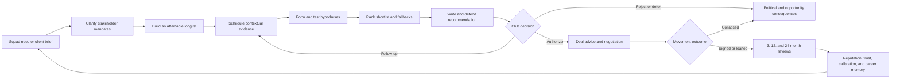

# First Team Scout — implementation plan

## Document status

- **Mode:** First Team Scout
- **Canonical mode ID:** `first-team-scout`
- **Repository baseline reviewed:** `980cf78d6d63e75f3810e5f6ecac739897495928`
- **Current product status:** planned and intentionally unavailable in the Youth Early Access build
- **Purpose:** implementation contract for taking the existing First Team prototype to the same depth, cohesion, accessibility, replayability, and long-career standard as Youth Scout while giving it a genuinely different game loop
- **Primary audience:** game design, simulation, UI, engineering, QA, narrative, accessibility, and production
- **Estimate convention:** S = at most three engineer-days, M = roughly one engineer-week, L = two to three engineer-weeks, XL = four or more engineer-weeks. Estimates include implementation and automated tests but not external moderated research.

This plan is based on the implementation, not feature names or marketing copy. File and function references describe the current baseline and are included so every current-state assertion can be rechecked before work begins.

---

## 1. Product thesis

First Team Scout should be the mode about **solving urgent, expensive recruitment decisions under incomplete information and institutional pressure**.

The player is not a manager with a reduced feature set. The player is the person who turns a vague or politically contested squad problem into a defensible recommendation before the opportunity closes. Their power comes from evidence, judgment, access, and persuasion. Their exposure comes from attaching their name to a recommendation that may cost a club millions and alter a manager's season.

The signature story is:

> The manager demanded a left-back who could invert into midfield, the sporting director wanted resale value, and the board would not exceed £14 million. I had twelve days. I rejected the obvious target after seeing how he reacted when pressed, backed a cheaper alternative after two contradictory viewings, and persuaded the recruitment meeting to act. We nearly lost him to a rival, changed the deal structure, and signed him on deadline day. He struggled for two months, then became essential after a tactical change. The manager remembered that I had defended him; the sporting director remembered that I had stayed inside the mandate. A year later, when another recommendation failed, those relationships determined whether I was trusted to recover.

### 1.1 Mode promise

Every important First Team decision must answer five questions:

1. **What problem is the club actually trying to solve?**
2. **What evidence is reliable enough before the deadline?**
3. **Which attainable candidate best fits the role, squad, finances, and people involved?**
4. **How strongly will the scout defend that recommendation, and to whom?**
5. **What did the recommendation cause over the next match, window, season, and career?**

### 1.2 What makes it different from Youth Scout

| Dimension | Youth Scout | First Team Scout |
| --- | --- | --- |
| Central fantasy | See future potential before the market does | Solve a present squad need before the window closes |
| Time horizon at decision | Months or years of development uncertainty | Days or weeks of availability, form, role, and price uncertainty |
| Candidate set | Often unsigned or lightly known prospects | Contracted, loan-listed, expiring, unsettled, or opportunistically available senior players |
| Primary fit question | Development pathway and long-term ceiling | Immediate role, tactical system, squad balance, adaptation, price, and timing |
| Main stakeholders | Families, academy staff, youth agents, local organisers | Manager, sporting director, board, analysts, agents, coaches, senior players, and selling clubs |
| Core pressure | Discover versus wait for more evidence | Depth versus speed while rivals and deadlines move |
| Main artifact | Development and placement report | Ranked recruitment case with fallback, walk-away point, and deal advice |
| Feedback cadence | Slow pathway milestones | Fast club response plus long-tail transfer accountability |
| Failure texture | A prospect stalls, chooses another pathway, or was misread | A brief expires, politics block the target, a deal collapses, or the signing fails in context |
| Career endgame | Elite talent identifier and pathway architect | Chief scout, recruitment leader, independent adviser, or global transfer strategist |

Equal depth does not mean identical mechanics. Reuse Youth's causal case spine, evidence discipline, professional reports, consequence memory, and long-term reviews. Do not reskin youth venues, placements, or potential projection.

### 1.3 Product architecture boundary

Use the shared product taxonomy rather than treating the current `Specialization` union as the product-mode API:

```ts
// RunManifestV2, GameModeId, RunKind, and ModeState are imported from the
// shared mode platform; this mode only narrows the canonical manifest.
type FirstTeamRunManifest = RunManifestV2 & {
  gameModeId: "first-team-scout";
};
```

- `GameModeId` selects the core evidence strategy, workspaces, career responsibilities, reports, progression, and mode-owned state.
- `Specialization` remains a scout capability/progression concept. The canonical legacy classifier may consider the current `Specialization = "youth" | "firstTeam" | "regional" | "data"` in `src/engine/core/types.ts:666` only as one part of a complete provenance/state signature; it never maps specialization directly to `GameModeId`.
- `RunKind` selects normal career rules or a challenge ruleset. Challenge Careers are not a fifth game mode: a challenge composes one host `GameModeId`, scenario constraints, objectives, scoring, and completion rules.
- First Team systems must read `state.runManifest.gameModeId === "first-team-scout"`. `RunManifestV2` is the shared run-identity authority; do not add a parallel `runIdentity`. Compatibility selectors may translate legacy values only after the canonical legacy-mode classifier has chosen a mode, then must be removed after all call sites and saves migrate.
- Perks, secondary expertise, staff skills, and cross-mode unlocks may still use specialization/capability IDs without changing the run's core mode.

### 1.4 Non-goals

- Do not add team selection, tactical instructions, training control, press conferences, or match management.
- Do not let an entry-level scout spend the club's budget or personally complete a transfer.
- Do not expose exact current ability, potential ability, hidden personality, deterministic transfer thresholds, or internal AI scores.
- Do not make the optimal play “filter by the largest number and submit a report.”
- Do not turn every activity into a separate card when it is a context applied to the same evidence loop.
- Do not promise manager changes, transfer bonuses, trials, or stakeholder consequences unless authoritative state actually changes.

---

## 2. Verified current implementation

### 2.1 Build exposure and product contract

- `src/data/productRoadmap.ts:113-123` correctly marks First Team Scout as `planned` and defines the intended fantasy around urgent briefs, tactical and dressing-room fit, attainable targets, transfer-window pressure, politics, price, and deadline fit.
- `src/components/game/NewGameScreen.tsx:91-105` contains a detailed First Team selection card, but `src/components/game/NewGameScreen.tsx:487-493`, `532-540`, and `1216-1219` force Youth in the current Early Access build.
- `src/stores/gameScreenScope.ts:48-53` and `111-113` classify the match/player database and negotiation/free-agent surfaces as future-build screens. This is honest gating and must remain until the mode's end-to-end state transitions are verified.
- The current role ladder exists in `src/engine/career/progression.ts:91-105`: Freelance Scout, First Team Scout, Senior Scout, Chief Scout, and Director of Football. Today these labels outpace differentiated responsibilities.

### 2.2 Current end-to-end trace

| Step | Current implementation | Persisted state | Current status |
| --- | --- | --- | --- |
| New game | `src/stores/gameStore.ts:1175-1197` generates manager profiles and directives only when a First Team scout starts with a club | `managerProfiles`, `managerDirectives` | Prototype; freelance First Team has no equivalent client-brief source |
| Brief generation | `generateDirectives` in `src/engine/firstTeam/directives.ts:308-400` finds two to four positional gaps and creates age, budget, CA-star, attribute, and role requirements | `ManagerDirective[]` | Functional but built from thin squad context and no deadline/history |
| Weekly planning | `src/engine/core/calendar.ts` exposes reserve match, scouting mission, opposition analysis, showcase, trial, and negotiation activities | `schedule` | Activities exist, but several execute as random sampling rather than an authored assignment |
| Observation | `src/stores/actions/weeklyActions.ts:2872-3295` creates light observations for First Team activities; `src/stores/actions/matchActions.ts:39-454` supports an interactive focused match session | `observations`, `discoveryRecords`, `activeMatch` | Match room is strong reusable interaction; background First Team activities are shallow or mis-targeted |
| System fit | `calculateSystemFit` in `src/engine/firstTeam/systemFit.ts:348-380` calculates position, role, tactical, style, and age fit | `systemFitCache` | Useful prototype, but it is commonly calculated only after reporting and uses truth-side player data |
| Report | `src/components/game/ReportWriter.tsx:301-460` enables structured brief reporting only for Youth; First Team receives the generic report form plus a fit card when cached | `reports`, `scoutingCases` | UI behind the intended First Team artifact |
| Directive match | `evaluateReportAgainstDirectives` in `src/engine/firstTeam/directives.ts:426-517` scores position, age, CA stars, assessed attributes, and role | No persisted breakdown | Partially connected; it falls back to exact CA and role truth when report evidence is absent |
| Club response | `src/stores/actions/reportActions.ts:295-415` immediately calls `generateClubResponse` for the first revision of a new case | `clubResponses`, report response, reputation | Connected, but collapses persuasion, committee review, shortlist, trial, and transfer authorization into one roll |
| Negotiation | `src/stores/actions/financeActions.ts:864-1078` lets the user initiate and complete a transfer negotiation | `activeNegotiations`, lifecycle movement, `transferRecords` | Mechanically substantial but disconnected from authorization, directive fulfillment, and the report response pipeline |
| Transfer lifecycle | `resolvePlayerMovements` is called by `acceptNegotiation` at `src/stores/actions/financeActions.ts:977-1018` | club rosters, contracts, movement history | Good authoritative foundation |
| Long-term review | `src/engine/firstTeam/transferTracker.ts` records observable participation and classifies hit/decent/flop after sufficient evidence; weekly processing is wired at `src/stores/actions/weeklyActions.ts:6634-6669` | `transferRecords`, evidence, outcome, accountability flag | Strong reusable base, but the verdict is too coarse for club fit, price, timing, calibration, and report-quality accountability |
| Politics | `src/engine/career/politicalMeetings.ts:193-718` supports manager and board meetings with persistent consequence memories | relationship, directives, consequence state, inbox | Good shared system; missing sporting director identity and genuinely conflicting mandates |
| Season rollover | `src/stores/actions/weeklyActions.ts:7271-7289` replaces all manager directives with newly generated ones | `managerDirectives` | Loses expired, fulfilled, revised, and politically significant brief history |

### 2.3 What is already worth preserving

1. **The causal case spine.** `ScoutReport`, `ScoutingCase`, `ReportDelivery`, and `ClubDecision` in `src/engine/core/types.ts:987-1170` already support immutable revisions, evidence IDs, a brief ID, deliveries, decisions, and explainable score breakdowns.
2. **Observation uncertainty.** The core observation/perception engine, longitudinal evidence, reflection hypotheses, source bias, and context-specific observations are the correct base.
3. **Interactive match observation.** `src/stores/actions/matchActions.ts:140-283` allows up to three focused players with lenses and produces persisted observations. `src/components/game/MatchScreen.tsx` and `PitchCanvas` supply real graphical interaction instead of a spreadsheet-only loop.
4. **Authoritative player movement.** The lifecycle resolver prevents parallel roster/contract mutations and should own every completed permanent transfer, loan, release, and retirement.
5. **Observable outcome evidence.** `TransferSeasonParticipation` and `TransferRecord` in `src/engine/core/types.ts:3825-3903` deliberately avoid inventing minutes or causes.
6. **Consequences and stakeholder memory.** `src/engine/consequences/decisionLedger.ts`, `stakeholderEcology.ts`, and `src/engine/career/politicalMeetings.ts` support deadlines, remembered choices, obligations, and delayed callbacks.
7. **Event pacing.** `src/engine/events/eventDirector.ts:17-215` increases tension through quiet periods and controls novelty; `src/engine/events/specialEventDeck.ts` already supports actor-specific reactions, obligations, and delayed branches.
8. **Career recovery and leadership.** `src/engine/career/recovery.ts:218-625` and `src/engine/career/leadership.ts:83-794` provide reusable setback plans, bounded leadership attention, ownership, delegation, deferral, and rejection.
9. **Historical comparisons and save retention.** `src/engine/world/historyComparison.ts:137-354` produces player, club, and manager timelines; `src/engine/world/saveRetention.ts:129-673` retains causal references while compacting long careers.
10. **Anti-grind report revisions.** `src/engine/reports/reportAccountability.ts` and `tests/invariants/reportCaseAccountability.test.ts` preserve revisions while counting the case once for volume and rewards.

### 2.4 Verified integrity and completeness gaps

These are implementation findings, not subjective feature requests.

| ID | Severity | Verified evidence | Player impact | Required disposition |
| --- | --- | --- | --- | --- |
| FT-P0-01 | Critical | `evaluateReportAgainstDirectives` falls back from missing `perceivedCAStars` to `player.currentAbility` at `src/engine/firstTeam/directives.ts:478-483`; role suitability also uses the truth-side player at `499-506` | A thin report can be judged with evidence the player never earned, invalidating uncertainty | Split truth-side need generation from knowledge-side candidate evaluation; missing evidence must remain unknown and reduce confidence, never silently resolve from truth |
| FT-P0-02 | Critical workflow follow-up; false-signing integrity fixed | Report submission now produces only interest, trial, or rejection states; trial resolution cannot sign a player, and signing reputation requires a canonical movement. A persisted committee mandate still does not authorize and scope player-led negotiation. | The false terminal outcome is removed, but the report, committee mandate, negotiation, and transfer still need one explicit workflow | Add persisted committee authorization and require that valid mandate before player-led negotiation; keep registered movement as the only signing authority |
| FT-P0-03 | Critical | Directives are created with empty `submittedReportIds` and `fulfilled: false` at `src/engine/firstTeam/directives.ts:377-392`; repository search finds no mutation to add a report or fulfill a directive; rollover replaces the entire array at `weeklyActions.ts:7271-7289` | The headline objective cannot actually complete and career evaluation reads false state | Introduce an explicit brief state machine and exactly-once transitions linked to report, decision, and canonical movement |
| FT-P0-04 | High | Scouting missions choose a random league at `weeklyActions.ts:2956-2969`; opposition analysis chooses any random other club at `3041-3055`; showcases and trials sample the global pool at `3121-3137` and `3196-3212` | Planning choices do not reliably determine what the scout does or sees | Every scheduled First Team activity must carry a validated brief, fixture, club, player, contact, or negotiation target |
| FT-P0-05 | Critical | A trial activity can resolve every unlinked pending trial from whichever random player was selected at `weeklyActions.ts:3225-3247`; weekly processing also resolves all trials without a real age check at `5997-6025` | Wrong players can resolve wrong cases; outcomes may process from unrelated actions | Persist a `TrialCase` with player, club, report, scheduled fixture/date, status, and idempotency key; resolve only that case once |
| FT-P0-06 | Critical | `financeActions.ts:864-903` only requires club, open window, and a player; accepted transfers can create a `TransferRecord` with empty `reportId` and default `recommend` conviction at `1020-1033` | A scout can bypass scouting and accountability, then spend club resources without authority | Add authority/mandate checks, require a causal report or explicitly mark an AI/non-scout move, and prevent reportless scout credit |
| FT-P0-07 | High | Offer validation at `financeActions.ts:913-917` checks fee plus signing bonus, not the monetary exposure of add-ons; `TransferAddOn` permits monetary values at `src/engine/core/types.ts:4816-4822` | Club commitments can exceed the stated budget and the financial UI can mislead | Calculate guaranteed and contingent exposure through one ledger-aware deal valuation; enforce both mandate and club limits |
| FT-P0-08 | Medium opening-content follow-up; truth defect fixed | The first sufficiently convicted report still guarantees at least interest for onboarding, but the tutorial now accurately frames that as a recruitment next step rather than a signing or bonus | The opening is truthful but still too fixed and generous to carry long-term replayability | Build a controlled but variable tutorial case whose positive aha is earned through evidence and persuasion; keep copy bound to the actual state |
| FT-P0-09 | High | `ClubResponse` applies reputation immediately at report submission (`reportActions.ts:392-400`), before any real decision, deal, or outcome | Farming instant reactions can dominate long-term judgment | Reward professional process at delivery; apply larger reputation, trust, and finance changes at committee, transfer, and review checkpoints |
| FT-P0-10 | High | First Team perks are declared in `src/engine/specializations/perks.ts:220-275` and `401-420`, but `applyPerkEffects` at `548-735` has no call site | Unlocks and descriptions can be cosmetic or misleading | Wire every perk to a named calculation and UI explanation, or hide it until implemented; add one behavioral test per perk |
| FT-P0-11 | High | `clubResponse.ts:284-292` contains a placeholder “fringe player” squad calculation that discards the result | Loan and squad logic are presented without real depth | Replace with a persisted squad-role/depth model, or remove the claim from decisions and copy |
| FT-P0-12 | High | `contractNegotiation` only sends an inbox message and generic modifiers at `weeklyActions.ts:3297-3311`; it does not advance `activeNegotiations` | A named action does not affect its advertised system | Convert it to a targeted negotiation-preparation action that changes leverage, information, or stakeholder confidence exactly once |
| FT-P0-13 | High | Manager firing/sacking events are specialization-gated in `src/engine/events/narrativeEvents.ts:80-85`, but `managerFired` and `managerSacked` are handled as informational-only at `1030-1054`; manager profiles are only generated at new game | The world says a manager left while the same manager, system, directives, and relationship persist | Add authoritative staff succession and migrate/archive stakeholder relationships and briefs on change |
| FT-P0-14 | Medium | `ScoutingDirective` at `src/engine/core/types.ts:2477-2505` and `src/engine/career/management.ts` is a second directive model alongside `ManagerDirective`; current political meetings use the latter | Parallel terminology and logic invite drift and invalid saves | Migrate any legacy rows, delete the old generator/calculation after call-site proof, and retain one recruitment-brief model |
| FT-P0-15 | High | Direct tests cover transfer tracking and truth-safe outcome evidence, while repository search finds no dedicated tests for directive generation/fulfillment, club response, system fit, perk behavior, negotiation rounds, or the complete First Team pipeline | The most valuable flow can regress without detection | Add unit, invariant, integration, E2E, accessibility, migration, and soak coverage described in section 11 |
| FT-P0-16 | High | The automated transfer-bonus path only examines movements newly applied during the weekly tick at `weeklyActions.ts:6212-6364`; `acceptNegotiation` applies its movement before that later tick and does not itself award the bonus | A player-completed deal can miss the income promised by the First Team path | Route all transfer completion effects through one post-movement event consumer with exactly-once ledger keys |

### 2.5 Current UI completeness

- `src/components/game/Dashboard.tsx:297-305` and `1989-2105` show active directives and recent transfers, but the cards are primarily status summaries rather than a decision queue.
- `src/components/game/PlayerDatabase.tsx:156-246` filters and sorts by basic identity, age, geography, league, value, observations, reports, and CA visibility. It lacks brief fit, role fit, availability, contract, wage, adaptation, registration, and deadline filters.
- `src/components/game/ReportComparison.tsx:320-672` compares two or three reports using radar, position bars, and strength/weakness matrices. It does not compare candidates against the same recruitment need or show price, wage, role, adaptation, and evidence-confidence tradeoffs.
- `src/components/game/NegotiationScreen.tsx:221-617` already supports rounds, add-ons, rival bids, agent demands, and selling-club personality. It needs the originating brief, board mandate, report advice, decision authority, total deal exposure, alternatives, and stakeholder consequences.
- `src/components/game/CareerScreen.tsx:2292-2380` exposes hit/decent/flop totals and transfer records, but no multi-axis review, evidence timeline, comparison against alternatives, or bias calibration.

---

## 3. Design pillars

> **Proposal boundary:** Section 2 reports verified current behavior from the cited implementation. Sections 3 through 17 specify the proposed target design and delivery plan; named new files, schemas, screens, events, and rules do not exist yet unless explicitly identified as reuse.

### 3.1 Brief before database

The player should enter the market through a real problem, not an unrestricted list of globally sortable players. A brief can be incomplete, politically contested, or revised, but it anchors opportunity cost and accountability.

### 3.2 Evidence before rating

The game may know a player's truth; the scout knows claims with source, context, confidence, freshness, and conflict. Candidate fit must be computed from the scout's available evidence. Unknown is a legitimate and strategically important state.

### 3.3 Comparison before recommendation

The central decision is not “is this player good?” It is “which of these attainable candidates is the best response to this specific need, at this moment, for these stakeholders, and why?” Every submitted recommendation must include a ranked fallback or an explicit “do not sign” conclusion.

### 3.4 Persuasion without managerial control

The scout controls evidence selection, framing, conviction, and political capital. The manager, sporting director, board, agent, player, and selling club retain their own goals and authority. A sound recommendation can be rejected; a flawed recommendation can be accepted for political reasons. Both outcomes must be explainable.

### 3.5 Fast pressure, long memory

A committee answer may arrive this week, a deal may conclude this window, and a proper recommendation review may take two seasons. The mode must connect all three time scales without hindsight leakage.

### 3.6 Every shortcut leaves a trace

An agent's curated showcase is fast but biased. A data package is broad but context-poor. Calling in a favor gains access but creates an obligation. Waiting improves certainty but increases price, rival heat, injury risk, or deadline pressure. No observation context is a strictly superior button.

---

## 4. Target game loops



### 4.1 Minute-to-minute loop

| Element | Target experience |
| --- | --- |
| Decisions | Inspect a brief; compare evidence; tag contradictions; choose a contextual viewing; change a hypothesis; rank targets; select framing and conviction; answer a stakeholder question |
| Information | Perceived ranges, source reliability, role clips, match phases, contract signals, stakeholder priorities, deadline and rival heat |
| Resources | Attention, weekly slots, travel time, evidence freshness, access favors, relationship capital, analysis capacity, personal fatigue |
| Risk | Missing a decisive context, believing a biased source, leaking interest, alienating a stakeholder, or letting a rival move first |
| Immediate feedback | New evidence claim, confidence shift, contradiction, shortlist movement, stakeholder reaction, or opportunity-clock change |
| Long-term consequence | Persistent hypothesis history, remembered behavior, report calibration, transfer outcome, access, promotion, or failure/recovery path |

### 4.2 Weekly loop

At the start of a week, the Desk presents no more than five ranked decisions:

1. A critical brief or committee deadline.
2. A target whose opportunity clock changed.
3. A scheduled fixture or access window that can reveal missing evidence.
4. A relationship or obligation that competes with field work.
5. A follow-up on a prior recommendation or signing.

The player sets **weekly intents**, not filler tasks:

- `closeEvidenceGap`
- `expandShortlist`
- `protectAccess`
- `advanceDecision`
- `supportNegotiation`
- `followSigning`
- `speculativeMarketWork`
- `delegatePortfolio`
- `recoverCredibility`

Each intent proposes concrete, target-bound activities and clearly states what is sacrificed. The player can still manually schedule, but the Planner explains why the activity matters and which deadline it serves.

### 4.3 Transfer-window loop

Windows should alter the mode, not merely allow a button:

- Pre-window: build dossiers, establish price bands, negotiate access, and identify fallback targets.
- Opening weeks: selling clubs test demand; agents circulate players; early movers can secure value but act with less current-season evidence.
- Mid-window: target availability changes with injuries, manager moves, and completed transfers; brief priorities are revised.
- Deadline phase: daily planning replaces weekly planning for active cases; travel and deep observation become expensive; rival bids and leaks accelerate clocks.
- Post-window: briefs resolve as fulfilled, strategically deferred, blocked, expired, or failed; every result receives a process review before performance hindsight is available.

### 4.4 Seasonal loop

1. Recruitment strategy meeting establishes squad risks and stakeholder mandates.
2. First-half briefs emerge from depth, form, injuries, contract horizons, and tactical plans.
3. Summer window tests preparation and prioritization.
4. Early-season performance changes role evidence and manager politics.
5. Winter window creates narrower, more urgent corrective work.
6. End-of-season review scores process, brief outcomes, budget discipline, politics, and prior signing evidence.
7. Manager/staff movement may preserve, revise, or cancel the next season's strategy.

### 4.5 Multi-season career loop

The player develops a recognizable recruitment identity: ready-now specialist, tactical translator, market-value operator, dressing-room assessor, recovery expert, or high-conviction deal maker. Reputation is multi-dimensional and club-specific, not one global meter. A scout can be trusted by pragmatic sporting directors but distrusted by risk-averse boards, or highly accurate on role fit but poorly calibrated on adaptation.

---

## 5. Mode starts, presets, and run identity

### 5.1 Starting routes

#### Club-employed start

- Begin at a lower-reputation club with one manager, one sporting director, a constrained budget, and two live squad needs.
- Receive salary, access, and clearer briefs, but accept exclusivity, politics, and board expectations.
- The club, manager, and market are seeded independently so the first problem is not always a left-back or the same scripted prospect.

#### Independent consultant start

- Begin with two client leads and one short retainer pitch, not zero directives.
- Clients pay for a scoped shortlist, opposition dossier, or transfer-window advisory package.
- The player has freedom to serve multiple clubs but must manage confidentiality, competing briefs, payment risk, and conflicts of interest.
- Independent scouts recommend deal parameters; they never directly spend a client's budget.

Both routes share the evidence and report engines. Employment changes authority, access, information, financial pressure, and political exposure.

### 5.2 Expressive scout presets

Each preset combines an origin, strength, blind spot, doctrine, starting relationship, and a real rules modifier. Custom allocation remains available.

| Preset | Advantage | Blind spot | Distinct play |
| --- | --- | --- | --- |
| Touchline Reader | Better live role and off-ball evidence | Overweights recent form unless corrected | Gains more from opponent-context viewing and rewatching tactical phases |
| Video Room Analyst | Faster breadth and comparison tagging | Personality/adaptation evidence is weaker remotely | Builds larger longlists but must buy or earn live access before conviction |
| Market Operator | Better price bands, availability signals, and agent leverage | Managers initially question football judgment | Can create deal structures and late-window opportunities others miss |
| Dressing-Room Listener | Better character, hierarchy, and adaptation evidence | Slower technical coverage | Prevents politically expensive misfits and gains coach/player contacts |
| Conviction Scout | More influence when evidence supports a strong position | Larger penalty for poor calibration | Fewer, higher-stakes cases and more volatile career stories |

### 5.3 Run modifiers

Select one condition from each seeded deck and persist it in `RunManifest`:

- **Club context:** new ownership, promoted underdog, aging contender, selling club, tactical rebuild.
- **Market climate:** inflated fees, cautious market, loan boom, expiring-contract wave, registration tightening.
- **Stakeholder tension:** manager dominance, sporting-director project, divided board, analytics mandate, supporter pressure.
- **Competitive ecology:** aggressive rival network, agent-controlled market, trusted local circuit, international poachers.

The modifiers change opportunity distributions and priorities, never simply add a flat difficulty percentage. The UI names observable conditions while hidden rolls remain hidden.

---

## 6. System specifications

### 6.1 Recruitment brief engine

Replace `ManagerDirective` with a durable `RecruitmentBrief` that can be authored by a manager, sporting director, board, or client and can preserve conflicting mandates.

#### Brief contents

- Football need: position, primary role, acceptable alternate roles, duty, system phase, and expected squad status.
- Squad reason: injury cover, succession, tactical change, registration slot, upgrade, sale replacement, leadership, or market opportunity.
- Time: issued date, review date, decision deadline, registration deadline, and urgency.
- Financial mandate: fee range, guaranteed exposure ceiling, wage range, agent/signing-cost tolerance, loan/permanent preference, resale horizon.
- Eligibility: age band, registration/work-permit risk, homegrown need, nationality/country constraints only when legally or strategically justified.
- Human mandate: manager must-haves, sporting-director must-haves, board constraints, and known conflicts.
- Risk tolerance: adaptation, injury, personality, form volatility, evidence uncertainty, and resale.
- Deliverable: longlist, ranked shortlist, single recommendation, opposition dossier, loan option, or “no suitable target.”
- Success rubric fixed at issue time so later review cannot move the goalposts.

#### Lifecycle

`draft → issued → acknowledged → researching → shortlistDue → decisionDue → authorized | deferred | rejected | blocked | expired → negotiating → fulfilled | dealCollapsed | strategicallyClosed → reviewable → archived`

Rules:

- Every transition is command-driven, validates the prior status, emits a domain event, and is idempotent.
- A report can be submitted only against an acknowledged brief unless explicitly marked speculative.
- A brief can link multiple report cases and one ranked shortlist.
- Fulfillment requires the canonical movement to match the authorized player, destination, and move type.
- A later manager change may reaffirm, revise, suspend, or cancel the brief; it never deletes history.
- A “no signing” recommendation can fulfill an avoid-bad-deal brief if the committee accepts it.

#### Generation

Extend the useful positional-gap logic in `src/engine/firstTeam/directives.ts`, but generate needs from:

- role-aware depth and projected minutes;
- injuries and recovery uncertainty;
- player age and decline risk;
- contract expiries, transfer requests, and expected sales;
- tactical style and intended changes;
- fixture/competition load;
- registration and homegrown constraints;
- board finances and recruitment doctrine;
- manager and sporting-director preferences;
- already active briefs and recent signings.

Brief generation may use world truth to model what the club knows internally. Candidate evaluation against that brief must use player-facing knowledge only.

### 6.2 Club identity, squad need, and recruitment doctrine

The current `Club` model in `src/engine/core/types.ts:586-612` has reputation, budget, one philosophy, manager, player IDs, academy rating, tactical style, and loan lists. Add a versioned recruitment profile rather than continuing to grow the base interface with unrelated optional fields.

`ClubRecruitmentProfile` should include:

- competitive objective and patience horizon;
- wage structure and financial risk tolerance;
- preferred age/value curve and resale expectation;
- geographic/cultural comfort and work-permit capacity;
- use of loans, free agents, release clauses, and data;
- tactical continuity versus manager-specific recruitment;
- squad-registration rules and current slot pressure;
- dressing-room hierarchy needs;
- manager/sporting-director decision weights;
- historic transfer tendencies and recent success/failure memory.

`SquadNeedSnapshot` should be immutable for a brief revision and contain role depth, expected availability, contract horizon, age distribution, tactical use, registration status, and uncertainty. UI explanations must say, for example, “one natural right-back, contract expires this season, 38% of expected minutes uncovered,” not “RB need score 82.”

### 6.3 Attainability and opportunity clocks

Each target in a brief receives a player-facing `OpportunityClock` derived from observable signals:

- availability status and confidence;
- selling-club stance;
- indicative fee/wage range;
- agent openness and reliability;
- contract horizon;
- rival interest band;
- registration risk;
- next known change date;
- heat: quiet, watched, contested, urgent, closing, closed.

The underlying system may precommit seeded change rolls, but the UI shows only justified signals. Contact tips can be wrong. An agent may manufacture interest. Waiting can improve evidence while price or access changes independently.

### 6.4 Observation and evidence contexts

Repeated observation should have diminishing returns when context and hypothesis do not change. Context diversity, not raw count, unlocks new categories.

| Context | Strongest evidence | Bias or blind spot | Cost/opportunity |
| --- | --- | --- | --- |
| Live league match | Role execution, pace of play, pressure response, off-ball habits | One match can exaggerate form and game state | Travel plus a match slot |
| Live opposition assignment | Player and team patterns against the scout's club context | Upcoming opponent may not contain a viable target | Satisfies a club duty but narrows discovery breadth |
| Reserve match | Sharpness, professionalism, response to demotion, physical recovery | Competition intensity is lower | Access often depends on club/contact trust |
| Training visit | Coachability, repetition, tactical learning, social behavior | Curated session and limited competitive pressure | Relationship favor or club access |
| Video package | Broad role samples, negative clips, historical context | Editing/sample bias; weak live behavior evidence | Analysis capacity or subscription cost |
| Data review | Volume, trend, opponent-adjusted performance, durability signals | Cannot directly establish personality or adaptation | Analyst time and data quality |
| Agent showcase | Availability, motivation, controlled technical evidence | Strong selection and sales bias | Fast, may create an agent obligation |
| Trial | Direct club/system evidence and coach feedback | Small sample, player knows they are assessed | Requires committee authorization and a scheduled case |
| Contact call | Injury, temperament, adaptation, availability, dressing-room claims | Source incentives and hearsay | Relationship capital and confidentiality |
| International match | Adaptability, role change, high-pressure evidence | Different system and irregular sample | Travel and calendar conflict |

Every observation creates `EvidenceClaim` rows with category, direction, confidence range, source, context, freshness, sample caveat, and related hypothesis. Conflicts are preserved and surfaced. The player chooses whether new evidence confirms, weakens, reframes, or does not address a hypothesis.

### 6.5 Interactive Match Room

Extend the existing `MatchScreen`, `PitchCanvas`, focused-player cap, lenses, commentary, and phase progression rather than building a second match viewer.

First Team additions:

- Show the active brief and the specific unanswered questions beside the pitch.
- Let the player spend three attention tokens across individual targets, a unit, or an opposition pattern.
- Add lenses such as role discipline, press resistance, defensive transition, chance creation, recovery behavior, and leadership response.
- During key phases, let the player flag a moment, annotate a hypothesis, or switch focus. Switching sacrifices continuity and should be a real choice.
- Provide a post-match evidence board: clips/moments, context, contradictory signals, what remains unknown, and suggested next contexts.
- Never reveal a final match-generated “fit score.” Show evidence and let the player update the dossier.
- Use motion, pitch positions, audio cues, commentary variation, weather, crowd ambience, and opponent shapes to create emotional texture without adding match control.

Acceptance: two scouts watching the same match with different lenses and attention choices preserve materially different evidence, even though the underlying match result is shared.

### 6.6 Target dossiers, hypotheses, and longitudinal knowledge

Each brief-target pair owns a `TargetCase`, while general knowledge remains on the player. This prevents evidence gathered for one club/system from becoming a universal fit conclusion.

The dossier must show:

- knowledge timeline and freshness;
- observations by context and source;
- explicit hypotheses with revision history;
- perceived ability/role/trait ranges;
- current-form versus underlying-quality interpretation;
- adaptation and dressing-room claims;
- injury/durability evidence;
- system, squad, and role-fit hypotheses for this brief;
- price/wage/availability bands and their sources;
- unresolved contradictions;
- comparison and shortlist history;
- report revisions and later outcomes.

The player can write a short free-text note, but all consequential decisions use structured tags so the simulation can evaluate what was actually claimed.

### 6.7 Longlist and shortlist comparison

The Player Database becomes a discovery tool, not the answer screen.

#### Longlist

- Built from known players, contact leads, delegated scouting, analyst queries, and club-provided candidates.
- Search returns only information the organisation can access.
- Filters include evidence confidence, role hypothesis, attainable fee/wage bands, availability, contract horizon, registration risk, adaptation evidence, injury evidence, geography, and brief constraints.
- Saved views and keyboard navigation support expert workflows.

#### Shortlist

- A brief has three to seven ranked slots depending on career tier and deliverable.
- Every rank change records a short reason and the evidence available at the time.
- Candidate comparison uses the same brief rubric, not a generic radar.
- Show category confidence, not false precision.
- Include “unknown” and “conflicting” as first-class comparison states.
- Provide scenario toggles: manager stays/leaves, price rises, immediate starter required, loan only, or budget cut. These are decision aids, not alternate truth.
- Require a fallback and walk-away point before high-conviction submission.

No candidate should dominate every axis. If one does, availability, price, evidence, adaptation, politics, or timing should still create a decision.

### 6.8 Professional First Team report

Create a mode-specific `FirstTeamReportInput`; do not overload `YouthPresentationApproach` or youth category verdicts.

Required sections:

1. Brief and audience.
2. Ranked recommendation and fallback.
3. Intended role, duty, squad status, and system phase.
4. Evidence summary by context, including contradictions.
5. Current ability band and form-versus-ability interpretation.
6. Role/system/squad fit claims with category confidence.
7. Adaptation, personality, injury, and consistency risk claims.
8. Estimated fee, wage, total exposure, and uncertainty band.
9. Availability and timing assessment.
10. Recommended action: sign, loan, trial, continue scouting, monitor, negotiate, or walk away.
11. Deal advice: opening band, ceiling, preferred structure, unacceptable terms.
12. Conviction and calibration statement.
13. Evidence still missing and why the scout is submitting anyway.

Quality scoring should reward relevance, evidence diversity, contradiction handling, calibrated confidence, and a coherent recommendation. It must not reward verbosity or hidden-truth agreement at submission time.

Revisions remain immutable and cost time/attention. New evidence can justify a revision; changing conviction without new evidence is allowed but exposes the reasoning and never creates another volume reward.

### 6.9 Recruitment meeting and stakeholder politics

Submitting a report creates a decision packet, not an instant random signing.

#### Persistent stakeholders

- **Manager:** immediate tactical utility, trust, job pressure, preferred evidence style.
- **Sporting director/head of recruitment:** portfolio coherence, price, resale, succession, process quality.
- **Board representative:** exposure, wage structure, reputation, strategic mandate.
- **Analyst/coach:** evidence-specific support or challenge.
- **Agent/player:** role promises, wages, career plan, relationships.
- **Senior squad/family/media contacts:** situational influence, not universal meters.

#### Meeting flow

1. Stakeholders ask one to three questions based on the weakest or most contested report claims.
2. The player chooses evidence, acknowledges uncertainty, reframes the need, invokes trust, compromises, challenges the premise, or withdraws the recommendation.
3. Each response helps some stakeholders and may hurt others.
4. The committee returns: authorized, follow-up requested, trial authorized, deferred, rejected, or brief revised.
5. Persist `DecisionReasons`, score bands, dissent, promises, and stakeholder memories.

The player may win approval with a politically shrewd weak case or lose approval with a sound case. Later review separates process quality, political influence, and player outcome so the simulation does not confuse them.

### 6.10 Negotiation and deal advice

Retain the current multi-round selling-club personality, add-ons, agent demand, rival bid, and deadline framework in `src/engine/firstTeam/negotiation.ts`, but put it behind a mandate.

#### Authority by career stage

- Tier 1 independent: recommends price/wage ranges to a client; client negotiates off-screen.
- Tier 2 club scout: supplies evidence and a walk-away point; can attend preparation.
- Tier 3 senior scout: can propose deal structures and respond to football questions.
- Tier 4 chief scout: controls shortlist sequencing and recommends budget reallocation.
- Tier 5 recruitment leader: may negotiate within a board-approved mandate but still cannot exceed club/registration rules.

#### Negotiation choices

- Hold, improve, restructure, add a loan/option, seek relationship leverage, ask for more time, switch to fallback, or walk away.
- The report's price band and risk claims matter. Contradicting the submitted advice creates a calibration/political consequence.
- Agent and selling-club relationships alter access and information, not guaranteed acceptance.
- Display guaranteed exposure, contingent exposure, wage commitment, registration impact, and remaining mandate.
- A recommendation can be excellent even if the club walks away above the ceiling.

Every accepted deal goes through the authoritative player lifecycle and one post-movement event that owns directive fulfillment, ledger postings, bonuses, history, stakeholder callbacks, and review scheduling.

### 6.11 Loans, free agents, and trials

These are acquisition strategies within the same brief, not disconnected modes.

- **Loan:** role/minutes expectation, wage share, duration, recall, option/obligation, development versus emergency fit.
- **Free agent:** live fitness, contract demands, adaptation, squad-registration timing, signing bonus, and higher uncertainty from limited current match evidence.
- **Trial:** committee-approved evidence-gathering state linked to one player/case, with training and match contexts and a fixed resolution date.

The report must be able to recommend a move type and fallback type. The committee can change the mandate, but the change is recorded for later accountability.

### 6.12 Recommendation accountability

Extend the truth-safe `TransferRecord` participation ledger and generalize the multi-checkpoint pattern from `src/engine/youth/recommendationReviews.ts`.

#### Review checkpoints

- **Decision review:** immediately after committee/deal resolution; evaluates evidence quality, brief relevance, timing, price discipline, and calibration without player-performance hindsight.
- **3-month review:** adaptation, availability, role use, and early fit; evidence may remain limited.
- **12-month review:** contribution, tactical use, availability, cost context, and whether identified risks occurred.
- **24-month review:** sustained fit, value, role evolution, movement, and strategic return.
- **Event review:** manager change, major injury, resale, release, retirement, or role transformation can create an additional callback.

#### Separate dimensions

- Brief suitability.
- Role and tactical fit.
- Squad-need fulfillment.
- Price/wage/structure judgment.
- Timing and opportunity cost.
- Risk identification.
- Adaptation and personality calibration.
- Confidence calibration.
- Evidence discipline and revision timing.
- Outcome under the conditions that actually occurred.

Bad luck must not automatically equal bad judgment. An unforeseeable injury can damage club value without making a calibrated low-risk report wrong; an injury history the scout ignored is different. A manager change can make the original fit obsolete and should be identified as context shift.

Persist best, worst, luckiest, most disciplined, most improved, and most politically costly recommendations. Career analytics must show recurring biases by role, league, context, source, conviction, and stakeholder.

### 6.13 Rivals and competitive recruitment

Rival scouts and organisations compete for evidence, access, credit, and client trust—not merely a random signing chance.

- Each rival has employer/client, specialties, methods, active attention, relationships, risk tolerance, and career movement.
- Rivals discover or advance the same target only when they spend attention or have credible access.
- Rival heat changes opportunity clocks and can trigger leaks, exclusivity, price movement, or a recruitment meeting.
- The player can outwork, differentiate, collaborate, trade territory, protect a source, expose unethical behavior, or abandon a contested target.
- Credit disputes attach to a specific case and can affect later media, board, and contact memories.
- Rivals change employers, get promoted, fail, retire, or become colleagues while preserving identity.

### 6.14 Special events and replayability

Add First Team event packs to the existing event director. Events must open or alter real state; an inbox paragraph alone is not a system.

#### Event families

- Manager sacked, hired, or changes system.
- Sporting director overrides or revises a brief.
- Board cuts/increases budget or changes ownership strategy.
- Injury crisis creates an emergency brief.
- Target transfer request, contract dispute, release clause, or surprise availability.
- Agent leak, false rival bid, exclusivity demand, or client conflict.
- Registration/work-permit rule change.
- Selling-club financial distress or embargo.
- Dressing-room warning from a player/coach contact.
- Data/live-observation contradiction.
- Trial brilliance or controlled-environment false positive.
- Deadline-day fallback decision.
- Rival claims credit or poaches a source.
- Prior signing recommends another player or privately challenges the scout.
- Media pressure after a high-conviction miss.
- Manager reunion, board callback, or former client opportunity years later.

#### Replayability rules

- Use weighted eligibility, cooldowns, novelty weights, actor availability, and run-condition modifiers.
- Precommit consequential random rolls and IDs from the root seed, case ID, date, and branch so save/reload cannot reroll.
- Choices schedule delayed consequences through the consequence ledger.
- Skipping a critical choice becomes an explicit delegation/default decision with a recorded actor and consequence.
- An event cannot claim a budget, manager, transfer, relationship, or access change unless the corresponding authoritative state changes.
- Measure divergence across seeds in briefs, signed targets, stakeholder alignments, event chains, career moves, recoveries, and archive outcomes—not only different names.

### 6.15 Finances and incentives

- Club-employed scouts receive salary plus contractually defined case or transfer bonuses posted through the immutable financial ledger.
- Independent scouts negotiate retainer scope, report fee, success fee, exclusivity, confidentiality, and payment timing.
- Travel, data, video, translators, employees, and relationship work create real cost-versus-certainty choices.
- No reward is created by revising the same case, submitting to an irrelevant audience, or being coincidentally attached to an AI move.
- Bonuses require a causal delivery/decision/movement chain and post exactly once.
- Senior roles gain budget responsibility, but the UI separates personal finances, scouting-department budget, and club transfer mandate.

### 6.16 Career progression, failure, and recovery

| Tier | Role | New responsibility | New risk | What becomes automatable |
| --- | --- | --- | --- | --- |
| 1 | Freelance/part-time observer | Deliver one scoped target or opposition dossier; build credible contacts | Irregular income, weak access, no authority | Administrative reminders only |
| 2 | Club First Team Scout | Own several briefs and defend reports to manager/recruitment lead | Missed deadlines and manager trust | Basic database triage |
| 3 | Senior Scout / specialist | Rank portfolios, mentor a junior, advise deal structure, cover international assignments | Conflicting briefs and delegated evidence quality | Routine follow-ups and broad video scans |
| 4 | Chief Scout | Allocate department attention, approve shortlists, manage methods and stakeholders | Staff performance, politics, budget tradeoffs | Routine observations and low-priority reports |
| 5 | Recruitment leader / elite consultant | Set recruitment doctrine, negotiate mandates, manage succession and crisis | Board exposure, strategic failures, organisational identity | Operational scheduling; player retains high-stakes decisions |

Promotion changes verbs, not only numbers. High tiers should spend less time manually filling a calendar and more time allocating scarce attention, auditing evidence, resolving conflicting stakeholder demands, and choosing which cases to own personally.

#### Failure states

- Formal warning after repeated process or political failures.
- Reduced authority or demotion after breaching a mandate.
- Firing after an ultimatum or trust collapse.
- Independent client loss, cash distress, or reputation concentration.
- Public high-conviction failure.
- Staff revolt or methodology failure at leadership tiers.

#### Recovery paths

Extend `src/engine/career/recovery.ts` with First Team-specific plans:

- **Take the lower-league rebuild:** smaller budgets, full responsibility, quick opportunity to prove fit judgment.
- **Become an opposition specialist:** stable short work with less transfer exposure; rebuild tactical credibility.
- **Independent redemption contract:** one difficult client brief with payment and reputation at risk.
- **Method reset:** audit past recommendations, accept slower progression, improve calibration.
- **Relationship repair:** fulfill obligations for a former manager, director, agent, or employee.

Recovery is playable and can create a stronger career story. It must not be a fixed cooldown followed by the same offer.

### 6.17 Leadership and delegation

Extend the bounded attention model in `src/engine/career/leadership.ts`:

- Assign a named scout/analyst to a brief, context, league, or evidence gap.
- Staff return claims with source, method, confidence, and bias—not a free perfect report.
- Review, challenge, request follow-up, accept, or reject delegated evidence.
- Delegation saves personal attention but makes the leader accountable for review quality.
- Staff remember credit, ignored warnings, overwork, ethics, and development opportunities.
- A methodology portfolio defines how the department balances live/data/contact evidence and how quality assurance works.

### 6.18 World continuity and staff movement

Implement a staff labor market before enabling manager-change stories:

- Manager and sporting director contracts, reputation, tactical identity, recruitment preference, ambition, and job status.
- Hiring, firing, resignation, retirement, and cross-club movement.
- Incoming leaders decide which existing briefs and staff to keep.
- The scout's relationship follows the person while club trust remains a separate institutional memory.
- Club and manager timelines feed `historyComparison.ts` and explain tactical context for old recommendations.
- Signings belong to the world after the scout leaves; callbacks can occur at future clubs.

---

## 7. UX and workspace plan

Keep the six permanent workspace model. Change the decision content and vocabulary for First Team rather than adding a second navigation architecture.

| Workspace | First Team purpose | Primary decisions | Detail surfaces |
| --- | --- | --- | --- |
| Desk | Recruitment room and action queue | Which deadline, conflict, follow-up, or stakeholder decision matters now? | Brief card, opportunity alert, committee question, event decision |
| Planner | Intent-driven week/window planning | Depth versus breadth, target/context, travel, delegation, relationship work | Fixture browser, deadline lane, travel plan, daily deadline mode |
| Targets | Longlist, shortlist, and target dossiers | Who is attainable, what is unknown, which context changes the decision? | Dossier, Evidence Board, live Match Room, contact source panel |
| Reports | Brief room, comparison, report writer, and decision history | Rank candidates, frame the case, choose conviction and fallback | Brief comparison, writer, recruitment meeting, report revisions |
| World | Market, fixtures, clubs, staff, and archive | Where are needs/opportunities changing and why? | Club/squad profile, manager/director timeline, window dashboard |
| Career | Employment, politics, track record, leadership, recovery | Which relationships, responsibilities, methods, and career risks to own? | Accountability review, calibration, staff portfolio, job/recovery offer |

### 7.1 Desk requirements

- Decision-first queue with explicit due date, stakes, likely time cost, and direct action.
- Collapse notifications into entity timelines; do not create one inbox item per numerical update.
- “Why now?” explanation for every ranked item.
- No dead-end card: every actionable item opens the exact state that can resolve it.
- Completed decisions move into a compact weekly digest and remain linked to their case.

### 7.2 Planner requirements

- Display briefs and opportunity clocks on the calendar.
- Drag or keyboard-schedule a concrete context/target combination.
- Preview travel, fatigue, expense, conflicts, and which evidence gap may be addressed.
- Activities without a valid target are disabled with a useful reason.
- Senior scouts can set policy and delegate, then inspect exceptions rather than schedule every slot.

### 7.3 Expert comparison requirements

- Compare three to five candidates against one brief.
- Pin categories, reorder candidates, save views, and export an internal shortlist snapshot.
- Toggle current evidence versus evidence-at-report-time.
- Link player, club, manager, transfer, injury, report, and relationship timelines.
- Support keyboard row navigation, accessible table semantics, readable chart alternatives, and non-color status indicators.

### 7.4 Mobile and accessibility

- Mobile uses an agenda, swipe-free accessible cards, and progressive disclosure; the full comparison table becomes stacked candidate/category panels.
- All pitch interactions have equivalent keyboard controls and textual phase summaries.
- Recruitment meetings and negotiation rounds announce state changes through live regions without moving focus unexpectedly.
- Charts expose accessible tables and summaries.
- Touch targets remain at least 44 by 44 CSS pixels.
- Respect reduced motion and independent music, ambience, commentary, and interface-volume controls.
- Run automated Axe checks on every workspace and modal, then complete manual NVDA and VoiceOver passes before release.

---

## 8. Data and state design

Keep core identity types shared, but move mode-owned state out of the already oversized `GameState` surface into the canonical discriminated `modeState` envelope. Upgrade the existing `runManifest` to `RunManifestV2`; do not add `runIdentity` or a parallel top-level `firstTeamMode`. The First Team branch is present only when `runManifest.gameModeId === "first-team-scout"`. `challengeState` is an optional sibling keyed by `runManifest.runKind` and must never be embedded into First Team state.

```ts
interface FirstTeamModeStateV1 {
  squadNeedSnapshots: Record<SquadNeedSnapshotId, SquadNeedSnapshot>;
  briefs: Record<RecruitmentBriefId, RecruitmentBrief>;
  targetCases: Record<TargetCaseId, FirstTeamTargetCase>;
  shortlists: Record<ShortlistId, RecruitmentShortlist>;
  decisionPackets: Record<DecisionPacketId, RecruitmentDecisionPacket>;
  committeeDecisions: Record<CommitteeDecisionId, RecruitmentCommitteeDecision>;
  trialCases: Record<TrialCaseId, TrialCase>;
  negotiationMandates: Record<NegotiationMandateId, NegotiationMandate>;
  recommendationReviews: Record<ReviewId, FirstTeamRecommendationReview>;
  runConditions: FirstTeamRunConditions;
}
```

The outer `modeState` envelope stores `modeStateSchemaVersion: 1`. Club recruitment profiles, manager/sporting-director identities, and staff careers remain in shared world state so every career mode observes the same people and club history. First Team records store stable IDs and immutable decision-time snapshots where accountability requires “what the scout knew then.”

### 8.1 Proposed core records

```ts
interface RecruitmentBrief {
  id: RecruitmentBriefId;
  clubId: ClubId;
  sourceStakeholderIds: StakeholderId[];
  issuedAt: WorldDate;
  decisionDueAt: WorldDate;
  registrationDueAt?: WorldDate;
  status: RecruitmentBriefStatus;
  revision: number;
  supersedesBriefId?: RecruitmentBriefId;
  need: RoleAndSquadNeed;
  constraints: RecruitmentConstraints;
  mandates: StakeholderMandate[];
  deliverable: RecruitmentDeliverable;
  successRubric: BriefSuccessRubric;
  squadNeedSnapshotId: SquadNeedSnapshotId;
  shortlistId?: ShortlistId;
  authorizedDecisionId?: CommitteeDecisionId;
  fulfilledMovementId?: PlayerMovementEventId;
  resolutionReason?: BriefResolutionReason;
}

interface FirstTeamTargetCase {
  id: TargetCaseId;
  scoutingCaseId: ScoutingCaseId;
  briefId: RecruitmentBriefId;
  playerId: PlayerId;
  status: "longlisted" | "shortlisted" | "recommended" | "fallback" | "dropped" | "closed";
  opportunityClock: OpportunityClock;
  evidenceClaimIds: EvidenceClaimId[];
  hypothesisIds: HypothesisId[];
  fitAssessment?: PerceivedFitAssessment;
  rankHistory: ShortlistRankChange[];
  dropReason?: string;
}

interface EvidenceClaim {
  id: EvidenceClaimId;
  playerId: PlayerId;
  briefId?: RecruitmentBriefId;
  category: FirstTeamEvidenceCategory;
  direction: "positive" | "mixed" | "negative" | "unknown";
  confidence: EvidenceRange;
  source: EvidenceSource;
  context: ObservationContext;
  observedAt: WorldDate;
  freshnessHorizonWeeks: number;
  biasFlags: EvidenceBiasFlag[];
  observationIds: ObservationId[];
  contradictsClaimIds: EvidenceClaimId[];
  playerVisibleExplanation: string;
}

interface RecruitmentDecisionPacket {
  id: DecisionPacketId;
  briefId: RecruitmentBriefId;
  reportId: ScoutReportId;
  rankedCandidateIds: PlayerId[];
  fallbackPlayerId?: PlayerId;
  walkAwayAdvice: DealBoundary;
  evidenceSnapshotIds: EvidenceClaimId[];
  submittedAt: WorldDate;
  status: "queued" | "questions" | "resolved";
}

interface RecruitmentCommitteeDecision {
  id: CommitteeDecisionId;
  packetId: DecisionPacketId;
  outcome: "authorized" | "trialAuthorized" | "followUp" | "deferred" | "rejected" | "withdrawn";
  decidedAt: WorldDate;
  reasons: DecisionReason[];
  stakeholderPositions: StakeholderPosition[];
  scoreBands: CommitteeScoreBands;
  negotiationMandateId?: NegotiationMandateId;
  dissent?: StakeholderId[];
}
```

### 8.2 Knowledge boundary

Introduce an enforced boundary:

- `src/engine/firstTeam/internal/` may read truth-side ability, personality, club plans, and precommitted rolls.
- `src/engine/firstTeam/knowledge/` accepts only `ScoutingKnowledgeView`, observations, claims, reports, and observable world state.
- UI selectors import knowledge-side result types only.
- A lint/import-boundary rule prevents components and knowledge evaluators from importing truth-only modules.
- Persisted decision explanations contain reason categories and player-visible evidence, never hidden values.

### 8.3 Domain commands and events

Mutations should enter through commands such as:

- `acknowledgeRecruitmentBrief`
- `scheduleBriefActivity`
- `addTargetToLonglist`
- `changeShortlistRank`
- `recordEvidenceClaim`
- `reviseTargetHypothesis`
- `submitRecruitmentPacket`
- `answerCommitteeQuestion`
- `authorizeNegotiationMandate`
- `adviseNegotiationAction`
- `resolveRecruitmentMovement`
- `completeRecommendationReview`

Each returns `{ state, events, messages, errors }`. Events carry stable IDs and are consumed exactly once by finances, relationships, history, achievements, tutorial, and analytics. Stores orchestrate commands; they do not reproduce business rules.

---

## 9. Engine and UI module plan

### 9.1 New or refactored engine modules

| Module | Responsibility | Reuse |
| --- | --- | --- |
| `src/engine/firstTeam/modeState.ts` | State creation, guards, selectors, and version defaults | New |
| `src/engine/firstTeam/squadNeeds.ts` | Role-aware depth, availability, contract, registration, age, and tactical need snapshots | Replace the thin CA-gap-only path in `directives.ts` |
| `src/engine/firstTeam/recruitmentDoctrine.ts` | Club/manager/director/board priorities and explainable identity | Extend Club, manager, board, and world-condition data |
| `src/engine/firstTeam/briefs.ts` | Brief generation, revisions, deadlines, status machine, fulfillment | Generalize Youth recruitment-brief lifecycle; migrate `ManagerDirective` |
| `src/engine/firstTeam/opportunityClock.ts` | Availability, heat, rival interest, access and deadline changes | Reuse seeded RNG and consequence scheduler |
| `src/engine/firstTeam/evidence.ts` | First Team claim derivation, freshness, conflict, and context diversity | Reuse observation, source bias, reflection, and knowledge types |
| `src/engine/firstTeam/fit.ts` | Perceived role/system/squad/adaptation fit with category confidence | Refactor `systemFit.ts`; separate internal truth from knowledge |
| `src/engine/firstTeam/shortlist.ts` | Longlist membership, rank history, comparison rubric, fallback/walk-away validation | New on shared ScoutingCase IDs |
| `src/engine/firstTeam/reports.ts` | Structured input validation, craft score, immutable revision, packet creation | Reuse report authoring and accountability utilities |
| `src/engine/firstTeam/committee.ts` | Stakeholder questions, persuasion, authorization, dissent, persisted reasons | Replace immediate `clubResponse.ts` outcome roll |
| `src/engine/firstTeam/trials.ts` | Targeted trial lifecycle and evidence | Replace both unlinked trial processors |
| `src/engine/firstTeam/negotiationMandates.ts` | Authority, financial bounds, deal advice, fallback transitions | Extend current negotiation engine |
| `src/engine/firstTeam/accountability.ts` | Process and outcome checkpoints, calibration, callbacks, reputation dimensions | Generalize Youth reviews and extend transfer tracker |
| `src/engine/firstTeam/career.ts` | Mode responsibilities, authority, offers, contracts, setback hooks | Extend progression/recovery/leadership |
| `src/engine/firstTeam/staffMarket.ts` | Manager/director movement, succession, relationship continuity | New shared-world subsystem candidate |
| `src/engine/firstTeam/events.ts` | Mode-specific eligibility, branch payloads, and authoritative effects | Reuse event director, special deck, and consequence ledger |
| `src/engine/firstTeam/migration.ts` | Idempotent legacy conversion and reference validation | Called only through canonical save migration |

### 9.2 Store/action split

Do not add more First Team branches to the 8,000-line `src/stores/actions/weeklyActions.ts`.

Create:

- `src/stores/actions/firstTeam/briefActions.ts`
- `src/stores/actions/firstTeam/targetActions.ts`
- `src/stores/actions/firstTeam/reportDecisionActions.ts`
- `src/stores/actions/firstTeam/negotiationActions.ts`
- `src/stores/actions/firstTeam/careerActions.ts`
- `src/engine/firstTeam/processFirstTeamWeek.ts`
- `src/engine/firstTeam/processFirstTeamSeason.ts`

`advanceWeek` calls one pure mode processor. Manual, automatic, and batch advancement call the same function with the same committed inputs.

### 9.3 UI components

| Component | Purpose |
| --- | --- |
| `FirstTeamDesk.tsx` | Brief/deadline/decision queue within Desk workspace |
| `RecruitmentBriefCard.tsx` | Need, conflicts, deadline, mandate, and next action |
| `FirstTeamPlannerLane.tsx` | Brief-linked activities and opportunity clocks |
| `TargetDatabase.tsx` | Knowledge-gated query and saved views; evolve `PlayerDatabase` |
| `TargetDossier.tsx` | Evidence, hypotheses, opportunity, timeline, and brief-specific fit |
| `EvidenceBoard.tsx` | Context/source matrix, conflicts, freshness, and next question |
| `BriefComparison.tsx` | Three-to-five candidate decision matrix; evolve `ReportComparison` |
| `FirstTeamReportWriter.tsx` | Professional report and deal advice on shared report primitives |
| `RecruitmentMeeting.tsx` | Stakeholder questions, evidence selection, and decision |
| `DealRoom.tsx` | Mandate-aware negotiation; evolve `NegotiationScreen` |
| `RecommendationReview.tsx` | Process/outcome checkpoints and calibration timeline |
| `RecruitmentStrategyPanel.tsx` | Tier 4/5 doctrine, staff, portfolio, and budget responsibility |

All mode screens load on demand and use narrow Zustand selectors. The first `/play` bundle must not import inactive First Team workspaces in Youth-only builds.

---

## 10. Explicit reuse, extension, replacement, and removal

| Existing system | Decision | Reason |
| --- | --- | --- |
| Observation/perception engine | **Reuse and extend** | It already models incomplete evidence; add First Team contexts and category claims |
| Reflection hypotheses/journal | **Reuse and extend** | The form-test-revise loop is central across modes |
| `ScoutingCase`, immutable reports, deliveries, decisions | **Reuse** | Correct causal architecture; add First Team-specific packet and review records |
| Youth recruitment-brief lifecycle | **Generalize pattern, not content** | Deadlines and canonical fulfillment are useful; academy pathway fields are not |
| Youth recommendation reviews | **Generalize pattern** | Due-date snapshots and truth-safe evidence handling are strong; use First Team dimensions/checkpoints |
| Match Room and PitchCanvas | **Reuse and extend** | Best existing interactive scouting surface |
| `ManagerDirective` | **Migrate then replace** | Too narrow, never fulfilled, no deadlines/history/conflicting stakeholders |
| Legacy `ScoutingDirective` and `career/management.ts` directive generator | **Remove after migration/call-site audit** | Duplicates the current model and terminology |
| `systemFit.ts` | **Refactor** | Preserve role/tactical components but calculate player-facing results from evidence |
| `clubResponse.ts` | **Replace with committee state machine** | Immediate response roll conflates recommendation, authorization, trial, and transfer |
| `transferTracker.ts` | **Extend** | Observable participation is strong; add multi-axis process/outcome reviews |
| `negotiation.ts` and `NegotiationScreen` | **Extend behind authority** | Substantial rounds/add-ons/rivals foundation; currently disconnected from reports and mandates |
| Board AI and political meetings | **Extend** | Keep persistent manager/board consequences; add sporting director and conflicting obligations |
| Consequence engine/stakeholder ecology | **Reuse** | Correct home for promises, delayed consequences, and remembered tradeoffs |
| Event director/special-event deck | **Reuse and add packs** | Good pacing/novelty; event effects must mutate authoritative First Team state |
| Career recovery and leadership | **Reuse and specialize** | Provides playable setbacks and bounded delegation |
| Basic Player Database | **Evolve** | Keep search infrastructure; replace truth-like generic ranking with brief/knowledge workflow |
| Generic Report Comparison | **Evolve** | Keep chart/table primitives; compare against one brief and evidence confidence |
| First-report response guarantee | **Remove** | Teaches the wrong strategy and makes consequence feel staged |
| Random First Team weekly samplers | **Replace** | Scheduled choices must determine targets and contexts |
| Unlinked trial processors | **Remove** | Unsafe parallel resolution paths |
| Cosmetic/unwired perks | **Wire or hide** | Player-facing descriptions must be true |

---

## 11. Persistence and migration

The current save envelope schema is version 4 in `src/lib/saveEnvelope.ts:21`. Use the next unclaimed schema at implementation time; if no parallel migration lands first, this plan expects schema 5.

### 11.1 Migration rules

1. Invoke the shared canonical legacy-mode classifier from `README.md`. Never classify from `primarySpecialization` alone. Only a validated `RunManifestV2`, known build provenance plus a complete First Team state signature, or an explicit legacy-scenario compatibility mapping may select `first-team-scout`; ambiguous conversions use the recorded `legacy-import` recovery flow.
2. Add the First Team branch to the shared `modeState` envelope only after classification. Other modes receive their own union branch, never an optional parallel First Team slice.
3. For First Team saves, convert each `ManagerDirective` into a `RecruitmentBrief`:
   - preserve ID through `legacyDirectiveId`;
   - map position, priority, budget, age, minimum CA stars, key attributes, preferred role, season, and tactical notes;
   - set issue date to the earliest supported season date;
   - derive a conservative deadline and mark it `legacyInferred`;
   - preserve `submittedReportIds` even if empty;
   - never invent fulfillment. Only link a canonical movement when report, destination, and timing can be proven.
4. Preserve `clubResponses` as `legacyCommitteeDecision` records with `evidenceQuality: limited`; do not treat `signed` text as a canonical transfer.
5. Expand valid `TransferRecord` rows into review schedules while preserving participation, outcome, evidence, and `accountabilityApplied` so reputation cannot repeat.
6. Move `systemFitCache` entries into legacy perceived-fit snapshots and invalidate entries whose manager/system identity is missing.
7. Convert active negotiations only when player, clubs, deadline, and lifecycle state are valid. Otherwise collapse them with an explicit migration reason and no money movement.
8. Convert old `ScoutingDirective` rows if any persisted save contains them, then remove the type and dead generator after fixture proof.
9. Link briefs to existing shared manager/director/staff career records. If the shared world migration must create a present-day staff identity, do so once at the shared-world layer without inventing prior employment history; never copy staff careers into First Team mode state.
10. Rebuild all derived indexes from authoritative records.
11. Run save-retention reference validation so compacted players, fixtures, reports, briefs, movements, and reviews remain resolvable.

### 11.2 Migration gates

- Migration is pure, idempotent, and never mutates input.
- Direct migration and load-through-local/cloud/conflict/recovery paths produce deep-equivalent state.
- Future schema versions fail closed with a player-readable message.
- Every fixture save from v0 through current loads, advances one week, saves, reloads, and preserves causal IDs.
- A migrated legacy response cannot create a transfer, reward, or fulfilled brief without canonical evidence.
- Interrupted writes and journal recovery do not duplicate committee decisions, movements, ledger entries, bonuses, or reviews.

---

## 12. Testing strategy

### 12.1 Unit tests

| Area | Required cases |
| --- | --- |
| Squad needs | role depth, injuries, contracts, age, registration, tactical change, already-active brief suppression |
| Briefs | generation, revision, expiry, cancellation, manager change, fulfillment validation, “do not sign” resolution |
| Opportunity clocks | deterministic heat changes, source misinformation, rival actions, closure, deadline rollover |
| Evidence | context diversity, diminishing returns, freshness, contradictory claims, unknown preservation, source bias |
| Perceived fit | no truth fallback, category confidence, manager/system change invalidation, equipment/perk effects |
| Shortlists | rank history, fallback validation, dropped target reason, scenario comparison, capacity by tier |
| Reports | structured validation, immutable revisions, craft scoring, confidence calibration, no volume/reward grind |
| Committee | stakeholder preferences, questions, dissent, follow-up, authorization bounds, persistence of reasons |
| Trials | correct player/case resolution, one-time processing, deadline, evidence generation |
| Negotiation | authority, mandate ceiling, contingent exposure, rival bids, add-ons, expiry, fallback, personal terms |
| Accountability | decision/3/12/24-month snapshots, context shift, bad luck versus ignored risk, limited evidence |
| Perks/equipment/infrastructure | one behavioral assertion per effect plus UI reason output |
| Career | tier responsibilities, delegation, firing, demotion, recovery, independent client loss, promotions |
| Staff market | hiring/firing/movement, relationship continuity, brief revision, archive history |

### 12.2 Property and invariant tests

- A brief can transition only through legal states and can resolve only once.
- A canonical movement can fulfill at most one acquisition outcome for one brief; one movement event is never applied twice.
- A trial resolves only the linked player, report, club, and trial case.
- A player cannot be simultaneously transferred permanently and loaned by the same tick.
- A scout-led negotiation cannot start without a live mandate and cannot exceed guaranteed or contingent limits.
- No report, fit evaluator, comparison selector, or UI payload reads exact hidden player truth when knowledge is absent.
- Unknown evidence stays unknown after save/reload and batch advancement.
- Every reputation, trust, bonus, cost, or budget change has one source event and one ledger/decision record.
- Revision does not create another case reward or table-pound allowance.
- Manual, automatic, and batch advancement are equivalent for authoritative First Team state.
- Save/reload at every pipeline boundary does not change future precommitted outcomes.
- Manager succession never leaves a live brief pointing at a nonexistent stakeholder.
- Archive compaction retains every player, report, fixture, stakeholder, movement, and review referenced by a live or historic First Team case.
- A perk description is available only when its effect is active and test-proven.

### 12.3 Integration scenarios

At minimum:

1. Club brief → targeted observation → shortlist → report → questions → authorize → sign → reviews.
2. Strong case rejected by politics; relationship and brief history explain why.
3. Weak evidence wins approval but later review separates process from outcome luck.
4. Price rises above walk-away point; scout advises withdrawal and receives good process credit.
5. Fallback target signs after the first negotiation collapses.
6. Trial is authorized and resolves only its own case.
7. Loan fulfills an emergency brief with the correct move-type rubric.
8. Free-agent signing validates fitness and contract constraints.
9. Manager is sacked mid-brief; successor revises the role and stakeholder identity.
10. Sporting director and manager issue conflicting mandates; choice creates different long-term relationships.
11. Independent consultant handles competing clients and confidentiality.
12. Rival leak changes price/access and is traceable to a case.
13. Deadline expires while the player waits for evidence; no action is recorded as a consequence.
14. High-conviction signing underperforms after predictable risk.
15. Good signing suffers an unforeseeable injury; review preserves good judgment.
16. Scout is fired, selects a recovery route, and earns a credible comeback.
17. Chief scout delegates evidence, catches a bad report, and protects the decision.
18. Chief scout delegates poorly and owns the failure.
19. Transfer bonus posts once from a player-completed negotiation.
20. Save/reload and cloud conflict at committee, negotiation, and movement boundaries.

### 12.4 E2E and rendered UX

- First five minutes for at least four seeded opening-case variants.
- Full first-hour journey for club and independent starts.
- Six workspaces on desktop, 1280px laptop, tablet, and 390px mobile.
- Empty/loading/error/modal/expired/deferred/collapsed/recovery states.
- Keyboard-only: open brief, schedule observation, focus a player, compare targets, submit report, answer committee, act in negotiation.
- Axe: zero serious or critical violations across every core workspace and high-stakes dialog.
- Manual NVDA on Windows and VoiceOver on macOS for the entire opening case and one negotiation.
- Reduced-motion, 200% zoom, high-contrast, text alternative for charts/pitch, and touch target checks.

### 12.5 Balance, replayability, and soak tests

- Exact 20-seed × 30-season full First Team soak with save/reload samples.
- At least 100 faster simulation seeds for distribution tuning.
- No empty candidate market for a valid brief; “no suitable target” remains a valid strategic result rather than a crash.
- Brief distribution spans roles, causes, budgets, urgency, and stakeholder conflicts.
- Different run-condition combinations materially alter signed-player profiles, event chains, stakeholder alignment, and career path.
- No dominant observation context, conviction level, preset, negotiation action, or career path across tested seeds.
- Finances, club budgets, fees, wages, bonuses, and contingent commitments remain bounded and explainable.
- Long-career save size, memory, and load time stay inside release budgets; compaction creates no reference violations.
- Manual every-week and accelerated advancement converge on authoritative state.

### 12.6 Performance gates

- First Team workspace route transition p95 below 250ms on target desktop hardware after initial load.
- Target table remains responsive with the largest supported database through virtualization and narrow selectors.
- Match Room sustains target frame rate with reduced-motion fallback.
- Thirty-season save loads within the declared release budget and does not exceed the memory ceiling.
- Run throttled Chromium journeys as emulation evidence, then profile on physical minimum Windows hardware and representative macOS/Linux machines.

---

## 13. Phased delivery roadmap

### 13.0 Executable work-package register

This is the authoritative implementation register. The phase tables that follow provide sequencing and exit gates; they do not replace the acceptance and test obligations here.

| ID | Verified current problem | Proposed solution | Player value | Existing modules to change / new modules | Dependencies and risks | Effort | Acceptance criteria | Required tests | Save-migration impact |
| --- | --- | --- | --- | --- | --- | --- | --- | --- | --- |
| FT-WP-01 | Current `Specialization` values double as product modes, leaving challenge/career composition implicit | Upgrade the canonical `RunManifest` to V2, add the shared discriminated `modeState`, and make challenges a sibling composition over one host mode | Clear, stable mode identity and honest save/routing behavior | Existing: core types, `runManifest.ts`, NewGame, mode gates, scenario state. New: shared mode registry, mode-state schemas, canonical classifier | Cross-mode dependency; avoid parallel identities, partial conversion, and mixed IDs | L | Every run has one valid manifest and one matching mode-state branch; First Team challenge and career use the same core mode data; no new product code branches on legacy `firstTeam` | Manifest/mode-state schema tests; legacy-classifier matrix; scenario-authority invariant; new/load/save/reload E2E for career and challenge | Required; use the shared classifier and explicit scenario mappings; specialization alone never determines the mode |
| FT-WP-02 | Directive/fit evaluation can fall back to exact CA and truth-side role attributes | Add a knowledge-only API and truth-import boundary; unknown evidence reduces confidence rather than being resolved | Scouting judgment, not hidden data, determines the recommendation | Existing: `directives.ts`, `systemFit.ts`, observation/report selectors. New: `firstTeam/internal/`, `firstTeam/knowledge/`, import-boundary rule | Sparse early dossiers; UI must make unknown useful | L | No player-facing result changes when inaccessible truth is altered; known evidence still changes it | Truth-leak mutation tests; import-boundary test; report/fit unit tests; rendered unknown-state test | Invalidate or label old fit cache as legacy/limited |
| FT-WP-03 | `ManagerDirective` cannot be completed, has no deadline/history, and is overwritten each season; legacy `ScoutingDirective` duplicates it | Implement durable, revisioned recruitment briefs with legal transitions and canonical fulfillment; migrate then remove both old paths | Urgent objectives have real stakes, history, success, failure, and callbacks | Existing: `directives.ts`, political meetings, career management, weekly/season processing. New: `briefs.ts`, `squadNeeds.ts` | Ambiguous old rows; do not manufacture success | XL | Brief links reports, committee decisions, mandate, movement, resolution, and review; every transition occurs once; season rollover archives rather than deletes | State-machine unit/property tests; migration fixtures; full brief integration; rollover/manual-batch tests | Required; preserve old fields/IDs and mark inferred dates/limited evidence |
| FT-WP-04 | Positional gap generation sees little beyond squad CA, while Club lacks registration, contract-horizon, role-depth, and recruitment-doctrine context | Add immutable squad-need snapshots and versioned club recruitment profiles | Different clubs ask for different football solutions and can explain why | Existing: Club/manager/board/tactical/world data. New: `squadNeeds.ts`, `recruitmentDoctrine.ts` | Simulation cost and tuning; avoid opaque composite scores | XL | Needs react to role depth, minutes, injuries, contracts, age, registration, tactics, finances, and prior moves; explanations name top observable causes | Formula/unit tests; 100-seed distribution; roster/registration properties; performance benchmark | Required; neutral doctrine defaults and first valid snapshot at load/rollover |
| FT-WP-05 | First Team weekly activities often choose a random league, opponent, showcase player, or trial player | Require validated brief/fixture/player/contact/negotiation targets and move mode processing out of `weeklyActions.ts` | Planning actions reliably cause the work the player chose | Existing: calendar, schedule, `weeklyActions.ts`. New: `processFirstTeamWeek.ts`, target validators, First Team action slices | Legacy untargeted activities and calendar UI changes | L | Every activity states target, evidence question, cost, and result; invalid targets cannot execute; auto/manual/batch share processor | Target validation units; manual/batch equivalence; legacy schedule migration; Planner E2E | Convert invalid legacy activities to rest with one explanatory message |
| FT-WP-06 | Trial activities and weekly processing can resolve unrelated pending trial responses | Add a persisted TrialCase linked to one player, brief, report, club, schedule, and idempotency key; delete both unlinked paths | Trials become credible, deliberate evidence rather than random resolution | Existing: weekly actions, club responses, observation. New: `trials.ts`, trial UI/state | Active legacy trials may be unresolvable | L | Only the linked case resolves; it produces correct evidence/decision follow-up once; cancellation/expiry are explicit | Cross-case property test; duplicate tick/save-reload test; trial E2E; migration test | Convert provable trials; collapse ambiguous ones without movement/reward |
| FT-WP-07 | System fit is commonly generated after report submission and behaves like an authoritative score | Build perceived category-level role/system/squad/adaptation hypotheses from earned evidence, with freshness and confidence | Fit becomes something the player investigates and debates | Existing: system fit, observation, reflection, equipment. New: `evidence.ts`, `fit.ts`, Evidence Board | Avoid replacing one dominant number with several dominant numbers | XL | Fit is available before reporting only when supported; categories show source/conflict/unknown; manager change invalidates context-specific conclusions | Context-diversity/diminishing-return units; truth boundary; manager-change invalidation; UI accessibility | Migrate cache as limited legacy snapshots or discard when identity is stale |
| FT-WP-08 | Player Database and Report Comparison do not solve a shared brief or expose attainability/evidence tradeoffs | Add brief-bound longlists, ranked shortlists, fallback/walk-away advice, saved filters, and comparison matrix | The core decision becomes choosing among credible alternatives | Existing: PlayerDatabase, ReportComparison, watchlist. New: `shortlist.ts`, Target Dossier, Brief Comparison | Large datasets, broad Zustand subscriptions, mobile density | XL | Three-to-five candidates compare on the same rubric; rank history and unknowns persist; no candidate is selected by one composite sort | Rank/history units; selector performance; keyboard/mobile E2E; visual/a11y tests | New state; optionally map watchlist players to an unranked legacy longlist |
| FT-WP-09 | Structured report fields and validation are Youth-only; generic First Team reports cannot express audience, role, price, fallback, or risk calibration | Add `FirstTeamReportInput`, immutable revisions, category confidence, evidence snapshot, deal advice, and structured validation | Recommendations feel professional and become meaningfully accountable | Existing: ReportWriter, report actions, case accountability. New: `firstTeam/reports.ts`, First Team writer panels | Form complexity and terminology; progressive disclosure required | XL | Report answers a live brief, ranks a fallback, states missing evidence, price/wage bands, action and conviction; revisions never farm rewards | Validation/craft units; revision/idempotency properties; keyboard/mobile writer E2E; screen-reader form pass | Existing reports remain generic legacy revisions with unsupported fields unknown |
| FT-WP-10 | A report immediately produces a random club response and reputation delta; first response is guaranteed positive | Replace with a recruitment meeting/committee state machine with named stakeholders, questions, dissent, follow-up, authorization, and persisted reasons | The player defends judgment and relationships/politics affect action | Existing: `clubResponse.ts`, report actions, political meetings, consequence engine. New: `committee.ts`, Recruitment Meeting UI | Persuasion must not make evidence irrelevant; control question volume | XL | Submission queues a packet; committee resolves through a real decision; no guaranteed result; stakeholder reasons and effects are explainable | Preference/question units; decision state properties; save/reload; multiple-stakeholder integration; meeting E2E/a11y | Convert old responses to limited legacy decisions; never infer movement |
| FT-WP-11 | Scout-led negotiation can start for any player and can create reportless/default-conviction credit; add-on exposure is not fully budgeted | Require committee mandate and tier/path authority; value guaranteed/contingent commitments through one deal model | Deal pressure matters without turning a junior scout into the manager | Existing: negotiation engine/screen, finance actions, lifecycle. New: `negotiationMandates.ts`, Deal Room | Crosses finance, contracts, window dates, and career authority | XL | No deal starts without authority; total exposure cannot exceed mandate; fallback/walk-away actions work; accepted deal uses canonical lifecycle | Mandate/authority units; exposure property tests; rival/deadline integration; Deal Room E2E; window rollover | Validate active deals; preserve valid ones with conservative mandate, collapse invalid ones explicitly |
| FT-WP-12 | `contractNegotiation` is only a generic inbox/XP result | Make it a target-bound preparation action that researches demands, improves a justified leverage band, or builds stakeholder confidence | Calendar work can materially affect an active deal | Existing: calendar/weekly action, negotiation. New: negotiation-preparation command/evidence | Must not become a guaranteed acceptance buff | M | Action changes one named information/leverage/relationship dimension, costs a slot, and is consumed once | Behavioral unit; no-double-consume property; Planner-to-Deal Room E2E | Remove legacy no-op activity result; no state conversion needed |
| FT-WP-13 | Manual negotiation completion can bypass the weekly transfer-bonus consumer; parallel effect paths threaten duplicate/missing money | Emit one post-movement event consumed by brief, finance, relationship, history, tutorial, and review systems | Signings, fees, bonuses, and credit always make sense | Existing: lifecycle, weekly actions, finance ledger, transfer tracker. New: post-movement effect consumer | Must coordinate AI and player movements without double credit | L | One movement yields one roster/contract update, one eligible reward, one history row, one fulfillment, and one review schedule across all paths | Ledger conservation; exactly-once property; manual/AI/batch parity; interrupted-write/recovery test | Reconcile prior valid movements without retroactively duplicating paid rewards |
| FT-WP-14 | Transfer accountability is a coarse hit/decent/flop and immediate report reactions dominate reputation | Add decision, 3-, 12-, and 24-month reviews for fit, price, timing, risk, adaptation, calibration, context shift, and outcome | Players learn why judgment succeeded or failed and build memorable careers | Existing: transfer tracker, Youth reviews, performance analytics. New: `accountability.ts`, Recommendation Review UI | Separate luck/context change from poor process; evidence can remain limited | XL | Reviews freeze date-bounded evidence, never invent causes, score dimensions separately, and apply each consequence once | Checkpoint/date units; future-evidence exclusion; injury/manager-change cases; reload/idempotency; archive E2E | Schedule reviews for valid historical records without repeating old accountability |
| FT-WP-15 | Manager/board politics exist, but no persistent sporting director or authoritative manager succession; sack events are informational | Add staff careers/labor market, sporting-director identity, conflicting mandates, and relationship continuity across employers | Clubs feel inhabited and political; careers produce recurring human stories | Existing: manager profiles, political meetings, contacts, event chains, world history. New: `staffMarket.ts`, director profiles | Churn can orphan briefs and overproduce conflict | XL | Manager/director moves alter tactics/briefs/authority; personal and institutional memories stay distinct; timelines remain valid | Staff-movement properties; brief succession integration; 20-season distribution; archive/reference tests | Seed current staff careers at load without invented prior history |
| FT-WP-16 | Rival First Team activity does not yet compete through bounded attention, access, and case-specific credit | Give rivals methods, attention budgets, target cases, access, employer movement, and case-linked actions | The market races the player fairly and creates recognizable rivals | Existing: rival scouts/organisations, contacts, consequence engine. New: First Team rival planner | Opaque cheating, excessive target loss, simulation cost | XL | Rival actions have source/resources and alter actual opportunity clocks/access/credit; identities persist across jobs | Bounded-attention property; deterministic seed/reload; no-teleport access; 10-season rivalry E2E | Neutral rival plans initialize from existing identities; preserve history |
| FT-WP-17 | Special events can be well paced but some claimed effects do not alter authoritative state | Add First Team event packs whose choices call mode commands and schedule delayed consequences | No two careers repeat the same political, market, and relationship story | Existing: event director, special deck, world conditions, consequence ledger. New: `firstTeam/events.ts` | Narrative/state drift and repetition | XL | Every event has eligibility, cooldown, actor, real mutation, delayed branch, and explanation; skip/default is recorded | Event contract tests; novelty/cooldown distribution; seed/reload; state-copy audit; rendered event E2E | New deck/state defaults; existing event history retained for novelty counts |
| FT-WP-18 | Career tier labels exist, but responsibilities change less than numbers; setbacks lack mode-specific recovery work | Add authority bands, leadership portfolio, methodology, delegation, staff accountability, and playable recovery routes | Early, middle, and late careers feel different; failure creates stories rather than dead saves | Existing: progression, recovery, leadership, NPC management, Career UI. New: `firstTeam/career.ts` | Late-game admin overload; automation must preserve high-stakes choices | XL | Each promotion adds a decision class and automates lower-value work; four recovery plans have distinct tasks/outcomes | Tier/authority units; delegation ownership; firing/recovery integration; full career E2E; 10-season soak | Derive neutral authority from tier/path; do not invent past delegation |
| FT-WP-19 | Tutorial outcome copy is now truthful, but the opening still teaches the same brief and guarantees interest rather than earning a variable football outcome | Add a one-time, skippable/replayable opening-case director with at least four seeded football scenarios and earned outcomes | First five minutes teach interpretation; first hour delivers a memorable, variable First Team story | Existing: tutorial store/steps, NewGame, match/report flow. New: First Team opening director/content | Tutorial must teach without changing core probabilities | L | Four scenarios share teaching beats but vary club/role/candidates/conflict/outcome; copy matches state; experienced players can skip or replay | Scenario determinism/divergence; tutorial persistence/replay; first-five-minute and first-hour E2E; moderated study | Player-experience migration only; preserve completed/skipped state |
| FT-WP-20 | Historical First Team UI exposes totals but weak multi-season explanation/comparison | Add recommendation, player, club, manager, and stakeholder timelines with evidence-at-decision snapshots and bias analytics | Experts can learn, reminisce, and compare careers over decades | Existing: historyComparison, save retention, Career/World UI. New: recommendation archive selectors/UI | Archive growth and hindsight leakage | L | Compare multi-season context and report-time knowledge; causal links survive compaction; hidden truth remains absent | Timeline units; compaction/reference property; 30-season performance; accessible comparison E2E | Backfill only from existing historical evidence; mark unavailable fields unknown |
| FT-WP-21 | Release proof for this mode does not exist | Execute accessibility, usability, performance, packaging, cloud/recovery, and 20×30-season gates | A trustworthy Early Access mode that justifies its price and does not corrupt careers | Existing: release harnesses, E2E, Electron/cloud/save tooling. New: First Team journeys and evidence records | Requires physical devices, assistive tech, moderated participants, clean tagged build | XL | All section 15 release gates pass on a commit/tag-bound package; limitations are documented, not waived | Full ladder: typecheck, lint, unit/property, smoke, E2E, Axe, NVDA/VoiceOver, soak, performance, packaged OS matrix | Tests all migrations and every persistence backend/boundary |

### Phase FT-0 — integrity and architecture

**Goal:** make every existing First Team claim honest before exposing the mode.

| ID | Problem and solution | Primary files | Effort | Dependencies/risks | Acceptance | Save migration |
| --- | --- | --- | --- | --- | --- | --- |
| FT-0.1 | Remove hidden-truth fallback from directive/fit evaluation; introduce knowledge-only input types and import boundary | `firstTeam/directives.ts`, `systemFit.ts`, observation knowledge selectors | L | Unknown-heavy UI may initially feel sparse | With no evidence, candidate categories remain unknown; tests fail if exact CA/hidden traits enter a UI payload | No |
| FT-0.2 | Create versioned First Team state slice and domain command/event shell | core types, `firstTeam/modeState.ts`, store composition | L | Avoid another monolithic optional-field cluster | New and legacy saves initialize identically; commands are pure/idempotent | Yes |
| FT-0.3 | Implement brief state machine and migrate both directive models | `firstTeam/briefs.ts`, `directives.ts`, `career/management.ts`, save migration | XL | Ambiguous legacy responses cannot be invented as success | Report links, expiry, revision, authorization, movement fulfillment, and archive history work exactly once | Yes |
| FT-0.4 | Replace random/unlinked First Team weekly handlers with target validation; remove duplicate trial resolution | `weeklyActions.ts`, `processFirstTeamWeek.ts`, `trials.ts`, calendar targets | L | Old scheduled activities may lack targets | Invalid legacy activities become rest plus explicit migration notice; trials cannot cross-resolve | Yes |
| FT-0.5 | Require report/committee mandate for scout-led negotiations and fix total deal exposure | `financeActions.ts`, `negotiation.ts`, lifecycle, finance ledger | L | Authority differs by tier/path | No reportless scout credit; no deal exceeds mandate; movement/bonus applies once | Yes for active deals |
| FT-0.6 | Wire or hide every First Team perk/equipment/infrastructure effect | `specializations/perks.ts`, relevant engines and UI | M | Effects can create dominant builds | One behavioral and one explanation test per visible effect | No |
| FT-0.7 | Add staff succession authority before enabling manager-change effects | event engines, manager profiles, world history | L | World churn can orphan relationships | Manager events alter staff/system/briefs and preserve person/club memory | Yes |

**Phase exit:** existing prototype can complete one causal brief-to-movement flow without truth leaks, duplicate processing, or false UI claims. Future-build gating remains on.

### Phase FT-1 — exceptional employed-scout vertical slice

**Goal:** make the first hour deliver the complete identity of the mode.

| ID | Problem and solution | Primary files | Effort | Dependencies/risks | Acceptance | Save migration |
| --- | --- | --- | --- | --- | --- | --- |
| FT-1.1 | Add club recruitment profile, role-aware squad need snapshots, and seeded opening briefs | `squadNeeds.ts`, `recruitmentDoctrine.ts`, world init | XL | Tuning must avoid impossible briefs | Opening cases vary by seed and have at least two defensible candidates or a defensible no-sign result | Yes |
| FT-1.2 | Build target dossier, Evidence Board, context diversity, and opportunity clocks | observation/reflection engines, target UI | XL | Information density and truth boundary | Player can explain what is known, source/context, conflict, freshness, and next useful action | Yes |
| FT-1.3 | Extend Match Room with brief questions, team-pattern focus, annotations, and post-match evidence | MatchScreen, PitchCanvas, match actions | L | Mobile/keyboard parity | Different attention/lens choices create different evidence; no match control added | No |
| FT-1.4 | Build brief-based longlist/shortlist and expert comparison | PlayerDatabase, ReportComparison, new shortlist engine | XL | Avoid a single composite score becoming dominant | Rank three-plus targets, preserve rank reasons, fallback, unknowns, and opportunity cost | Yes |
| FT-1.5 | Build First Team professional report and recruitment meeting | ReportWriter, reports engine, committee engine/UI | XL | Persuasion must not erase evidence quality | Report answers brief; committee asks evidence-based questions; reasons/dissent persist | Yes |
| FT-1.6 | Replace tutorial with four variable opening cases and a one-time/optional replay system | tutorial steps/store, opening-case director | L | Controlled aha without fake guarantee | First five minutes reach meaningful evidence; first hour reaches earned committee/deal consequence; experienced players can skip or replay | Player experience only |

**Phase exit:** moderated players can state the brief, identify a real evidence tradeoff, compare candidates, defend a recommendation, and understand the club's response without facilitator help.

### Phase FT-2 — transfer window and accountability

**Goal:** make the recommendation matter through the window and for years.

| ID | Problem and solution | Primary files | Effort | Dependencies/risks | Acceptance | Save migration |
| --- | --- | --- | --- | --- | --- | --- |
| FT-2.1 | Add mandate-aware Deal Room, authority bands, fallback switching, and negotiation preparation | negotiation engine/UI, finance actions | XL | Too much control turns scout into manager | Tier determines influence; every action has evidence/political/deal tradeoff; transfer uses lifecycle | Yes for active deals |
| FT-2.2 | Integrate permanent, loan, free-agent, and trial acquisition paths under briefs | lifecycle, loans, free agents, trials | XL | Parallel movement logic | Each path resolves once, fulfills correct brief type, and posts complete ledger/history events | Yes |
| FT-2.3 | Build decision, 3-, 12-, and 24-month reviews and scout calibration | transfer tracker, accountability, career analytics | XL | Do not punish unforeseeable luck | Reviews separate process, fit, price, timing, risk, calibration, context shift, and outcome | Yes |
| FT-2.4 | Make windows reshape planning and opportunity clocks | calendar, economic events, planner, daily schedule | L | Raw week arithmetic around rollover | Pre/open/mid/deadline/post phases create distinct decisions using fixture-aware dates | Yes |
| FT-2.5 | Post all income/cost effects through one source-event ledger | finance engine, post-movement consumer | L | Legacy balance mutations | A completed action reconciles exactly; manual/AI/batch paths agree | Yes |

**Phase exit:** the complete report-to-deal-to-review chain is stable across window rollover, save/reload, and manual/batch advancement.

### Phase FT-3 — career, politics, and replayability

**Goal:** make seasons and careers diverge rather than repeat the same brief loop.

| ID | Problem and solution | Primary files | Effort | Dependencies/risks | Acceptance | Save migration |
| --- | --- | --- | --- | --- | --- | --- |
| FT-3.1 | Add named sporting directors, stakeholder conflicts, recurring agents/coaches/players/media, and cross-club memory | contacts, consequence ecology, politics | XL | Combinatorial opacity | One choice can help one actor and hurt another; UI explains specific remembered events | Yes |
| FT-3.2 | Implement rival attention, access, credit, and career movement | rivals engine/UI, staff market | XL | Rival cheating or opaque rolls | Rivals spend bounded resources, preserve identity, and alter real opportunities | Yes |
| FT-3.3 | Specialize five career tiers with authority, delegation, methodology, contracts, and objectives | progression, leadership, NPC management, Career UI | XL | Late game may become admin-heavy | Every promotion adds new decisions and automates lower-value work | Yes |
| FT-3.4 | Add playable firing/demotion/client-loss recovery routes | recovery engine/UI, jobs | L | Recovery can become a disguised cooldown | At least four plans create distinct tasks, risk, offers, and enduring career facts | Yes |
| FT-3.5 | Add First Team run-condition and event packs with authoritative effects | run manifest, event director/deck, mode events | XL | Event repetition and unsupported copy | Seed divergence passes; events create/alter real briefs, stakeholders, access, budgets, and clocks | Yes |
| FT-3.6 | Add historical player/club/manager/recommendation comparison and bias analytics | history comparison, Career/World UI | L | Save growth | Expert can compare multi-season context without exposing hidden truth; compaction retains references | Yes |

**Phase exit:** two ten-season careers differ materially in stakeholder network, recruitment identity, signed-player profile, failures, recovery, leadership, and archive—not just names.

### Phase FT-4 — release proof and polish

**Goal:** make the mode shippable rather than merely feature complete.

| ID | Work | Effort | Acceptance |
| --- | --- | --- | --- |
| FT-4.1 | Visual/audio/narrative pass for match room, committee, deal room, deadline day, signing, failure, and callbacks | L | Events have multiple authored variants, restrained motion, owned/licensed assets, independent audio controls, and no repeated copy in the first season |
| FT-4.2 | Full automated accessibility and manual assistive-technology audit | M plus manual sessions | Zero serious/critical Axe findings; complete NVDA and VoiceOver opening-case and negotiation scripts |
| FT-4.3 | Moderated first-five-minute and first-hour usability studies | External study | Target comprehension, time-to-first-decision, aha recall, and no-facilitator completion thresholds are met |
| FT-4.4 | Physical minimum-hardware, memory, and long-save profiling | M plus hardware matrix | Published budgets met on supported Windows/macOS/Linux configurations |
| FT-4.5 | Packaged install/offline/save/recovery/cloud-conflict/interrupted-write certification | L | Clean package manifest; all supported OS matrices pass; no duplicate irreversible effect |
| FT-4.6 | Exact 20-seed × 30-season release soak and balance review | M compute/analysis | No integrity failures, bounded economy/save growth, acceptable divergence and strategy distributions |

### 13.1 Overall delivery estimate

- One senior gameplay engineer, one senior UI engineer, fractional designer/narrative/QA: **18-26 calendar weeks**.
- Two gameplay-capable engineers plus one UI engineer, embedded design/QA: **10-15 calendar weeks** if architecture work is protected from unrelated feature churn.
- FT-0 and FT-1 are the minimum coherent Early Access mode. Shipping the mode before FT-2 would break its promise because recommendation consequences would stop at committee approval.

---

## 14. First five minutes and first hour

### 14.1 First five minutes

1. A 30-second situational intro names the club/client, competition level, budget reality, and stakeholder tension.
2. The player receives a seeded urgent brief with two visible contradictions, such as immediate defensive reliability versus resale value.
3. The Desk presents three actions with different evidence/time outcomes, not a passive tutorial arrow.
4. The player enters a short interactive match phase and chooses one lens/attention tradeoff.
5. A post-match claim conflicts with an agent or analyst source. The player records or revises a hypothesis.

The first five-minute aha is **“the same performance can mean different things for this role, and my attention changed what I learned.”** It is not a guaranteed signing.

### 14.2 First hour

The opening director chooses among at least four scenarios:

- emergency injury cover;
- tactical-system change;
- expiring-contract succession;
- late-window market opportunity.

Names, clubs, roles, candidate mix, source contradiction, stakeholder alignment, and opportunity changes are seeded. The teaching beats are constant; the football story is not.

The player should:

1. Understand and clarify a brief.
2. Make one meaningful schedule tradeoff.
3. Observe with a chosen lens.
4. Resolve or preserve a contradiction.
5. Compare at least two credible candidates.
6. Submit a ranked report with fallback and conviction.
7. Answer one recruitment-meeting challenge.
8. Receive an earned authorization, follow-up, or strategically valid rejection.
9. See the next consequence: negotiation mandate, trial, rival movement, or opportunity closure.

Tutorial behavior:

- First install/new profile: offered once and skippable.
- New career on an experienced profile: tutorial off by default, with an optional “guided opening.”
- Settings: replay any mode tutorial or screen guide.
- Ironman: tutorial does not change outcome probabilities.
- Completion is stored in player experience, not per-save game state, following the replay/skip pattern already present in `src/stores/tutorialStore.ts:564-624`.

---

## 15. Release acceptance criteria

First Team Scout is release-ready only when all of the following are true:

### Core fantasy

- A player can complete club and independent versions of brief → evidence → comparison → report → committee → deal/trial/rejection → long-term review.
- At least 80% of moderated players can explain why their top target fits the brief and name one unresolved risk after the first case.
- At least 70% can recall a specific choice/consequence pair from the first hour without prompting.

### Integrity

- No player-facing selector or report decision uses unavailable hidden truth.
- No transfer, loan, trial, brief fulfillment, reward, ledger posting, or review can resolve twice.
- Reportless or unauthorized scout-led transfers are impossible.
- Manual, automatic, batch, save/reload, and recovered-save paths agree on authoritative state.
- Every event claim about a manager, budget, relationship, access, or transfer has a matching state mutation.

### Depth and replayability

- Each observation context reveals a distinct evidence mix and carries a distinct cost/bias.
- At least four starting presets and four opening scenario families have tested mechanical differences.
- No dominant candidate filter, viewing context, conviction level, deal action, or career path appears across balance seeds.
- Ten-season careers show distinct recruitment doctrine, stakeholder network, rival history, recommendations, setbacks, and recovery.

### Usability and accessibility

- Six workspaces preserve clear decision hierarchy on desktop and mobile.
- Expert comparison supports multi-season entity timelines, saved views, keyboard navigation, and accessible alternatives.
- Zero serious/critical Axe findings; manual NVDA and VoiceOver scripts complete without blockers.
- No action-required message lacks a real action, and no visible control is cosmetic.

### Technical and production

- Current save plus all fixture migrations pass idempotence, conflict, journal, recovery, and interrupted-write tests.
- Exact 20-seed × 30-season soak passes with bounded save growth, memory, finances, player pools, and archive references.
- Physical minimum-hardware and packaged Windows/macOS/Linux matrices pass.
- Release package is generated from a clean commit/tag with a complete manifest and approved asset provenance.

---

## 16. Production sequence and dependency graph

1. **Knowledge boundary and state slice.** Nothing else is safe until player-facing fit cannot read truth and the mode has versioned ownership.
2. **Brief state machine and squad needs.** Observation, report, and negotiation need a durable problem definition.
3. **Target-bound activity execution.** The Planner must cause the intended evidence work.
4. **Dossier, shortlist, and report.** Build the player judgment artifact before committee outcomes.
5. **Committee and mandate.** Replace instant response with stakeholder decision.
6. **Lifecycle-connected negotiation and reviews.** Make consequences authoritative and long-term.
7. **Career, rivals, events, and leadership.** Add breadth after the core case is credible.
8. **Polish, accessibility, performance, packaged certification, and soak.** Keep gates closed until evidence exists.

The critical dependency chain is:

`knowledge boundary → squad need snapshot → recruitment brief → target case/evidence → shortlist/report → committee decision → negotiation mandate → canonical movement → accountability review → career/stakeholder consequences`

Parallel work is safe only at explicit interfaces: Match Room UI can proceed against the evidence-claim contract; visual design can proceed against the workspace contracts; narrative can author event templates against command payloads; QA can build migration and invariant harnesses as soon as schemas stabilize.

---

## 17. Final implementation standard

Do not consider a First Team feature complete because a screen, type, notification, or random outcome exists. It is complete only when:

1. the player makes a legible decision;
2. the decision spends or risks something;
3. the simulation records the exact choice and evidence available;
4. authoritative state changes once;
5. affected people or systems remember it;
6. the immediate result is explained without hidden-truth leakage;
7. later consequences can call back to the same causal record;
8. save/reload, manual/batch advancement, migration, and long-career compaction preserve it;
9. automated and rendered tests prove the behavior; and
10. the feature makes First Team Scout feel unlike Youth Scout, Data Scout, Regional Expert, or a football manager.

The mode reaches world-class quality when the player is not merely sorting footballers. They are managing uncertainty, credibility, institutional conflict, and time—and can look back years later at a signing, a mistake, a rival, or a career recovery and explain how their own judgment helped create that story.
