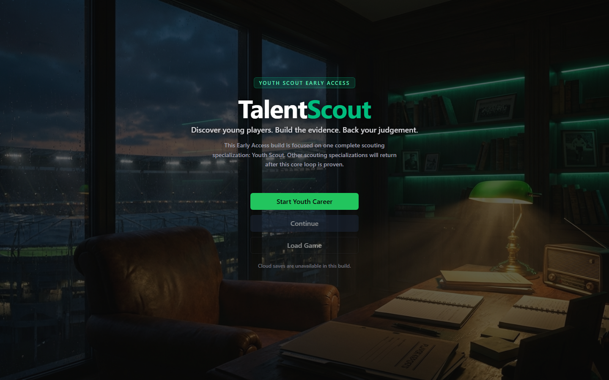
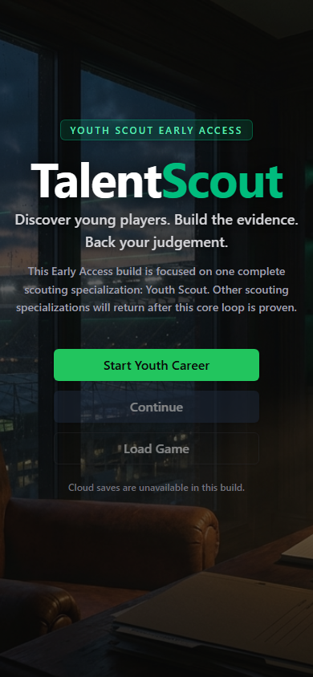
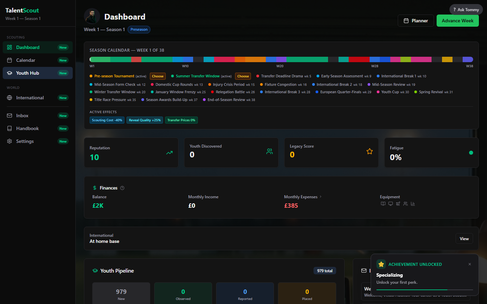
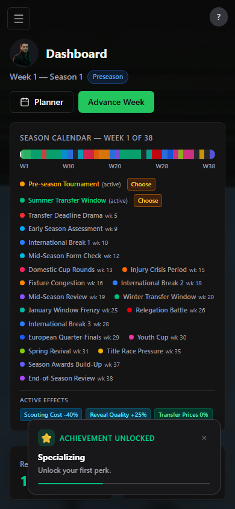
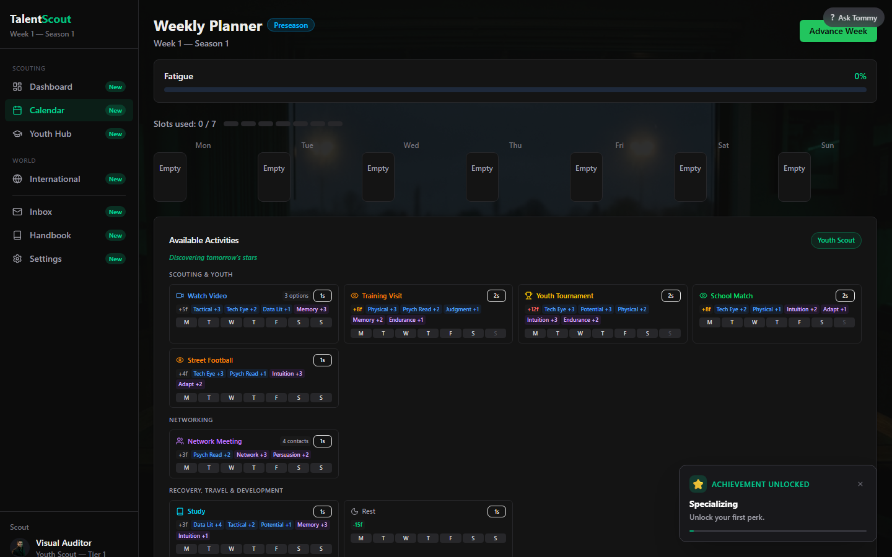
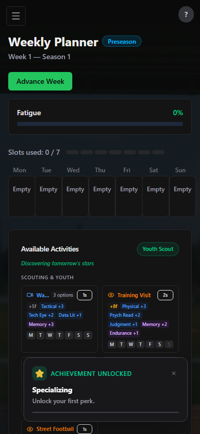

# TalentScout Design Audit Report

## Executive Summary

- **Overall Design Score:** 5.4/10
- **Base Design Score:** 5.6/10
- **System Cohesion Score:** 5.5/10
- **Product type:** Desktop-first football scouting career simulation with mobile-responsive web UI
- **Primary user goal:** Plan scouting work, interpret uncertain evidence, recommend players and build a career
- **Primary business goal:** Make the Youth Scout Early Access fantasy immediately legible, trustworthy and compelling enough to sustain long careers
- **Core diagnosis:** TalentScout has a memorable visual identity and a strong first impression, but the working interface gives display density and small repeated controls more emphasis than the scout's next judgment. Similar-looking actions do not always share behavior, important outcomes disagree across screens, and mobile accessibility falls behind the atmospheric shell.
- **Redesign thesis:** Turn the product from a collection of dark management dashboards into a scout's evidence-and-decisions workspace: one prioritized weekly agenda, one player/case history, large validated actions, and explicit cause-and-consequence feedback.

## Evidence Captured

| Evidence | Details |
|---|---|
| Routes/states | Packaged `/play.html`: main menu, onboarding identity, fresh-career dashboard, populated calendar/planner |
| Viewports | Desktop 1440×900; mobile 390×844 |
| Screenshots | 16 viewport/full-page captures in `capture-live/screenshots/` |
| Flows walked | Full Early Access onboarding; weekly planner; School Match; day decisions; live observation; insight; halftime; reflection; dossier; report writer/history/marketplace; network meeting; follow-up; finance; career; international travel inspection |
| Automated checks | axe-core on all eight viewport states; DOM inventory of headings, accessible names, font sizes, contrast colors and control dimensions |
| Assumptions | Youth Scout/Freelance is the only playable Early Access path. Other career paths are excluded from visual scoring. Captures use the packaged build for a stable, reproducible render; final source typecheck and production build passed. |

The skill's bundled capture helper passed dependency discovery but failed when importing the local CommonJS Playwright package. The documented fallback was used: direct Playwright capture plus `@axe-core/playwright`, without editing application code.

### Representative captures

| Desktop | Mobile |
|---|---|
|  |  |
|  |  |
|  |  |

## Scorecard

| Dimension | Score | Weight | Key reason | Priority |
|---|---:|---:|---|---|
| Visual hierarchy | **6.0** | 12 | Main menu/onboarding establish a clear focal point; dashboard timeline and planner grids compete with the actual next decision. | High |
| Layout and spacing | **5.5** | 10 | Atmospheric shell and centered onboarding are controlled; planner wastes desktop space and compresses mobile content. | High |
| Typography | **6.5** | 8 | Type family/weight system feels cohesive; operational text and day controls drop to 9–12px and headings are semantically inconsistent. | Medium |
| Color and contrast | **5.0** | 10 | Green-on-charcoal palette is distinctive; axe found serious desktop contrast failures in dashboard/calendar muted text. | Critical |
| Components and states | **5.5** | 10 | Cards, borders and buttons share a visual grammar; affordability, eligibility and activity-specific states are inconsistent. | High |
| Interaction and feedback | **4.5** | 8 | Toasts, transitions and weekly summaries exist; silent rejected actions and mismatched report values break trust. | Critical |
| IA and navigation | **5.5** | 10 | Progressive sidebar disclosure helps early play; related evidence/history is split across many screens and raw IDs leak. | High |
| Conversion or task flow | **5.0** | 11 | Starting a career is coherent; weekly planning/reporting require excessive clicks and often lack a clear consequence preview. | Critical |
| Accessibility and inclusive UX | **4.5** | 8 | Some accessible names and keyboard scaffolding exist; serious contrast, missing landmarks/H1, heading order and 17×16px controls are material failures. | Critical |
| Imagery and iconography | **8.0** | 5 | Pitch photography, green glow, silhouettes and Lucide-style icons establish football/scouting atmosphere without visual clutter. | Low |
| Brand visual system | **7.5** | 7 | The charcoal/emerald scout identity is recognizable and more distinctive than a generic sports dashboard. | Medium |
| Emotional trust and polish | **5.5** | 4 | First impression is polished and aspirational; clipped controls, false achievements and outcome inconsistencies erode credibility during play. | High |

Weighted base score: **5.6/10**. No formal hierarchy/accessibility/component cap applies because scores remain at or above the skill thresholds. The final score receives a **−0.2 cohesion adjustment** because interaction behavior and journey structure do not consistently honor the polished visual promise.

## Cohesion Diagnosis

### Cohesive strengths

1. **Visual grammar:** dark zinc/slate surfaces, fine borders, restrained emerald accent, rounded cards and line icons feel like one family.
2. **Brand-emotion match:** the subdued pitch imagery and green signal evoke night scouting, analysis and opportunity rather than club management spectacle.
3. **Early progressive disclosure:** the initial sidebar exposes Dashboard, Calendar, Youth Hub, International, Inbox, Handbook and Settings, then reveals report/career/finance surfaces as they become relevant.

### Cohesion conflicts

1. **Visual confidence versus behavioral uncertainty:** strong polished buttons sometimes do nothing, apply a different target count, or lead to values that change across the next screen.
2. **Decision intent versus dashboard emphasis:** season timelines, totals and dense repeated cards dominate the page while urgent choices, evidence gaps and deadlines are not visually primary.
3. **Shared component appearance versus divergent rules:** a Live Session affordance can appear on a Network Meeting; activity decisions use generic templates; enabled insight actions can be unaffordable.
4. **Desktop density versus mobile compression:** the same grid language is squeezed into mobile, producing clipped labels, long scroll and toast occlusion instead of a redesigned small-screen flow.
5. **Brand promise versus historical fragmentation:** the interface promises a personal scouting story, but observation, reflection, report, sale and outcome do not read as one continuous case.

### System-cohesion subscores

| Subscore | Score | Rationale |
|---|---:|---|
| Visual grammar coherence | **7.0** | Palette, surfaces, iconography and typography are recognizably consistent. |
| Intent coherence | **5.0** | Hierarchy often emphasizes world/status display over the next scouting judgment. |
| Interaction coherence | **4.5** | Similar controls do not consistently share validation, cost, target propagation or outcome behavior. |
| Journey coherence | **5.0** | Onboarding and early unlocks flow; player evidence and consequence history fragment after discovery. |
| Brand-emotion coherence | **7.5** | The visual tone strongly supports a serious, grounded football-scout fantasy. |

**System Cohesion Score: 5.5/10.**

### Caps or penalties applied

- No formal score cap applied.
- −0.2 applied to overall score for cross-screen trust/cohesion conflicts.
- Mobile did not test three full points below desktop, so the mobile disparity cap did not apply; it remains a high-priority defect.

## Top Recommendations

| Priority | Recommendation | Why it matters | Impact | Effort | Acceptance criteria |
|---:|---|---|---|---|---|
| 1 | Make the dashboard a decision agenda | The current season timeline and totals do not answer “what needs my judgment now?” | Very high | L | First viewport shows deadlines, active cases, evidence gaps, obligations and cash risk; every card has a valid action or source link; no background statistic outranks urgent work. |
| 2 | Replace the planner's micro-button matrix | 17×16px controls fail accessibility and turn scheduling into high-click targeting. | Very high | L | Primary targets ≥44px; schedule via activity→slot or drag/drop with keyboard alternative; mobile uses agenda/list layout; no clipped labels at 390px. |
| 3 | Create one Recommendation Case workspace | Fragmented journal/report/outcome screens prevent comparison, attachment and nostalgia. | Very high | L | One route shows brief, evidence, hypotheses, report versions, stakeholder response, decision and long-term outcomes; every related entity deep-links back. |
| 4 | Bind every control to one validated command preview | False enabled states and inconsistent targets destroy trust faster than visual roughness. | Very high | M | Control displays exact target/cost/eligibility; invalid action is disabled with reason; committed result matches preview; no generic activity action leaks. |
| 5 | Establish accessible semantic/design tokens | Contrast, landmarks, heading order and small text repeat across screens. | High | M | Zero serious axe violations on critical routes; H1/main landmarks; logical headings; tokenized text contrast; visible focus; primary text ≥14px and controls meet target guidance. |
| 6 | Reduce notifications and preserve context | Toasts obscure mobile content and messages replace history. | High | M | Toast never blocks primary action; achievements queue/dismiss; action-required items have a real command/deadline; background events group into feed/case history. |

## Detailed Findings

### Visual hierarchy — 6.0/10

**Strengths**

- The main menu has an immediate focal sequence: large TalentScout wordmark, Early Access/Youth context, one emerald primary CTA and subordinate Continue/Load actions.
- Onboarding uses a clear central card and six-step progression; current, completed and future states are visually distinguishable.
- Emerald is generally reserved for primary action, success or current selection.

**Problems**

- The fresh dashboard gives a large amount of first-viewport area to the season timeline, even though early play requires “plan this week” and “complete onboarding case.”
- Planner rows and 66–68 day buttons have nearly equal visual weight, so the eye scans a spreadsheet rather than a decision hierarchy.
- The achievement toast can occupy the mobile dashboard's highest-attention area over core stats/actions.
- Secondary descriptions, internal IDs and repeated metadata accumulate until every card feels similarly important.

**Direction:** one dominant decision per screen, followed by supporting evidence, followed by history. Status totals should not compete with active choices.

### Layout and spacing — 5.5/10

**Strengths**

- Main menu and identity step are balanced on both viewports, with controlled max widths and generous atmospheric negative space.
- Cards use consistent padding/borders and align reasonably on desktop.

**Problems**

- Desktop planner reserves large horizontal/vertical surfaces for tiny day cells and repetitive controls; information density is paradoxically both high and inefficient.
- Mobile calendar compresses the desktop matrix, clipping labels such as Watch Video, while creating a very long page.
- The fixed/persistent achievement overlay competes with mobile viewport content instead of reserving layout space or using a non-blocking queue.
- Operational controls and descriptions sometimes sit too close to similarly styled adjacent cards, making row ownership unclear.

**Direction:** separate opportunity selection from time placement. Desktop can use a two-pane opportunity board/calendar; mobile should use a one-column agenda and slot picker.

### Typography — 6.5/10

**Strengths**

- The large display wordmark and restrained sans-serif UI type suit the serious modern-football tone.
- Weight and casing usually distinguish headings, labels and metadata without excessive font variety.

**Problems**

- Planner day buttons measured around 9px, while much operational text is 12px; this is difficult at normal desktop distance and worse on mobile.
- Identity onboarding starts at H2/H3 without an H1. Calendar content skips heading levels.
- Dense all-caps/muted labels reduce scanability when many appear together.
- Raw `youth_grassroots_access`-style identifiers break professional tone and readability.

**Direction:** set a 14–16px operational floor, reserve 12px for genuinely secondary metadata, establish semantic H1→H2→H3 structure and map every internal token to player-facing copy.

### Color and contrast — 5.0/10

**Strengths**

- The emerald accent is distinctive against charcoal and carries the “found signal in noise” brand idea.
- Dark surfaces use enough tonal variation to separate major cards without heavy shadows.

**Problems**

- axe reported a serious `color-contrast` violation on six desktop dashboard nodes and six desktop calendar nodes. Repeated offenders included muted zinc 500/600 text and capitalized metadata.
- Low-emphasis gray is used for content that is actually required to interpret costs, dates or status.
- Disabled/upcoming states sometimes rely primarily on diminished color/contrast.
- Mobile happened not to report the same contrast rule in the captured state, but uses the same token family; this is not evidence the palette is safe.

**Direction:** define semantic text tokens with measured contrast against every surface: primary, secondary, metadata, disabled and decorative. Required information must meet AA; disabled content should also use icon/copy/state, not faint color alone.

### Components and states — 5.5/10

**Strengths**

- Buttons, cards, chips, progress marks, borders and icons generally share shape and surface language.
- Main CTA, secondary and tertiary actions are usually visually distinguishable.
- Accessible names exist for many planner actions even when their visible labels are tiny.

**Problems**

- Insight actions costing 20–30 IP remained enabled at 0 IP.
- A Network Meeting exposed a Live Session affordance intended for observation.
- Focus target selection and resolved target count diverged.
- Report craft and price changed across writer, history and marketplace surfaces.
- Upcoming onboarding step circles measured 32×32px; many global controls are 20–40px, and planner cells are 17×16px.

**Direction:** every component state should be generated from a shared command validator: eligible, disabled with reason, pending, committed, failed with recovery. Visual sameness must imply behavioral sameness.

### Interaction and feedback — 4.5/10

**Strengths**

- Hover/selection styling, motion, weekly summaries and achievement notifications make the app feel responsive.
- Live observation gives immediate moment detail when focus/lens changes and preserves flags into reflection.

**Problems**

- Clicking an unaffordable insight simply closed the panel without inline error, retained state or explanation.
- Network choice feedback used prose from another activity.
- The report system previews values that do not match committed values, so feedback cannot teach the rules.
- Balance changes without ledger feedback; the finance screen contradicted the visible cash change.
- Tutorial highlighting can precede completed navigation, creating delayed or ambiguous response.

**Direction:** optimistic feedback only where the committed result is guaranteed; otherwise show pending/validated state. Every rejected action must preserve context and explain the remedy.

### IA and navigation — 5.5/10

**Strengths**

- Progressive sidebar disclosure prevents a fresh Youth Scout career from showing every late-game system.
- Dashboard, Calendar, Youth Hub, International and Inbox map reasonably to early user concepts.
- Player selection creates a recognizable profile drill-down.

**Problems**

- Player Database, Discoveries, Youth Hub and Alumni are overlapping entity lists rather than saved views of one intelligence model.
- Observation Journal, Report History, analytics, transfer outcome and stakeholder response are separate histories.
- Important contextual routes are not consistently linked: financial transactions to report, report to brief, message to case, relationship change to event.
- Dashboard/timeline supplies history without enough prioritization, while Inbox supplies volume without a durable case organization.

**Direction:** navigation should organize around **Work**, **Players**, **Cases**, **People**, **World** and **Career**, with screens as saved views rather than duplicate data silos.

### Conversion or task flow — 5.0/10

For this game, “conversion” means completing a meaningful scouting decision and continuing the career.

**Strengths**

- Main menu to career creation has a clear primary action and a comprehensible six-step setup.
- Progressive unlocks introduce Calendar before Reports/Finance, roughly matching the first-week learning sequence.
- Live observation→reflection→dossier is the best connected task flow.

**Problems**

- Scheduling an activity requires targeting tiny day cells across repeated rows.
- The planner does not clearly compare expected information gain, opportunity deadline, income, relationship value and fatigue before commitment.
- Report writing lacks a brief, so the flow asks for conviction before establishing the decision context.
- Follow-Up promises targeted work but does not let the user target a hypothesis/quality.
- Action-required messages are not guaranteed to contain a meaningful action.

**Direction:** every major flow starts with the decision and its stakes, collects the minimum relevant evidence, previews the consequence and ends on a durable case update plus next decision.

### Accessibility and inclusive UX — 4.5/10

**Automated findings**

- Main menu desktop/mobile: zero axe violations in the captured state.
- Identity desktop/mobile: three moderate violations—no main landmark, no H1, and content outside landmarks.
- Desktop dashboard: one serious contrast rule affecting six nodes.
- Desktop calendar: one serious contrast rule affecting six nodes plus moderate heading-order failure.
- Mobile dashboard: zero violations in the captured state.
- Mobile calendar: moderate heading-order failure.

**Control-size evidence**

- Desktop calendar: **66/66** inventoried scheduling controls below 44px.
- Mobile calendar: **68/68** below 44px.
- Day buttons measured about **17×16px** with 9px labels.
- Main-menu primary actions measured 40px high; onboarding future-step controls measured 32px.

**Additional risks**

- Color reduction is a major signal for disabled/upcoming content.
- Very small text and long dense pages increase cognitive and motor burden.
- Mobile toast occlusion can conceal the state the notification is describing.
- Keyboard scaffolding exists in the repository, but the full path could not be certified because the 235-test E2E run did not complete.

**Direction:** semantic landmarks/headings, AA token audit, 44px primary touch targets, visible focus, keyboard alternatives to drag/drop, non-color state cues, zoom/reflow tests and queued non-blocking toasts.

### Imagery and iconography — 8.0/10

**Strengths**

- The blurred/darkened football-pitch image creates place without competing with text.
- Emerald glow and silhouetted football context reinforce discovery and analysis.
- Line icons are stylistically consistent and restrained.
- The interface avoids decorative chartjunk and sports clichés in the first view.

**Problems**

- Later dashboards rely almost entirely on generic line icons/cards, so the distinctive scouting atmosphere recedes.
- Some icon-only or tiny controls need stronger visible labels/tooltips and target areas.
- Player/country/venue identity can feel interchangeable when imagery/visual data is sparse.

**Direction:** preserve restraint, but use contextual artifacts—fixture ticket, pitch map, evidence clipping, notebook annotation, travel stamp—inside Recommendation Cases to carry story without adding decorative noise.

### Brand visual system — 7.5/10

**Strengths**

- TalentScout looks like its own product. The emerald/charcoal “signal in darkness” motif fits discovery and judgment.
- “Youth Scout Early Access” sets an honest current boundary at the main CTA.
- Tone is professional and focused rather than arcade-like.

**Problems**

- Generic dashboard/card patterns begin to overpower the scout-specific metaphor after onboarding.
- Raw IDs, incorrect activity copy and fictional outcome messages break the brand's professional credibility.
- Career screens emphasize RPG unlock language more than a football recruitment profession.

**Direction:** make the brand system semantic: evidence, confidence, source reliability, deadline, conviction and consequence each receive consistent visual grammar. Avoid decorative football branding where a professional artifact would be more distinctive.

### Emotional trust and polish — 5.5/10

**Strengths**

- The main menu feels unusually finished for an Early Access simulation.
- Live observation and reflection create suspense and ownership.
- Motion and restrained color make discovery moments feel intentional.

**Problems**

- False/unearned achievement toasts cheapen accomplishment and block content.
- Silent failures and mismatched values make the UI feel unreliable precisely where professional trust should peak.
- Long-term outcomes arrive as generic messages rather than a preserved visual story.
- Mobile clipping and tiny cells feel prototype-like next to the polished shell.

**Direction:** reserve celebration for verified milestones, preserve the full causal case, and let visual polish communicate truth rather than mask missing state.

## Redesign Direction

### The scout's command center

The dashboard should answer four questions in order:

1. **What demands a decision now?** Closing lead, client deadline, conflicting evidence, stakeholder response, cash risk.
2. **Which cases are changing?** New evidence, stale knowledge, rival activity, player move, outcome review.
3. **How should I allocate this week?** Opportunity board and calendar, with visible trade-offs.
4. **What is the longer story?** Career trend, best/worst calls and world events—below the actionable layer.

### The Recommendation Case as the primary page

Use a stable two-column desktop / single-column mobile structure:

- Header: player, current status, opportunity deadline, brief and next action.
- Evidence rail: claims grouped by domain, confidence, source/context, conflict and age.
- Opinion: hypotheses, personal assessment, revision history and conviction.
- Professional output: report versions, alternatives, stakeholder reaction and decision.
- Consequence timeline: move, minutes, adaptation, injuries, development, reviews, relationship memories.

The page should never display hidden true ability. It visualizes the scout's evidence and the world outcomes that later became observable.

### Weekly planner interaction

- Left pane: ranked opportunities with deadline, duration, location, expected information category, pay, relationship obligation and rival heat.
- Right pane: seven-day capacity with travel and fixed commitments.
- Select opportunity→show eligible slots→commit exact target and goal.
- “Schedule best slot” for routine work; drag/drop optional; full keyboard controls mandatory.
- On mobile: opportunity card→bottom-sheet detail→eligible slot list; no miniature matrix.

## Implementation Acceptance Criteria

1. All critical routes have one `main` landmark, one H1 and logical heading order.
2. No serious/critical axe violations at 1440×900 or 390×844.
3. Every primary/touch scheduling and action control is at least 44×44px or meets WCAG spacing equivalence; no 9px actionable text.
4. All required text meets WCAG AA contrast on its actual background; disabled state uses more than color/opacity.
5. No clipped labels or horizontal overflow at 390, 768, 1024 and 1440px.
6. Toasts never obscure the primary action or critical status; multiple unlocks queue and can be reviewed later.
7. An unaffordable/ineligible action is disabled with a readable reason; rejected commands keep the panel open and preserve input.
8. Exact selected player/activity targets shown in the command preview equal committed result targets.
9. Report preview, stored artifact and marketplace base metadata use the same committed evaluation object.
10. A player can navigate from message→case→evidence/report→transaction/outcome and back without losing filters.
11. A new player can plan the first week, complete observation and submit a valid report without tutorial deadlock.
12. Keyboard-only users can complete onboarding, schedule work, observe, reflect, write a report, resolve inbox actions and save/load with visible focus.
13. At ten simulated seasons, dashboard, planner, profile and case lists remain within an agreed p95 interaction/render budget and use virtualized/narrow selectors where needed.

## JSON Summary

The full machine-readable summary is in `design-audit-summary.json`.
