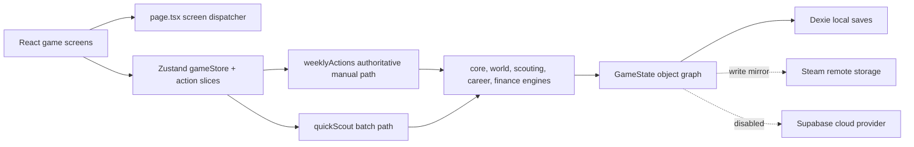

# TalentScout Principal Product and Simulation Review

**Review date:** 11 July 2026
**Repository:** `C:\Users\hands\OneDrive\Pictures\TalentScout\talentscout`
**Reviewed revision:** local `main` at `ca94fec`, including the existing uncommitted worktree
**Product build played:** the repository's packaged static build plus the local development build
**Verdict:** promising scouting prototype; not yet a credible multi-season career simulation

## Executive conclusion

TalentScout has found the right subject but has not yet built the causal spine that can support it.

The best part of the current game is the live observation session. Weather, venue, match phase, attention tokens, observation lenses, uncertain attribute ranges, flagged moments, and post-session reflection briefly produce the intended feeling: *I saw something, I am not certain what it means, and I need to decide what I believe.* The main menu, visual identity, onboarding tone, and progressive disclosure also present a coherent Youth Scout Early Access product rather than a generic management dashboard.

The problem is that the rest of the simulation does not reliably preserve or price that judgment. Repeated observations can increase their own count exponentially. Hypotheses are stored but never tested by the engine. Reports omit audience, need, club fit, price fit, risks, deadline, alternatives, and follow-up; the same report can be resubmitted and overwrite itself while incrementing career statistics. Manual and batch advancement do not simulate the same world. Season rollover duplicates fixtures. Promotions and relegations do not move clubs. Every fit senior player appears in every match. A rival can announce a multi-million-pound counter-bid without charging the scout or moving the player. Relationships are primarily meters, not memories or obligations. The career can grow numerically without gaining a qualitatively different job.

These are not polish gaps. They prevent the player from trusting cause and effect. A world-class scouting game requires one durable chain:

> evidence → opinion → professional recommendation → stakeholder decision → player and club outcome → remembered reputation and relationship consequences

TalentScout currently has pieces on both sides of that chain, but several links are cosmetic, bypassable, or processed by incompatible code paths. The correct next move is therefore not a broad feature expansion. It is to make this chain authoritative, deterministic, explainable, and persistent; then deepen the football world around it.

### Readiness scores

| Area | Score | Summary |
|---|---:|---|
| World credibility | **3/10** | Many simulated entities and events exist, but standings, squads, promotion, match participation, and season continuity are not trustworthy. |
| Scouting depth | **4/10** | The live session has strong raw material; evidence novelty, disagreement, bias, hypothesis testing, and longitudinal calibration are incomplete. |
| Decision quality | **4/10** | Scheduling creates opportunity cost, but many actions are flat, obviously dominant, repeatable for free, or disconnected from consequences. |
| Career progression | **3/10** | Tiers and unlocks exist; new authority, political responsibility, failure recovery, and distinct paths largely do not. |
| Relationships and politics | **3/10** | Contacts, rivals, boards, and employees exist as systems, but rarely remember specific acts or create conflicting obligations. |
| Information design and usability | **5/10** | Strong atmosphere and generally clear onboarding are offset by dense dashboards, tiny planner controls, weak outcome causality, and misleading affordances. |
| Replayability | **3/10** | Seeds, difficulties, countries, scenarios, and latent paths exist, but Early Access exposes one specialization and one start, while systemic divergence is weak. |
| Emotional engagement | **4/10** | Discovery and reflection can land; vindication, regret, rivalry, nostalgia, and career identity are usually reduced to messages or numbers. |

**Current world-class readiness: 3.6/10.** This is not a measure of effort or code volume. It measures whether a player can build a believable career by making uncertain scouting judgments whose consequences persist.

## Evidence standard and scope

The review did not treat a component, type, message, or README claim as proof of a working system. Claims are classified as follows:

- **Verified defect:** reproduced through normal play, controlled state, automated execution, or direct end-to-end state tracing.
- **Likely risk:** code structure or persistence behavior creates a credible failure mode, but no destructive reproduction was performed.
- **Design weakness:** behavior works as implemented but does not create the intended decision, trade-off, or fantasy.
- **Subjective recommendation:** a proposed direction whose value depends on product taste rather than correctness.
- **Unverified:** an interface or engine path could not be reached sufficiently to claim behavior.

Work performed:

- Mapped the Next.js, React, Zustand, simulation, persistence, Electron, Steam, Supabase, and test architecture.
- Played onboarding and the first two weeks through the normal interface, including a School Match, live observation, reflection, report writing and listing, networking, and follow-up observation.
- Inspected international travel, the career screen, financial history, player dossiers, report history, achievements, and progressive navigation.
- Used deterministic controlled states to exercise a full season, season rollover, eight-week manual-versus-batch advancement, club employment, agency systems, international assignments, rivals, transfers, loans, and long-career state.
- Ran the 20-test Vitest suite, lint, typecheck, a long-career Playwright invariant test, and attempted the 235-test Playwright suite.
- Captured desktop and mobile screenshots plus axe evidence for the main menu, identity onboarding, dashboard, and planner.
- Inspected recent commits, the current worktree, TODO/stub markers, test configuration, CI, save migrations, cloud/Steam behavior, and Electron security.
- Queried the connected GitHub repository for open issues; none were returned.

Important limits:

- The shipping interface identifies itself as **Youth Scout Early Access**. Youth Scout is the only selectable specialization and Freelance is the only selectable starting position. First Team, Regional, Data, and club starts are explicitly unavailable. Those unavailable paths were traced and exercised only through controlled state; they are not claimed as validated normal-play experiences.
- During the review, the OneDrive-backed dirty worktree temporarily reported `src/components/game/CalendarScreen.tsx` as deleted and the development server failed to read source files. The file later reappeared as a modified tracked file. Final verification passed both typecheck and production build. This incident is recorded as a source-availability/workspace risk, not a final code defect, and no cause is attributed.
- A full normal-speed season would repeat the same week interactions for hours and was not necessary to verify the rollover. A seeded controlled season and the repository's long-career scenario were used, then compared with manual advancement.

## Repository architecture

TalentScout is a client-side Next.js 15 / React 19 game packaged with Electron. Zustand owns a very large serializable `GameState`. Store action slices orchestrate pure-ish TypeScript engine modules. Dexie stores the full state in IndexedDB; Steam cloud is mirrored from writes when available; Supabase code exists but cloud saving is disabled in product configuration.



### Main architectural areas

| Area | Principal entry points | Assessment |
|---|---|---|
| App shell and navigation | `src/app/play/page.tsx`, `src/components/game/GameLayout.tsx` | A single screen-dispatch component with progressively unlocked navigation. Functional, but tightly coupled to store screen names. |
| UI | `src/components/game/*` | Rich breadth and good visual identity. Several screens exceed 1,500–2,300 lines, increasing state and regression risk. |
| Store orchestration | `src/stores/gameStore.ts`, `src/stores/actions/*` | Central authority in theory; business logic and migration logic are distributed across massive files. |
| Weekly simulation | `src/stores/actions/weeklyActions.ts` | More than 7,500 lines and the real gameplay spine. It combines UI gating, activity resolution, world ticks, messages, career processing, and rollover. |
| Core world | `src/engine/core/gameLoop.ts`, `src/engine/world/*` | Broad feature coverage, but several entities are updated from derived or incomplete participation models. |
| Scouting | `src/engine/observation/*`, `src/engine/scout/*`, `src/engine/insight/*` | The strongest domain model, though the interactive results and durable knowledge model are only partly connected. |
| Reports and finance | `src/engine/reports/*`, `src/engine/finance/*`, report/finance store slices | Has craft, conviction, marketplace and delayed validation; lacks an authoritative assignment-to-outcome case. |
| Career and people | `src/engine/career/*`, `src/engine/network/*`, `src/engine/rivals/*` | Numerous systems exist, but most effects are numeric and multiple paths drift from the same state model. |
| Persistence | `src/lib/db.ts`, `src/lib/activeSaveProvider.ts`, `src/stores/gameStore.ts` | Full-state saves and ad hoc migrations; no explicit save-schema version in `GameState`; Steam is write-only from the active provider's perspective. |
| Desktop | `electron/main.js`, `electron/preload.js`, `electron-builder.yml` | Narrow preload and context isolation are good. Chromium sandbox is disabled and CSP remains permissive. |
| Tests | `tests/`, `e2e/`, `vitest.config.ts`, `playwright.config.ts` | 20 unit tests and 235 listed browser tests, but CI runs no tests and some long-career tests use the non-authoritative batch path. |

### Structural risk concentration

The primary risk is not merely file length; it is that domain transactions are not bounded. `weeklyActions.ts` decides UI gates, performs the world tick, mutates calendars, processes rivals, careers, fixtures, messages, awards, and season changes. `gameStore.ts` owns initialization, migrations, persistence and broad action composition. `core/types.ts` exceeds 4,000 lines. This makes it easy to add a feature to one advancement path, one career path, or one save migration while missing the others.

The alternate `batchAdvance` path is the clearest consequence: after the same seeded eight weeks, the manual world had £2,470, 43 rival activities and two performance records; the batch world still had £2,000, no rival activities and no performance records. The game therefore has two definitions of time.

### Repository maturity, recent changes and unfinished work

The reviewed worktree is not a release snapshot. At final inventory it contained **113 modified tracked entries and 24 untracked entries/groups**, with roughly **14,121 insertions and 8,024 deletions** across the tracked diff. These pre-existing changes span UI, simulation, persistence, Electron, tests and configuration, so the current product is effectively an integration branch without a clean baseline.

Recent history supports that interpretation:

| Commit | Date | Subject | Review significance |
|---|---|---|---|
| `ca94fec` | 2026-04-15 | `wip: pre-migration snapshot` | Current HEAD; 123 files and about +10k/−1.7k lines, combining observation, marketplace, saves, UI and E2E work in one snapshot. |
| `20a36a7` | 2026-03-06 | Steam launch readiness | Platform/security/leaderboard changes arrived before save-provider lifecycle was complete. |
| `ac38636` | 2026-03-02 | Tutorial system overhaul | Explains strong progressive disclosure, but tutorial tests/copy now drift from current UI. |
| `52a72c5` | 2026-02-27 | Playwright suite, equipment, PA estimates and engine improvements | Broad tests were added, but CI never began running them. |
| `163151b` | 2026-02-26 | Activity dedup, ratings, tables, tutorial, loans, tournaments, UI polish | Many vertical features landed together, increasing cross-system integration debt. |

The connected GitHub repository returned **no open issues**. That does not indicate defect absence: the confirmed register in this review contains issues that are not represented in the issue tracker.

Explicit unfinished markers also align with reproduced gaps:

- `src/stores/actions/weeklyActions.ts:6508` leaves unclaimed perk tracking as a TODO.
- `src/engine/core/types.ts:1608-1632` labels Phase 2–4 extension fields as stubbed.
- `src/engine/reports/reporting.ts:889` generates information that is never shown to the player.
- `src/engine/firstTeam/clubResponse.ts:289` substitutes `ca: 0` as placeholder data for a count check.
- The handbook describes several systems more confidently than their current state effects support, including insight actions and form-vs-ability behavior.

The product needs an integration-hardening phase with explicit feature ownership and exit criteria, not another broad WIP snapshot.

## Phase 1 — What the current game actually is

### Primary player fantasy

The playable product fantasy is narrower than the underlying type system: **start as a freelance youth scout, schedule local scouting work, observe uncertain young players, turn selected observations into reports, sell those reports, build reputation and contacts, and unlock broader travel and career tools.**

It successfully foregrounds the scout rather than the manager. The player does not select lineups or control matches. The intended verbs are attend, notice, investigate, reflect, report, persuade, travel, network and follow up. The current long-term simulation, however, often rewards volume and numeric unlocks more reliably than judgment.

### Loop assessment

| Loop | Decisions and information | Resources and risks | Feedback and long-term consequence | Progression and status |
|---|---|---|---|---|
| **Minute-to-minute** | Choose a screen, inspect a player or message, schedule an activity, choose a day-event response, spend focus, flag a moment, or write a report. Information arrives as cards, ranges, narrative moments, toasts and inbox items. | Click attention, focus tokens, insight points, calendar slots and sometimes cash/fatigue. Risks are usually not shown at the point of action. | Immediate copy, XP, IP, discovered players, reputation and notifications. Causal links to later outcomes are weak. | New screens and activities unlock, but core interaction changes little. **Functional but fragmented.** |
| **Weekly planning** | Fill seven days with observation, video, training, tournaments, networking, study, follow-up, travel or rest. Choose depth versus breadth and whether to advance with empty days. | Slots, fatigue, travel time, cash, opportunity cost. Free days restore fatigue so aggressively in sparse early weeks that fatigue is rarely a hard choice. | Day-result decisions, weekly summary, messages, money, reputation and discoveries. Manual processing is rich; batch processing omits many systems. | More cards appear, but the planner grows horizontally and becomes micro-management heavy. **Meaningful core with integrity defect.** |
| **Seasonal** | Continue weekly work; respond to season review, awards, jobs and youth events. The player receives fixtures, world events and career evaluation. | Time, career targets, board satisfaction and finances. | Reviews, awards, new fixtures, youth generation and delayed report evaluation. Season rollover currently duplicates fixtures and leaves league membership unchanged. | Intended to reset objectives and advance the world. **Broken at the continuity layer.** |
| **Multi-season career** | Build reputation, choose perks, accept roles, found or grow an agency, travel and revisit alumni. | Reputation, money, job security, stakeholder trust and years of career time. | Reports can validate after two seasons; alumni develop; tiers unlock. Retirement and an ordinary-career end are absent, while legacy completion is circular. | Numeric scope increases more than responsibility. **Partially connected.** |
| **Scouting and observation** | Select context/mode, react to a day event, spend half-by-half focus tokens, choose lenses, flag moments, label prospects, and decide whether to follow up. Receives contextual moments, noisy ranges, confidence and notes. | Calendar time, attention, IP, fatigue, access and the risk that another opportunity moves first. Competitive timing is mostly narrative. | Strong immediate evidence and reflection; durable ranges and notes reach the dossier. Observation counts can grow 1→2→4→8→16, destroying calibration. | New modes and insight actions unlock, but many effects are discarded or flat. **Promising but mathematically unsafe.** |
| **Reporting** | Choose a player, auto-compose assessments, optionally remove strengths/weaknesses, write a summary and select conviction. Receives craft score, price estimate and market response. | Nominal evidence, conviction and time; manual submission consumes no weekly slot and can be repeated. | Immediate reputation, listing, income and later validation. Predicted craft/price can disagree with the stored/listed values; duplicate IDs overwrite history while statistics rise. | Higher reputation raises prices and access but does not make reporting more professionally complex. **Functional but shallow and exploitable.** |
| **Relationships/networking** | Choose a contact and a generic interaction response; inspect relationship/trust/access values and gossip. | A calendar slot and sometimes a reciprocal opportunity. Conflicting stakeholder interests are rare. | Relationship numbers and narrative messages. The Network Meeting response displayed unrelated scouting copy in normal play. Gossip is written to one field and read from another. | Larger networks increase reach, but contacts do not reliably remember specific favors, failures or promises. **Partially connected.** |
| **Financial** | Pay for travel, equipment, training and staff; earn report sales, placement fees and salary. View balance and some history. | Cash, salary, recurring costs, report price and travel cost. | Balance changes immediately. A normal report sale raised the balance while the Financial Dashboard still showed no income because the ledger tracks only selected sources. | More income and expenses arrive with career growth, but cheap employee contracts and missing ledgers create exploits. **Functional arithmetic, incomplete accounting.** |
| **Career progression/employment** | Spend perks, meet tier gates, inspect job offers, accept club work, respond to reviews and manage board satisfaction. | Reputation, stats, relationships, salary and job security. | Unlocks, offers, promotions, warnings or firing. Accepting a job can reset lifetime statistics; non-Ironman firing can leave club/salary/path state attached. | Tiers raise numbers and menus. Club-path selection can remain permanently prompted. **High-risk partial implementation.** |
| **Agency/management** | Hire employees, set salaries, delegate assignments and grow an organization. This is not normally selectable in Early Access. | Money, staff capacity and assignments. £1 salaries carry no morale/retention penalty. | Delegated work can produce results, but the analyst quality boost is calculated then discarded. | Intended endgame delegation exists, without enough organizational politics or economic pressure. **Engine ahead of playable UI; shallow.** |
| **International** | Inspect a country, pay and book multi-week travel, or later accept assignments. Receives regional knowledge, cost, duration and access. | Large cash cost, calendar/travel slots and absence from local opportunities. | Travel changes location/knowledge and can open prospects. Assignments automatically complete on return without a deliverable. Displayed week ranges are ambiguous. | Tier gates broaden geography. **Travel is functional; assignments are placeholder-like.** |
| **Rival scouts** | Read activity/intelligence, concede or counter a poach, and theoretically compete over a prospect. | Reputation/opportunity and a displayed 150% market-value bid. | Activities populate under manual advancement. A successful £41m counter-bid charged no money, moved no player and promised a clubless freelancer that the player would join “your club.” | Rivals get aggression and budgets, but competition is predominantly narrative. **Misleading.** |
| **Player development/alumni** | Revisit discovered players, follow careers and receive outcomes. The player has little direct control, appropriately. | Time and the reputational risk of prior recommendations. | Players age, develop, decline, suffer injuries, transfer and generate ratings. Every fit senior player participates in every match; youth transfers can land only in academy arrays; report evaluation is truth-error, not decision quality. | Multi-season validation is the intended emotional payoff. **Broad but causally weak.** |
| **Scenarios/legacy** | Pick objectives, track targets, chase achievements and eventually produce a legacy. | Time, objective deadlines and difficulty. | Completion and rewards, global achievements, last-season legacy summaries. Unknown objective IDs can complete, deadlines are inconsistent and first legacy completion requires an achievement that itself requires a prior legacy score. | Intended replay/endgame framework. **Partially connected; legacy start is unreachable.** |
| **Victory, failure, retirement** | Scenario completion and achievements are the nearest victories; Ironman firing is the clearest failure. | Career security and scenario limits. | Ordinary careers can continue without a definitive retirement, bankruptcy resolution or authored ending. | No complete transition from active scout to legacy/retirement. **Incomplete.** |

### Normal-play findings

The first two weeks show both the product's promise and its current disconnects:

1. The Early Access setup is honest about its boundary: only Youth Scout and Freelance can be selected. The seeded world and country choice make the start feel owned.
2. A School Match in heavy rain created venue effects, five phases, half-time focus recovery, observation lenses, vague versus specific moments, and a meaningful “Promising” label. This was the strongest ten minutes of the game.
3. The prospect picker visually selected only Kevin Taylor, yet the result said “Focus targets: 2” and described split attention. The interface and simulation disagreed.
4. The insight panel showed **0 IP available** while presenting enabled actions costing 20–30 IP. Clicking one closed the panel without explanation.
5. Reflection captured the conditions, flags and a persistent note. Kevin's dossier later preserved that note and journal entry—a good example of connected state.
6. The dossier labeled attributes “3x” after one live session and used ranges/confidence, but the underlying accumulation algorithm can double prior cumulative counts.
7. The report writer offered evidence snippets and conviction, but no audience, club need, role, value-for-money, wage context, risk plan, next step, deadline, comparison target or alternative. “Note” produced craft 63 and “Recommend” craft 59, yet the higher-conviction option immediately tripled the displayed price, rewarding overstatement. The submitted history then stored craft 52 instead of the predicted 59, and the listing showed a third suggested price.
8. The report sale raised the balance from £2,000 to £2,600, while Financial Dashboard stated “No income recorded this period.” The balance is authoritative; the ledger is not comprehensive.
9. A Network Meeting response appended generic “Cast Wide Net” scouting prose, and an irrelevant Live Session button appeared on the networking activity.
10. A targeted follow-up promised examination of specific qualities but provided no quality or hypothesis selector.
11. Fresh careers unlocked achievements such as Specializing, and in one development run Frequent Flyer, Globetrotter and Global Network appeared before the career had earned them. Achievement state is global local storage rather than part of the save.

### Where the game currently creates emotion

| Emotion | Current source | Why it lands or fails |
|---|---|---|
| Discovery | First contextual live observation and a newly named prospect | **Lands briefly.** Limited focus and noisy moments create attention. |
| Suspense | Hidden ranges, poor weather, waiting for more evidence | **Partial.** Competitive opportunity clocks rarely force the decision. |
| Pride | A polished report, a sale, reputation gain | **Weak.** Report quality and pricing disagree, and the artifact lacks professional context. |
| Risk | Conviction, travel cost, job security | **Mostly numerical.** Conviction raises value without credible downside calibration. |
| Surprise | Unusual moments, world events, rival activity | **Mixed.** Surprise becomes disbelief when state does not change. |
| Rivalry | Poach messages and counter-bids | **Fails.** No real transfer, payment, ownership or durable contest. |
| Attachment | Reflection notes and alumni profiles | **Promising.** Notes persist, but case histories do not assemble the full story. |
| Loss | Failed reports, missed prospects, firing | **Underdeveloped.** Consequences are sparse, delayed, or leave impossible state. |
| Vindication | Delayed report validation and alumni success | **Too narrow.** It compares estimates with truth, not whether the recommendation solved the brief. |
| Embarrassment | Overconfident miss | **Mostly absent.** Stakeholders do not remember the exact mistake. |
| Ambition | Tier gates, international reach, agency tools | **Readable but abstract.** The work itself changes too little. |
| Nostalgia | Journal, report history, legacy | **Fragmented.** No unified career timeline or recommendation case archive exists. |

## Phase 2 — Assessment against world-class simulation principles

### A. World credibility — 3/10

The code simulates clubs, finances, fixtures, transfers, free agents, loans, injuries, form, youth generation, awards and careers independently of the player. Breadth is substantial. Credibility fails at the junctions:

- Season rollover adds another full fixture set without replacing or correctly scoping the previous one: 2,036 fixtures became 4,072.
- Promotion and relegation generate messages and reputation effects but do not update league membership.
- Every available senior player receives an appearance/rating each match; there is no XI, bench or minutes context.
- A form update is calculated from a synthetic rating and then again from the actual match rating, while stable momentum cannot initiate normally.
- Under-18 permanent signings are added only to academy lists, while senior match simulation reads senior lists.
- Several systems hard-code 38 weeks even when a league fixture generator produces a 46-week competition.

The world moves, but the player cannot reliably explain why it moved or trust that its tables describe the same reality.

### B. Scouting depth — 4/10

The observation design is the product's most promising foundation. Context, lenses, focus, hidden information, range width, scout skill, weather, notes, and reflection all exist. Yet repeated observation is not strategically modeled as evidence novelty. It can be repetition for a larger count; analysis can farm the same data point for IP; quick interactions return flat rewards; investigation results are only partly applied; and hypotheses have no engine caller that updates or resolves them.

Two competent scouts cannot yet disagree for legible reasons such as source reliability, stylistic bias, tactical reference frame, recency or risk tolerance. The game can be noisy, but it does not adequately explain whether a miss came from variance, context, bias, sparse evidence, change in the player, or bad inference.

### C. Decision quality — 4/10

The planner creates genuine opportunity cost, and live focus tokens are a good scarcity mechanism. Many other decisions fail one of the core tests:

- **No trade-off:** quick interaction options all grant the same reward.
- **Dominant option:** manual reports do not consume calendar time and can be repeated.
- **False consequence:** rival counter-bid success is only a message.
- **Missing information:** report conviction is priced before the player can see stakeholder need or overconfidence risk.
- **No feedback:** unaffordable insight actions appear enabled and fail silently.
- **Discarded result:** manager directives, analyst quality boosts and several seasonal modifiers are calculated but not applied.
- **Display-only screen:** standings do not drive actual competition movement.

The dashboard often tells the player that something happened without making the next decision clearer.

### D. Career progression — 3/10

Tier gates, perks, tools, training, jobs, contracts, board satisfaction, employees, agency structures and paths all exist. Progression mostly adds capacity, activities and numbers. It does not consistently shift the player's role from doing work to setting standards, managing portfolios, defending recommendations, allocating staff, handling politics, or owning organizational risk.

State defects also undermine the fantasy: job acceptance can reset lifetime statistics; club-path selection can remain unresolved; firing can leave employment data attached; independent and club careers share incompatible review language and tier logic. Setbacks are therefore more likely to look broken than narratively survivable.

### E. Relationships and politics — 3/10

Contacts have types, trust/access-like values, interactions and gossip; boards, managers, agents, rivals and employees exist. People rarely hold event-specific memories. They do not form enough individual goals, obligations, conflicts, debts, loyalties or ideological differences. Helping one stakeholder seldom harms another. Report responses are more sensitive to aggregate craft/conviction than to a sporting director's historic trust in this scout, need, risk appetite, or prior failure.

A relationship should answer “what happened between us, what does this person currently want, and what do I owe them?” TalentScout currently answers mostly “what is the meter?”

### F. Information design and usability — 5/10

The product is visually coherent, atmospheric and often readable. Progressive sidebar unlocks reduce early overwhelm. The live session distinguishes context, moment and action well. Problems become acute in the planner and outcome surfaces:

- All 66 desktop planner scheduling controls and all 68 mobile controls measured below the 44px target; day buttons were about 17×16px.
- Desktop dashboard/calendar captures had serious contrast failures; onboarding lacked a main landmark and H1; planner heading order skipped levels.
- Mobile planner labels truncate and the achievement toast obscures first-viewport decisions.
- Important cause is hidden: balance changes lack ledger entries, report estimates disagree, summary terminology alternates between session and observation counts, and career UI exposes raw perk IDs.
- Dense season timeline content dominates the dashboard before it creates an actionable decision.
- Related histories—observation, reflection, report, stakeholder response, transfer and outcome—live on separate surfaces rather than one case timeline.

See `design-audit-report.md` for the 12-dimension visual/UX assessment and rendered evidence.

### G. Replayability — 3/10

The engine has seeds, countries, difficulties, specializations, scenarios, club/independent/agency concepts, world events and generated players. The current shipped setup exposes one specialization and one starting position. The same activity cards, response templates, tier gates and report form dominate careers. Geographic variation changes pools and travel more than scouting culture or evidence. Club identities and economic differences do not yet produce distinct recruitment problems. Scenario objective validation is loose enough that it cannot be trusted as a divergent challenge.

Two seeds change names and outcomes; they do not yet reliably create different professional identities.

### H. Emotional engagement — 4/10

The live session and persistent reflection note demonstrate the right emotional unit: a remembered judgment about a specific person under specific conditions. The broader game collapses that story into points, toasts and generic messages. There is no canonical “case” where the player can see the original brief, conflicting evidence, what they believed, whom they persuaded, the terms of the decision, the player's adaptation, and the resulting trust or regret. Without that memory, even simulated drama is disposable.

## Phase 5 — Applying Football Manager's principles correctly

The benchmark is not “how many FM features can be copied.” It is whether entities belong to a persistent world, decisions have legible context, and history turns simulation into personal story.

Official Football Manager material demonstrates several useful design principles: Recruitment Focuses express a role, age, transfer type, geography and priority, consume staff capacity, and return recommended/near/ongoing candidates; report knowledge can become stale and need updating; stakeholder expectations can conflict; and a career timeline deliberately records failures as well as achievements. See [Recruitment Revamp](https://www.footballmanager.com/features/recruitment-revamp), [FM26 Recruitment Hub](https://www.footballmanager.com/fm26/features/powered-transferroom-fm26s-recruitment-revamp), [Supporter Confidence](https://www.footballmanager.com/features/supporter-confidence), and [Dynamic Manager Timeline](https://www.footballmanager.com/features/dynamic-manager-timeline).

| Principle | TalentScout now | Gap | TalentScout-specific implementation | Scouting-fantasy value | Effort / dependencies / risk |
|---|---|---|---|---|---|
| **Persistent independent world** | Weekly world ticks, fixtures, transfers, loans, development and rivals exist. | Advancement paths and season state diverge; major world events are cosmetic. | One `SimulationClock` and idempotent domain event pipeline; clubs process needs, budgets and player decisions from the same events whether the player watches or skips. | The scout competes in a world that will not wait. | **XL**; requires P0 clock, fixture, squad and migration work; high save risk. |
| **Extensive historical records** | Messages, report history, journal, alumni and match ratings are separate. | No unified causal history; some records are ephemeral or overwrite. | Immutable `RecommendationCase` timeline linking brief, observations, revisions, report versions, stakeholder actions, transactions and yearly outcomes. | Makes “I found him first” reviewable years later. | **L**; event IDs and save version first; storage growth risk. |
| **Strong entity identity** | Generated players/clubs/contacts have attributes and labels. | Clubs lack sufficiently active recruitment philosophies; contacts lack event memories. | Club recruitment doctrine, risk/age/region/role preferences, manager style, budget state; contact goal, memory and obligation ledger. | Fit becomes more important than generic ability. | **L**; depends on role/need model; tuning complexity. |
| **Interacting systems** | Many modules run weekly. | Effects are often discarded, duplicated or only messaged. | Typed domain events with declared producers/consumers and a weekly audit log; no UI copy without a committed state event. | Stories arise from access + timing + need + evidence + politics, not scripts alone. | **XL**; architecture migration; temporary feature slowdown. |
| **Meaningful uncertainty** | Attribute ranges, confidence, hidden personality and contextual moments. | Count inflation and repetitive certainty; bias/conflict are not legible. | Evidence items with source, context, recency, reliability and independence; Bayesian-style category confidence with scout-specific bias profile. | The player reasons about evidence rather than filling a progress bar. | **L**; needs balance research and explainability UI. |
| **Long-term consequences** | Delayed validation compares predicted ability/potential with truth. | Ignores brief, fit, price, timing, adaptation, risk and appropriate confidence. | Multi-checkpoint case review at 3, 12, 24 and 48 months, evaluating decision quality separately from outcome luck. | A good process can survive bad luck; reckless luck can still be recognized. | **L**; case model, club need, finances and minutes needed. |
| **Multiple routes to success** | Tier/perk/path scaffolding exists. | Early Access has one path; latent paths mostly add numbers. | Distinct authority models: local discoverer, embedded club specialist, chief scout, international fixer, independent consultant, agency founder. | Careers express a scouting philosophy and political appetite. | **XL**; core loop must stabilize first; content cost. |
| **Comparison and filtering** | Player lists, profiles, searches and analytics exist. | Cross-player evidence and fit comparison is cumbersome; history is fragmented. | Saved shortlists and side-by-side comparison by evidence quality, fit, value, risk and deadline—not hidden true ratings. | Turns a pile of prospects into a defensible recommendation. | **M**; needs normalized evidence/case data. |
| **Emergent story generation** | Narrative chains and messages are broad. | Messages often have no stateful origin or consequence. | Stories render from domain events and remembered relationships; authored text supplies voice, not causality. | Rivalry, regret and vindication become earned. | **L**; event pipeline and relationship memory first. |
| **Outcome explainability** | Weekly summaries and messages report results. | Displays disagree and root causes are missing. | Every important outcome exposes a “Why?” trace: inputs, modifiers, uncertainty, decision and affected state. Hide exact rolls where mystery matters, but show causal categories. | Players improve their judgment instead of guessing the rules. | **M**; instrumentation and consistent vocabulary. |
| **Career continuity** | Full-state saves, seasons and legacy scaffolding. | No schema version, broken rollover, write-only Steam mirror, incomplete retirement. | Versioned saves, golden migrations, immutable history compaction, conflict-aware cloud provider and retirement archive. | Ten-season stories remain safe and returnable. | **XL**; P0 prerequisite; data migration risk. |

### Useful principles from other respected simulations

Two adjacent benchmarks reinforce the same direction without expanding TalentScout into their genres:

- **Out of the Park Baseball treats history as part of the decision surface.** Its official manual preserves prior scouting reports so the user can compare how an opinion changed, and its development report can compare players over multi-month or multi-year periods. TalentScout should go further by storing the scout's evidence, hypothesis and confidence at each revision, but the underlying lesson is vital: a current rating is less meaningful than a dated sequence of beliefs and outcomes. See [OOTP scouting-report history](https://manuals.ootpdevelopments.com/index.php?man=ootp16&page=help_player_page.scouting_report) and [OOTP player development report](https://manuals.ootpdevelopments.com/index.php?man=ootp23&page=player_development_report).
- **RimWorld explicitly positions simulation as a story generator.** Its official description emphasizes characters with traits/backstories/relationships and a storyteller that reacts to the current situation. TalentScout should not fabricate outcomes to manufacture drama; it should use a presentation director to identify already-real tensions—closing opportunities, contradictory evidence, remembered failures, rival overlap—and surface them at a narratively useful moment. See [RimWorld's official overview](https://rimworldgame.com/).

The shared principle is **state first, story second**. A narrative system may select and frame meaningful causal events, but it must never substitute copy for a transfer, relationship memory, financial transaction or player outcome.

## Phase 6 — Redesigned core loops

### 1. Observation: from repeated clicks to hypothesis-driven evidence

The fundamental unit should be an **evidence item**, not an observation count.

Each evidence item records:

- player and timestamp;
- source: self, employee, coach, agent, data provider, journalist or rumor;
- context: competition level, opposition quality, score state, tactical role, position, weather, surface, home/away, training, interview or video;
- claim: “scans before receiving,” “loses intensity late,” “responds well to instruction,” “family reluctant to relocate”;
- domain: technical, tactical, physical, psychological, personality, medical, adaptability or market;
- direction and strength;
- reliability, independence, recency and potential bias;
- the scout's interpretation and confidence at the time.

The playable loop:

1. **Form a question.** Before attending, pick one or two hypotheses or let the session remain exploratory. Example: “Can Kevin make decisions under an aggressive press?”
2. **Choose context.** A school match may reveal competitive instinct and technique against age peers; training reveals coachability and repetition; a stronger-opposition match reveals processing speed; family/contact work reveals adaptability. No context reveals everything.
3. **Allocate attention.** Focus tokens remain, but each token chooses player × domain × phase. Watching too many targets reduces evidence resolution. Fatigue affects missed cues, not just a global percentage.
4. **Observe variable performance.** A performance model separates stable trait, current form, role fit, opposition and random match variance. The UI makes unusual performance possible without announcing the hidden roll.
5. **Reconcile sources.** Contact evidence may contradict live evidence. The player can accept, discount, annotate or schedule a discriminating observation.
6. **Update a hypothesis.** Mark support, contradiction or ambiguity and write the reason. The engine proposes changes but never silently rewrites the scout's personal opinion.
7. **Decide sufficiency.** Report now, follow up, delegate, request data, or drop the lead. More evidence costs time; a visible opportunity clock models rival interest, contract deadlines, trial windows and club urgency.

#### Diminishing returns

Confidence rises mainly from **independent, diagnostic evidence**. Seeing the same player in the same role and level again has low novelty unless it contradicts the prior distribution. A different tactical role, stronger opposition, training, interview or medical source opens new evidence coverage. Confidence decays when evidence becomes stale or the player changes environment.

The interface should show “what remains uncertain and which context would reduce it,” not “watch three more times.”

### 2. Reports: professional artifacts with accountable advice

A report begins with a **brief**, not a blank verdict:

- audience and decision owner;
- club/client need and why it exists;
- intended role, development horizon and squad pathway;
- transfer/loan/free-agent route;
- budget, wage and deadline constraints;
- required traits and unacceptable risks;
- competing candidates.

The report contains:

1. Executive recommendation and conviction.
2. Role and club-fit assessment.
3. Current contribution and projected development.
4. Evidence-backed strengths and concerns, each with category confidence.
5. Personality, consistency, injury, adaptability and environment risks.
6. Price/wage/availability range and value-for-money judgment.
7. What is known, inferred, contradicted and still unknown.
8. Recommended next step and decision deadline.
9. Comparison player and at least one alternative target.
10. Conditions that would change the recommendation.

Conviction should not simply multiply sale price. It is a promise to the audience about how strongly the scout stands behind the evidence. Overconfident weak evidence may persuade a stakeholder in the short term but increases calibration and relationship downside. Appropriately cautious reporting can build trust with risk-averse stakeholders; decisive calls matter when a window is closing.

#### Evaluation rubric

At later checkpoints, evaluate dimensions independently:

- Did the recommendation match the brief and intended role?
- Was price/wage value reasonable at the decision date?
- Was the timing early enough and not recklessly premature?
- Were strengths and risks correctly identified?
- Was category confidence calibrated to the evidence available then?
- Did the player adapt to country, club, role and pathway?
- Did injuries or usage explain outcome variance?
- Did the scout revise the opinion when contradictory evidence appeared?
- Did the club follow the recommendation as written?

This distinguishes **good judgment with bad luck**, **bad judgment with good luck**, and **a good player who was wrong for that club**.

### 3. Weekly planning: an opportunity portfolio

Keep the week as the central cadence, but replace the card grid with a prioritized **opportunity board** plus a calendar.

Every opportunity has a deadline, estimated time, travel/location constraint, expected information gain, relationship obligation, financial value and competitive heat. Examples include:

- a known assignment due Friday;
- a speculative school final that may reveal several unknowns;
- a follow-up that tests one important hypothesis;
- a favor promised to an academy coach;
- a cheap local job that pays the bills;
- a two-week international trip with exclusive access;
- a rival-linked trial window closing;
- review and mentoring of employee work.

At the start of the week, the player decides:

- depth versus breadth;
- paid work versus speculative discovery;
- known targets versus new search;
- local access versus travel;
- personal attention versus delegation;
- relationship maintenance versus immediate evidence;
- club request versus personal scouting thesis;
- follow an existing case versus open another.

Interruptions should be rare, stateful and costly: a manager changes a brief, a player withdraws from a trial, a contact offers one-night access, an employee flags a contradiction. The player can replan, break a promise, or let an opportunity pass. At higher tiers, templates and staff automate routine logistics while the player allocates scarce personal judgment and political capital.

### 4. Career: authority, not just unlocks

| Stage | New work and access | New pressure and risk |
|---|---|---|
| **Local amateur scout** | Public fixtures, school/community contacts, tiny paid reports, hands-on observation. | Cash flow, little credibility, poor access, each claim matters. |
| **Regional specialist** | Better local network, recurring clients, regional knowledge products, first exclusives. | Rival ownership of territory, source reliability, opportunity triage. |
| **Club scout** | Explicit briefs, squad-pathway context, staff reports, internal meetings. | Manager/DoF disagreement, budgets, deadlines, employment review. |
| **Senior scout** | Portfolio ownership, mentor juniors, cross-check reports, defend recommendations. | Accountability for others, internal politics, limited personal observation. |
| **Chief scout / recruitment leader** | Set methodology, allocate coverage, lead decision meetings, shape club doctrine. | Board outcomes, staff quality, process failures, political capital. |
| **International specialist** | Exclusive cross-border network, adaptation intelligence, multi-club clients. | Travel, cultural reliability, work permits, regional reputation. |
| **Independent consultant** | Choose clients, preserve independence, sell retained advice and audits. | Conflicts of interest, volatile pipeline, confidentiality, lawsuits/reputation. |
| **Agency founder** | Build a firm, hire/coach scouts, select markets and clients, own methodology. | Payroll, retention, client concentration, quality control, ethics. |
| **Elite recruitment figure** | Board-level influence, succession, major strategic assignments, legacy projects. | Reputation concentration, public scrutiny, preserving standards while delegating. |

Promotion changes the **object of the player's attention**: from individual moments, to cases, to portfolios, to people and organizational process. The game should automate low-leverage repetition as status rises, not merely add more of it.

Setbacks should produce playable recovery: demotion, a smaller client, a damaged relationship, a public correction, a period rebuilding in a familiar region, or choosing independence after political failure. Only explicit Ironman or bankruptcy rules should end a career abruptly.

### 5. Long-term consequences: the Recommendation Case

Create one durable aggregate for every consequential recommendation:

```text
RecommendationCase
  Brief and stakeholder need
  Evidence timeline and source conflicts
  Scout hypotheses and revisions
  Report versions and conviction
  Stakeholder reactions and promises
  Decision, fee, wage, role and pathway
  Rival claims and media narrative
  Adaptation, appearances, injuries and development
  3/12/24/48-month reviews
  Financial and sporting return
  Relationship memories
  Reputation effects by category
```

Reputation becomes a vector, not a single ladder: youth projection, immediate readiness, tactical fit, market value, personality, medical risk, regional expertise, decisiveness, calibration and discretion. Stakeholders weight those categories differently and remember the cases that affected them.

The career archive then generates:

- best discovery, best value and best club-fit call;
- most painful miss and most overconfident report;
- opinion most improved by re-evaluation;
- player whose outcome was worst despite sound process;
- recurring bias patterns;
- relationships won or lost through specific cases;
- cases a rival claims credit for;
- the scout's evolving philosophy and calibration graph.

That is TalentScout's equivalent of a trophy cabinet.

## Phase 8 — Remove, consolidate, automate or defer

World-class depth requires fewer fake choices and stronger shared foundations.

### Remove or disable until real

- **Disable `batchAdvance` as a player-facing option** until it invokes the same domain pipeline as manual advancement. It currently creates a different history.
- **Disable rival counter-bids** until money, employing club/client authority, transfer state and rival ownership are committed atomically.
- **Hide standings promotion/relegation claims** until league membership, fixtures and histories change.
- **Hide unaffordable insight buttons** and any seasonal modifier whose downstream consumer is absent.
- **Disable repeat manual report submission** and repeatable free board/manager boosts.
- **Do not present Steam as a complete save provider** until list/load/delete/conflict behavior exists.
- **Hide legacy completion** until a first completion is reachable without prior legacy state.

### Consolidate

- Consolidate School Match, Street Football, Training Visit, Watch Video and Tournament into one **Observe** action with context variants. Context should change evidence, not require parallel card implementations.
- Consolidate Discoveries, Player Database, Youth Hub and Alumni into a **Player Intelligence workspace** with saved views: new leads, active cases, watchlist, reported, signed, alumni and lost opportunities.
- Consolidate Observation Journal, Report History, stakeholder response and player outcome into the **Recommendation Case timeline**.
- Consolidate finance balance, sales, salaries, travel, equipment, training and placement fees into one double-entry-like **career ledger** with filters and source links.
- Consolidate action-required messages into a true **Action Inbox**. Every “must respond” item must block or materially affect a deadline; informational narrative belongs in a feed or case timeline.
- Consolidate duplicate season/standings/fixture initialization and career review logic behind single services.

### Automate by career tier

- Routine travel booking, rest placement and low-value local coverage.
- Contact maintenance with established trusted contacts, while preserving high-stakes favors and conflicts for the player.
- Formatting and evidence citation in reports; the player still owns interpretation and conviction.
- Employee assignment matching and routine quality checks; the player reviews exceptions and contradictions.
- Low-priority player follow-up and stale-evidence alerts.
- Report marketplace administration once the player works under a club or retainer.

### Convert busywork into decisions

- Replace one button per activity per day with drag/drop or “schedule best slot,” while preserving conflicts and travel constraints.
- Replace notification floods with weekly triage: urgent decision, changed evidence, opportunity, outcome and background world.
- Replace generic interaction choice cards with intent plus consequence: ask for access, trade information, challenge a report, protect a source, call in a favor, or decline an obligation.
- Replace dashboards that merely recite counts with decision queues: which case is becoming stale, which deadline is closing, which employee report conflicts, which stakeholder is waiting.

### Defer

- Additional specializations and geography content until the authoritative clock, evidence model, report case and season continuity are stable.
- More narrative templates until events have durable state causes.
- More equipment/lifestyle items until they create distinct work patterns rather than percentage modifiers.
- Expanded Steam/online achievements until save-local achievement correctness and migration are reliable.
- Cosmetic match depth beyond what scouting evidence needs. TalentScout does not need tactical match control; it needs role, opposition, minutes and context credible enough to support scouting inference.

## Product strategy: the next playable promise

The next milestone should be marketed and scoped as:

> **Build one season of a youth scout's career where every observation, report, signing and consequence can be explained and revisited.**

Acceptance at product level:

1. One seed produces equivalent world state through manual, quick and save/reload play.
2. A player can be discovered in two contexts, generate conflicting evidence, be reported against a real brief, be signed or rejected, and remain traceable for at least three seasons.
3. The report is evaluated for fit, value, timing, risk identification and calibration—not only hidden ability error.
4. At least three stakeholders remember the case differently and alter future access or trust.
5. A rival can genuinely win the opportunity through the same rules.
6. The world completes a season with correct fixtures, tables, squads, promotion/relegation and history.
7. The career archive can tell the complete story without reading transient inbox copy.

Only after that vertical slice is trustworthy should the product scale to more paths, leagues, agency management and international content.

## Release recommendation

**Do not treat the current repository as release-candidate quality.** Typecheck and production build pass in the final observed state, but the simulation has multiple P0 integrity failures that can invalidate long careers and the full E2E suite does not pass/complete. It is suitable for internal prototype playtesting focused on observation feel, onboarding and visual direction, with explicit warnings that season, quick-sim, rivals, employment and legacy are not authoritative.

The detailed evidence and implementation plan are split into the companion files:

- `system-completeness-matrix.md` — frontend-to-state trace for all required systems.
- `screen-decision-audit.md` — decision, information, trade-off and consequence review for every major screen.
- `verified-defects.md` — confirmed defects with reproduction, root cause, impact, fix and regression test.
- `roadmap.md` — P0–P4 backlog with effort, dependencies, acceptance criteria, tests and migration requirements.
- `testing-strategy.md` — unit, property, integration, deterministic, E2E, migration, soak and performance strategy.
- `design-audit-report.md` — rendered desktop/mobile design, usability and accessibility audit.
- `design-audit-summary.json` — machine-readable visual audit scores and evidence.
