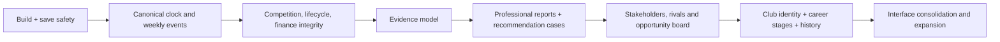

# Prioritized Product and Engineering Roadmap

Effort assumes a small experienced game/product team already familiar with the repository:

- **S:** up to one engineer-week
- **M:** roughly 1–3 engineer-weeks
- **L:** roughly 1–2 team-months
- **XL:** multi-month, cross-system initiative

The priority order is intentionally architectural. New content placed on top of non-authoritative time, evidence and history would increase rework and player distrust.

## P0 — Critical integrity and stability

### Scope and player value

| ID | Problem | Proposed solution | Player value | Relevant modules | Technical approach |
|---|---|---|---|---|---|
| **P0-01** | CI runs only for tags/manual dispatch and its quality job omits unit/E2E tests; the current full E2E suite does not pass/complete. | Establish a required pull-request/release gate and repair/quarantine no failures silently. | Every merged build is reproducible and core stories stay playable. | `.github/workflows/build.yml`, Playwright/Vitest config, package scripts | Add PR/main triggers; route smoke; CI order: install→lint→typecheck→unit/property→build→targeted E2E→accessibility→package smoke; upload traces/seeds. |
| **P0-02** | Manual, fast-forward and batch process different systems. | One canonical `AdvanceWorldTick` pipeline with decision policies as inputs. | Speed controls never change career truth. | `stores/actions/weeklyActions.ts`, `engine/core/quickScout.ts`, `engine/core/gameLoop.ts` | Extract an idempotent week command and ordered domain-event phases; manual UI pauses for decisions, quick mode supplies defaults, both commit the same events. |
| **P0-03** | Scattered 38-week arithmetic conflicts with variable schedules. | Absolute `WorldDate` plus competition calendars. | Deadlines, travel, loans and windows behave consistently. | calendar, negotiations, marketplace, economic events, quickScout, season events | Store monotonic tick/date; competition has start/end/matchweeks; convert legacy `(season, week)` at migration; prohibit raw duration arithmetic. |
| **P0-04** | Fixture rollover duplicates matches; standings and promotion are false. | `CompetitionSeason` aggregate with idempotent rollover, scoped tables and structural promotion/relegation. | The football world can be trusted across seasons. | fixtures, standings, relegation, `weeklyActions.ts`, initialization | Season IDs on fixtures/results; close/archive one season; atomically move membership; generate one next set; maintain history indexes. |
| **P0-05** | Observation counts double prior cumulative totals. | Atomic evidence ledger and derived aggregates. | More watching improves knowledge at a believable rate. | `scout/perception.ts`, observation types/actions, profile/report selectors | Give every reading an evidence ID; store one atomic contribution; derive count/confidence; migrate old aggregates conservatively. |
| **P0-06** | Player moves, loans and rival actions have parallel non-atomic paths. | Player lifecycle state machine and command handler. | A player has one club/contract/loan status and moves once. | `world/playerLifecycle.ts`, transfers, loans, free agents, rivals, finance actions | Validate command→emit one movement event→apply squad/contract/finance/history atomically; idempotency key and terminal-state guards. |
| **P0-07** | Matches use the full roster as participants; form is calculated twice. | Lightweight selection, minutes and one performance event. | Development, form and scouting outcomes reflect actual playing opportunity. | `core/gameLoop.ts`, match ratings, injuries, development | AI selects XI/bench by eligibility/role/quality; generate substitutions/minutes; one `PlayerMatchPerformance` feeds form, development, injury exposure and history. |
| **P0-08** | Reports can be submitted repeatedly, overwrite IDs and disagree with previews. | Immutable report commands/versions and one evaluation preview. | Advice is accountable and cannot be farmed. | `reportActions.ts`, reporting, ReportWriter, marketplace | Unique command ID, explicit revision relation, capacity cost, committed preview nonce, reward once, immutable artifact. |
| **P0-09** | Job transitions can erase history or leave employment attached after firing. | Explicit career/employment state machine. | Setbacks are credible and career identity survives jobs. | career progression/review context, progression actions, weekly application | Separate lifetime career, employment contract and seasonal review records; atomic hire/end/firing transitions and invariants. |
| **P0-10** | Balance mutations lack a complete ledger; agency salary and rival bids bypass economic reality. | Immutable financial transaction journal and authorization rules. | Money is explainable; financial choices and solvency matter. | finance engine/actions, marketplace, salaries, travel, rivals | Only ledger posting changes cash; source event, account, currency, counterparty and balance; authorized spending mandate; derive UI totals. |
| **P0-11** | Saves lack an explicit schema version; Steam is write-only in practice. | Versioned save envelope and one provider contract. | Long careers survive updates and cloud claims are truthful. | `lib/db.ts`, `saveProvider.ts`, `activeSaveProvider.ts`, `gameStore.ts`, Steam/Supabase | `{schemaVersion, buildVersion, careerId, state, checksum}`; sequential pure migrations; provider CRUD/conflict/tombstone contract; backup before migrate. |
| **P0-12** | Domain code uses unseeded clocks/IDs/RNG and false actions remain exposed. | Inject `SimulationContext` and add implementation registry/feature gates. | Save/reload is stable; no button promises a non-effect. | RNG/ID hotspots, events, achievements, beta flags, insight/seasonal actions | Seeded RNG, deterministic ID factory and clock per command; every action declares validator+reducer+explanation; gate missing reducers. |

### Delivery contract

| ID | Dependencies | Main risk | Effort | Acceptance criteria | Required tests | Save migration |
|---|---|---|---:|---|---|---|
| **P0-01** | None | Flaky long UI cases can slow feedback if not layered correctly | **M** | PRs cannot merge without lint/typecheck/unit/build/critical E2E; failed tests retain traces; one Electron smoke opens main menu and starts game | Route render, build, unit/property, critical story, packaged smoke | No |
| **P0-02** | P0-03, event IDs from P0-12 | Large refactor changes tuned outcomes | **XL** | Canonicalized state equal after 1/8/38/100 weeks across manual-default, fast and batch for 100 seeds | Equivalence property, replay/golden seeds, crash retry | Yes—store pipeline/version marker only |
| **P0-03** | P0-11 migration framework | UI assumes `(season, week)` everywhere | **L** | All deadlines order correctly in 38–46 week calendars; no negative duration | Calendar boundary/property tests | Yes—convert dates |
| **P0-04** | P0-02, P0-03, P0-06 | Existing saves contain duplicate fixtures | **XL** | One fixture set/competition season; clean Week 1 table; membership changes; ten seasons remain valid | Season golden, standings invariant, promotion property, soak | Yes—dedupe/archive fixtures and assign season IDs |
| **P0-05** | P0-11 | Old cumulative count cannot be reconstructed exactly | **L** | N atomic readings produce N; same evidence cannot apply twice; confidence bounded/monotonic only for informative evidence | Evidence idempotency, confidence properties, migration fixture | Yes—conservative evidence snapshot |
| **P0-06** | P0-10 for money; P0-03 for dates | Many existing transfer/loan code paths | **XL** | Every player has compatible ownership/contract/loan/squad state; movement resolves once; rival cannot bypass authority | State-machine/property tests, under-18/loan/rival integration | Yes—normalize current player status/history |
| **P0-07** | P0-06 squad eligibility | Performance tuning and CPU cost | **L** | 11 starters, valid bench/subs/minutes; non-participants no rating; one performance feeds all consumers | Selection invariants, deterministic matches, 10-season performance | Yes—new performance history defaults |
| **P0-08** | P0-05; P0-10 | Existing duplicate/overwritten reports | **L** | Submit/retry once; explicit revision distinct; preview equals stored artifact; capacity consumed | Idempotency, preview/commit, marketplace integration | Yes—assign versions and mark ambiguous history |
| **P0-09** | P0-11 | Existing impossible employment states need normalization | **M** | All path/job transitions satisfy invariants; lifetime stats monotonic; firing ends access/pay exactly once | Career transition matrix, Ironman/normal regression | Yes—derive canonical employment |
| **P0-10** | P0-12 event IDs | Reconstructing historical balance sources | **L** | Cash equation reconciles every tick; no direct mutations; £1 contract invalid or consequential | Conservation/property, duplicate event, insolvency tests | Yes—opening-balance migration plus future ledger |
| **P0-11** | None, then prerequisite for most | Bad migration could destroy saves | **XL** | Golden saves from each supported version load; failed migration preserves original; provider CRUD parity/status visible | Migration matrix, corruption/checksum, fake providers, Electron Steam | Yes—this is the migration foundation |
| **P0-12** | P0-02 uses it | Deterministic IDs can collide if scope is wrong | **M** | No domain `Math.random`/`Date.now`; replayed command emits identical IDs/events; gated action cannot render | Static rule, replay property, action registry coverage | Small context/version addition |

## P1 — Core-loop transformation

### Scope and player value

| ID | Problem | Proposed solution | Player value | Relevant modules | Technical approach |
|---|---|---|---|---|---|
| **P1-01** | Scouting stores ranges/counts, not a reasoning history. | Evidence graph with source, claim, context, reliability, recency and scout interpretation. | The player develops an opinion rather than filling bars. | observation, perception, knowledge, profiles | Normalize `EvidenceItem`; derive category belief/confidence; preserve personal assessment separately from hidden truth. |
| **P1-02** | Repeating the same context is usually optimal/repetitive. | Diagnostic contexts, novelty/diminishing returns and staleness. | Choosing *where and why* to watch becomes strategic. | observation contexts/moments, venues, calendar | Context feature vector; independence/novelty score; “best next evidence” suggestions; decay/update after role/environment change. |
| **P1-03** | Hypotheses and observation modes are cosmetic or exploitable. | Hypothesis-driven session contract and fully connected mode reducers. | Players form, test, revise and preserve football judgments. | session/reflection/analysis/investigation/interaction/insight | Pre-session questions; evidence supports/contradicts; unique data consumption; insight registry consumes every result; remove flat choices. |
| **P1-04** | Waiting has little concrete competitive cost. | Opportunity clocks and lead ownership. | “Do I know enough?” becomes tense. | calendar, contacts, rivals, contracts, marketplace | Each lead has deadline/heat/next events; rivals allocate real attention; access windows can close or be extended through relationships. |
| **P1-05** | Reports lack audience, need, fit, economics and next action. | Professional report artifact tied to a recruitment brief. | Recommendations feel like accountable work for a real client. | ReportWriter, reports engine, club/agency contracts | Brief schema; role/pathway/budget/deadline; evidence claims, confidence, risks, value, alternatives and conditions to revise. |
| **P1-06** | Validation rewards hidden-truth accuracy only. | `RecommendationCase` and multi-checkpoint process/outcome evaluation. | Good process, fit, timing and calibration matter for years. | reports, transfer tracker, development, finance, relationships, analytics | Link brief→evidence→report versions→decision→transfer→3/12/24/48-month outcomes; dimension-specific scoring and explanations. |
| **P1-07** | Weekly planner is card micro-management with weak prioritization. | Opportunity board + calendar + workload/delegation planner. | Every week asks hard breadth/depth/income/relationship/travel questions. | CalendarScreen replacement, activity engine, NPC delegation | Unified opportunity objects; rank by deadline/heat/info gain/value/obligation; schedule best slot; interruptions and promise costs. |
| **P1-08** | Stakeholder persuasion and rivals are messages/meters. | Stateful recommendation meeting and competitive case model. | Standing behind a player can win trust, lose political capital or lose the player. | contacts, boards/managers, rivals, narrative events | Stakeholder goals/risk appetite/history; present evidence, acknowledge risk, set conviction; rival submits competing case through same rules. |

### Delivery contract

| ID | Dependencies | Main risk | Effort | Acceptance criteria | Required tests | Save migration |
|---|---|---|---:|---|---|---|
| **P1-01** | P0-05, P0-11 | Data/UI complexity overwhelms player | **XL** | Every displayed belief can cite evidence; two scouts can differ for stated reasons; hidden truth never leaks | Evidence derivation properties, bias/reliability simulations, UI trace | Yes—convert knowledge snapshots |
| **P1-02** | P1-01 | Novelty formula becomes opaque meta | **L** | Same-context repeats yield bounded diminishing gain; diagnostic new context materially changes relevant confidence | Context matrix/golden cases, staleness tests | Yes—context metadata defaults |
| **P1-03** | P1-01/02 | Too much note-taking friction | **L** | Hypothesis can be formed, supported, contradicted, revised and closed; all modes have distinct non-exploitable outputs | Mode contract suite, repeat-action property, save/reload | Yes—hypothesis schema |
| **P1-04** | P0-02/03/06; P1-08 | Pressure feels arbitrary | **L** | Opportunities have visible reason/deadline; rivals can win real leads; no lead resolves twice | Clock/rival simulations, deadline boundary E2E | Yes—lead entities |
| **P1-05** | P1-01, club needs P2-01 | Report becomes form-filling | **L** | Report cannot submit without brief/role/finance/risk/next action; evidence claims trace; alternatives compare | Schema/unit, full report E2E, accessibility | Yes—legacy reports become unbriefed archive |
| **P1-06** | P0-06/07/10; P1-05 | Evaluation feels unfair due outcome luck | **XL** | Separate process/outcome scores; checkpoints explain injuries, minutes, adaptation and club deviation | Case lifecycle golden, counterfactual fixtures, calibration property | Yes—case link/backfill where possible |
| **P1-07** | P0-02/03; P1-04 | Planner redesign could slow experts | **L** | Schedule core week in <90 seconds; exact conflicts/costs shown; keyboard/mobile targets pass | Task-time usability, scheduling properties, Playwright desktop/mobile | Yes—schedule compatible |
| **P1-08** | P1-05/06; P2-02 memory can follow | Dialogue content scope | **L** | Same case yields different stakeholder responses for legible goals/history; promises and rival result persist | Stakeholder matrix, rivalry E2E, event idempotency | Yes—initial neutral profiles/memories |

## P2 — World depth and career longevity

### Scope and player value

| ID | Problem | Proposed solution | Player value | Relevant modules | Technical approach |
|---|---|---|---|---|---|
| **P2-01** | Clubs buy from generic logic and weak identities. | Club recruitment doctrine, needs portfolio, budgets and pathway model. | A prospect can be excellent yet wrong for one club and ideal for another. | clubs/types, transfers, board AI, reports | Age/region/role/value/risk preferences; squad age/depth/minutes needs; manager/DoF tension; explainable candidate scoring. |
| **P2-02** | Relationships are meters without episodic memory or conflicting wants. | Person goals, memory, favors, obligations and faction links. | Access and politics generate long stories. | contacts, agents, boards, managers, rivals, employees | `RelationshipMemory` from domain events; salience/decay; promise/debt ledger; stakeholder compatibility and confidentiality. |
| **P2-03** | Career tiers add volume rather than authority. | Role-specific career stages and responsibility contracts. | Early, middle and late game feel like different professions. | career progression, jobs, agency, planner | Separate local/club/leader/international/consultant/agency authority; stage objectives, autonomy, delegation and political capital. |
| **P2-04** | Agency is economically exploitable and organizationally thin. | Firm simulation: payroll market, retention, methodology, quality control and client conflicts. | Agency ownership becomes a genuine endgame. | finance/agency, employees, NPCs, contracts | Labor market; employee traits/careers; review queues; client concentration, ethics/confidentiality, satellite strategy. |
| **P2-05** | International travel is a timer and geography is mostly access. | International briefs, regional scouting cultures and adaptation evidence. | Each region changes how the scout obtains and interprets knowledge. | international, travel, regional knowledge, contacts, player adaptation | Documentation/access norms, competition reliability, family/work-permit/language evidence, local intermediaries and deliverables. |
| **P2-06** | Player development lacks credible pathway context. | Development environment and career-decision model. | Alumni outcomes become understandable rather than random CA movement. | players, clubs, matches, loans, injuries, training | Minutes/level/role/coach/facilities/adaptation/injury/reputation drive development and movement; explanation snapshots. |
| **P2-07** | History is fragmented and awards/events are ephemeral. | World and career history service. | The save becomes a place with memory and nostalgia. | reports, players, clubs, leagues, awards, inbox, analytics | Immutable notable events, season records, entity timelines, case archive, searchable best/worst/first records; compaction policy. |
| **P2-08** | Scenarios, failure, retirement and legacy are incomplete. | Validated scenario DSL plus survivable setbacks and retirement. | Careers have distinct arcs, endings and replay hooks. | scenarios, career, legacy, achievements | Schema-validated objective predicates, explicit deadlines, recovery states, retirement event and career archive; legacy perks from completed record. |
| **P2-09** | Scout/staff careers and labor movement are static. | Staff labor market, rival careers and succession. | Rivals and colleagues belong to the same world and can outgrow the player. | NPC scouts, rivals, contacts, jobs, clubs | Staff contracts, ambitions, performance, poaching, retirement, reputation specialties and relationship continuity. |

### Delivery contract

| ID | Dependencies | Main risk | Effort | Acceptance criteria | Required tests | Save migration |
|---|---|---|---:|---|---|---|
| **P2-01** | P0-06/07/10; P1-05 | Candidate AI becomes expensive/opaque | **XL** | Clubs publish/act on needs; signings fit doctrine/budget more often; UI explains top drivers and rejections | AI transfer simulations, budget/need invariants, 20-season distributions | Yes—club doctrine defaults |
| **P2-02** | P0-12 events; P1-08 | Memory explosion and repetitive prose | **XL** | Contacts recall named cases/favors; helping one can harm another; access obligations persist | Memory salience/decay, promise invariant, stakeholder E2E | Yes—neutral memory ledgers |
| **P2-03** | P0-09; P1-07 | Too many bespoke path screens | **XL** | Each stage changes information, authority, risk and work mix; setbacks have at least two recovery routes | Full career-path matrix and 10-season path E2E | Yes—map tier/path to role contract |
| **P2-04** | P0-10; P1-06; P2-03 | Becomes spreadsheet administration | **L** | Low pay affects hiring/retention; staff quality reaches cases; delegation removes routine workload | Payroll conservation, retention properties, agency E2E | Yes—normalize employee contracts |
| **P2-05** | P0-03; P1-01/05 | Cultural stereotypes / content burden | **L** | Assignment requires deliverables; at least four regions demand distinct evidence/access plans; adaptation is case-relevant | Assignment quality matrix, travel/date tests, sensitivity review | Yes—assignment schema |
| **P2-06** | P0-07; P2-01 | Tuning long arcs takes time | **XL** | Player paths show minutes/level/role/environment effects; 20-season distributions plausible; reason trace available | Distribution/property/soak, injury/loan pathways | Yes—development context snapshot |
| **P2-07** | P0-11/12; P1-06 | Save growth | **L** | Every key entity has season/career timeline; case story retrievable after 10 years; save stays within budget | History idempotency, compaction and 30-season size/load soak | Yes—backfill available history |
| **P2-08** | P0-09/11; P2-07 | Objective DSL false positives | **L** | Unknown objective rejected; first retirement reachable; scenario deadlines exact; legacy starts second career | Predicate property, first/second career E2E, migrations | Yes—scenario/legacy version |
| **P2-09** | P0-09; P2-02/03 | World churn makes contacts disposable | **L** | Staff change jobs, develop, retire and preserve relationships; rival identity persists across employers | Labor-market invariants, seeded career histories | Yes—staff contract/career fields |

## P3 — Interface and onboarding

### Scope and player value

| ID | Problem | Proposed solution | Player value | Relevant modules | Technical approach |
|---|---|---|---|---|---|
| **P3-01** | Related player intelligence is split across Discoveries, Database, Youth, Alumni, Journal and Reports. | Player Intelligence workspace with saved views and case drill-down. | Find, compare and resume work without remembering screen boundaries. | GameLayout/navigation, list screens, PlayerProfile, reports | Entity-route model; saved filters; active case status; deep links between player, club, contact and case. |
| **P3-02** | Planner has 17×16px controls, truncation and excessive per-day clicks. | Accessible calendar interaction and mobile-specific scheduling. | Weekly planning becomes fast, legible and usable by keyboard/touch. | CalendarScreen replacement, activity cards/panel | 44px targets, row/action menus, drag/drop plus keyboard alternative, schedule-best-slot, responsive list view. |
| **P3-03** | Comparison emphasizes ratings rather than evidence/fit/risk. | Side-by-side Evidence and Fit Compare. | Defend why one candidate is better for this brief. | player/report lists, analytics, brief/case | Compare confidence, evidence age/context, role fit, value, risk, opportunity deadline and alternatives; saved shortlists. |
| **P3-04** | Important outcomes lack causal explanation and displays disagree. | Universal “Why?” trace and shared terminology. | Players learn and trust the simulation. | summaries, inbox, finance, career, reports, analytics | Render domain event inputs/modifiers/reason categories; one glossary for observation/session/craft/confidence; link source event. |
| **P3-05** | Tutorial can highlight before navigation settles and teaches shallow/changed flows. | Event-driven contextual onboarding with practice cases. | New players learn reasoning, not button locations. | tutorial store/overlay/guided session, screens | Wait for route/control readiness; teach one complete evidence→report→outcome example; optional advanced modules; version tutorial steps. |
| **P3-06** | Notifications obscure decisions and “action required” can lack action. | Action Inbox + background feed + case updates. | Urgent work is clear without toast/message fatigue. | Inbox, Dashboard, AchievementToast, events | Classify by required command/deadline; group background items; snooze/resolve; case timeline absorbs history. |
| **P3-07** | Contrast, landmarks, heading order, target size and huge component performance need work. | Design-system/accessibility/performance hardening. | Depth remains readable and inclusive on desktop/mobile. | global styles, UI components, large game screens, selectors | Semantic landmarks/headings, token contrast, focus states, 44px controls, virtualization, narrow Zustand selectors, responsive test matrix. |

### Delivery contract

| ID | Dependencies | Main risk | Effort | Acceptance criteria | Required tests | Save migration |
|---|---|---|---:|---|---|---|
| **P3-01** | P1-06, P2-07 | Large navigation change | **L** | Reach any active case in ≤3 interactions; saved views persist; no dead-end entity screen | Information-finding usability, route E2E | Minor saved-view settings |
| **P3-02** | P1-07 | Drag/drop accessibility | **M** | No interactive target <44px for primary/touch actions; planner works at 390px and keyboard only; no clipped labels | axe, keyboard, mobile screenshots, scheduling E2E | No |
| **P3-03** | P1-01/05 | Information overload | **M** | Compare 2–5 candidates; differences and missing evidence visible; action returns to brief | Comparison logic/unit, responsive/keyboard E2E | Shortlist schema if persisted |
| **P3-04** | P0-12 event audit | Overexposing hidden RNG | **M** | Every money/reputation/relationship/career outcome links to reason trace; hidden truth remains hidden | Event-to-explanation coverage, terminology snapshots | No |
| **P3-05** | Stable P1 flow | Tutorial maintenance burden | **M** | No highlight before target exists; first case completes without deadlock; skip/resume/version works | Fresh/returning/mobile tutorial E2E | Tutorial-version local migration |
| **P3-06** | P1-06/P2-07 | Players miss low-priority story | **M** | Every action-required item has valid command/deadline; grouped feed reduces first-season message volume ≥50% | Message contract/property, inbox E2E | Message classification migration |
| **P3-07** | Can start now; finish after redesigned screens | Visual regression churn | **L** | Zero serious axe violations on critical routes; hierarchy/system cohesion ≥7; p95 key screen interaction budget met at 10 seasons | axe, visual snapshots, React profiler/load budgets | No |

## P4 — Polish and expansion

| ID | Problem / opportunity | Proposed solution and player value | Modules / approach | Dependencies | Risk | Effort | Acceptance criteria / tests | Migration |
|---|---|---|---|---|---|---:|---|---|
| **P4-01** | Consequences often arrive as text only. | Layered audio, restrained motion and case milestone presentation make discovery, deadline, signing, failure and vindication emotionally distinct. | audio engine, motion components, case timeline; event-driven cues with reduced-motion/audio controls | P1-06, P2-07 | Repetition and sensory overload | **M** | Cue never reveals hidden result early; settings/accessibility tests; 20-week repetition playtest | No |
| **P4-02** | Narrative breadth is disconnected from causality. | Expand authored voices only through state-backed case/memory templates: media claims, rival credit disputes, family concerns, board retrospectives. | events/templates/content tooling with typed required context | P0-12, P2-02/07 | Content combinatorics and tonal repetition | **L** | Every template validates context/effects; no unsupported claim; seeded narrative snapshots | Content version only |
| **P4-03** | Geographic replay is shallow. | Add region packs with competition structures, source ecosystems, adaptation challenges and scouting cultures—not cosmetic player pools. | countries, regional knowledge, contacts, competitions, content data | P2-05/06 | Research accuracy and stereotypes | **XL** per broad expansion | Region creates measurably different opportunity/evidence strategy; expert sensitivity review; distribution tests | Data schema/version |
| **P4-04** | Long-term community replay tools are limited. | Safe data packs, scenario editor, world seeds and shareable recommendation-case stories. | validated data schemas, deterministic seed export, redacted case renderer | P0-11/12, P2-07/08 | Mod corruption/security/IP | **L** | Invalid pack cannot load; seed reproduces world; exported case contains no hidden truth/spoiler by default | Mod/API version |
| **P4-05** | Desktop/platform experience lacks trustworthy sync/status and career celebration. | Complete Steam CRUD/conflicts, platform achievements mapped to qualified events, optional legacy/case sharing. | save provider, Electron/Steam, achievement event service | P0-11, P2-07/08 | Platform certification/data conflict | **L** | Offline/reconnect/conflict/delete tests pass; sync status visible; achievements unlock once from event | Yes—provider and achievement state |

## Suggested sequencing

### Practical releases

1. **Integrity release:** P0-01 through P0-12, with unavailable systems hidden. No new specialization content.
2. **Judgment vertical slice:** P1-01 through P1-06 for one country, one freelance youth path and one complete three-season recommendation case.
3. **Living market release:** P1-07/08 plus P2-01/02/06/07; real briefs, rivals, stakeholders and club outcomes.
4. **Career release:** P2-03/04/05/08/09; distinct paths, organization, international work and retirement.
5. **World-class usability release:** P3, followed by selective P4 expansion.
